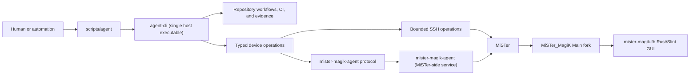
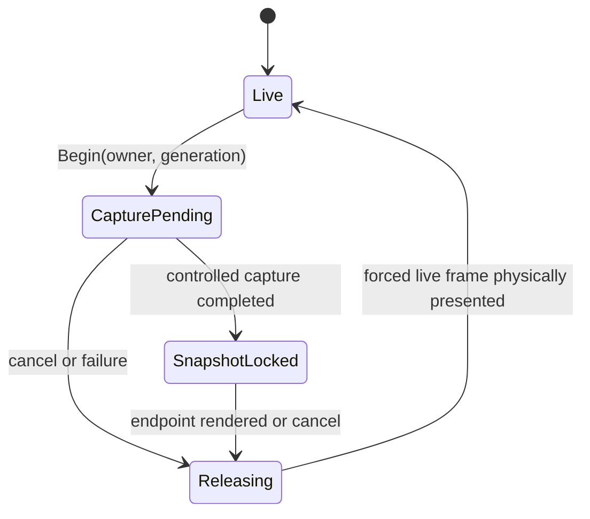
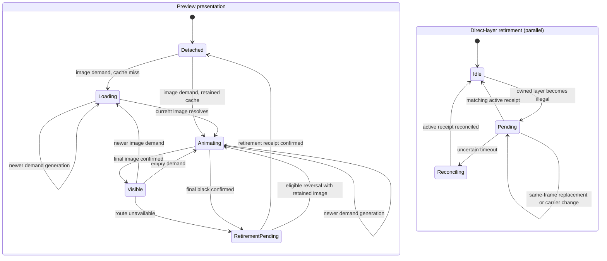
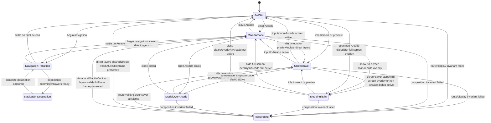
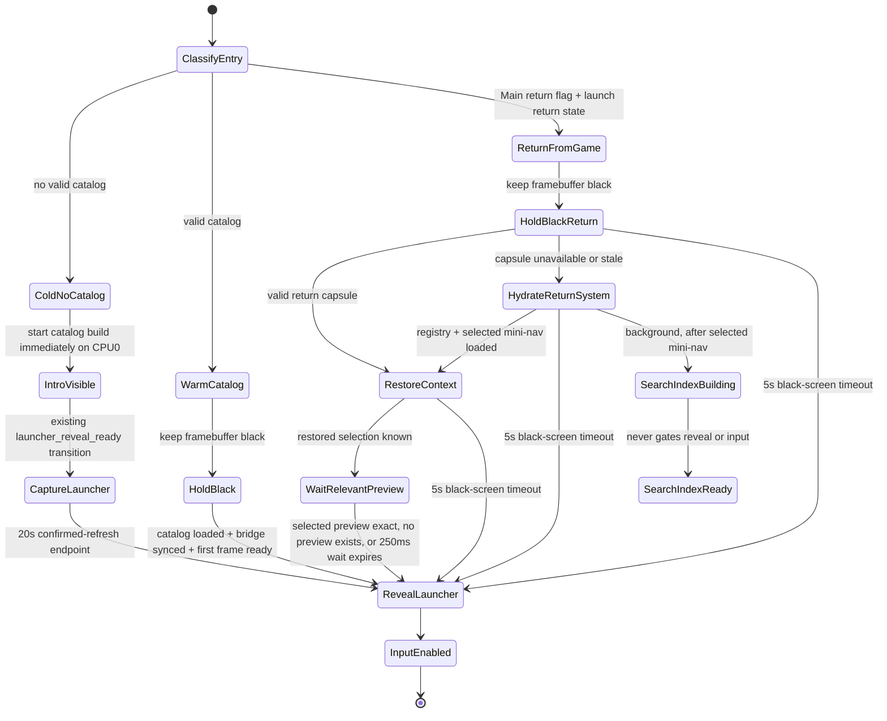
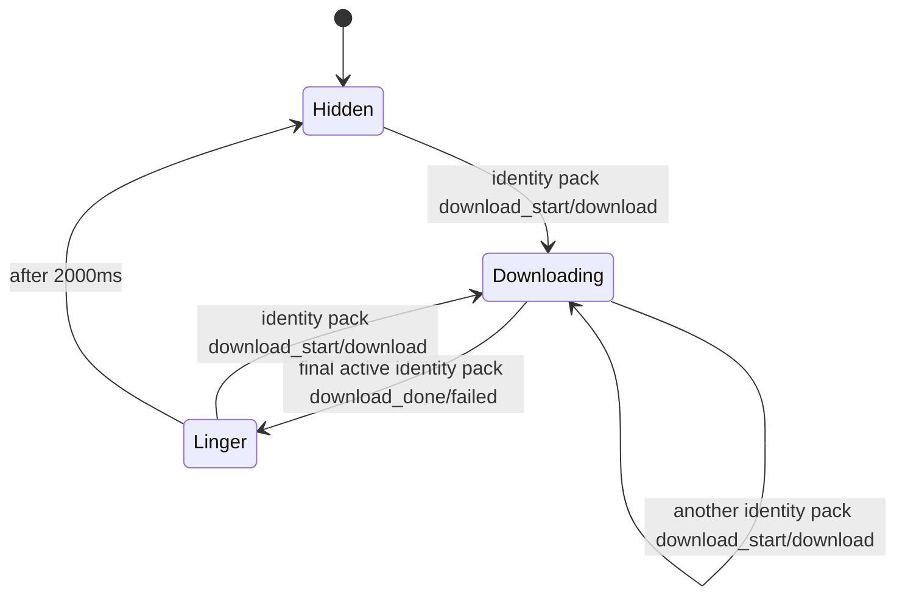

# MiSTer MagiK Architecture

The production controller and keyboard navigation contract is documented in
[Unified input](input.md). Main proxy protocol v2 is the sole application input
source; raw device snapshots are setup and diagnostic data only.

This document describes the current architecture. Dated experiments and older
attempts live in `history/`; treat those as evidence, not policy, unless this
document or `AGENTS.md` links to them as the reason for a current rule.

## Product Shape

MiSTer MagiK is a Rust/Slint frontend for MiSTer FPGA. It aims to make MiSTer
feel like a polished launcher rather than a configuration project: fast game
discovery, controller-friendly navigation, smooth 60fps browsing, and reliable
game launch.

The app repo contains the Rust/Slint frontend and deploy tooling. The
Main_MiSTer fork is maintained separately as `../Main_MiSTer` by default; see
`docs/main-mister-fork.md`.

Repository source is organized by role: applications live under `apps/`,
portable domain and wire crates under `crates/`, and MiSTer-only kernel, FPGA,
hardware contracts, runtime adapters, and operational tools under `mister/`.
`crates/magik-core` defines domain-level platform capabilities without Slint,
filesystem, process, or hardware types. The MiSTer runtime implements those
capabilities while keeping framebuffer ioctls, FPGA commands, and Main handoff
details on the platform side of the seam.

Portable framebuffer scenes cross a narrow RGB565 seam. The Slint-free
`crates/framebuffer-scenes` crate owns checked geometry, buffer identity, scene
clock/target contracts, and pure launcher navigation-transition rasterization.
The Slint-free `crates/particles` crate owns the complete qualified MagiK
pipeline—lookahead preparation, projection cohorts, command ordering, dirty
history, RGB565 rasterization, and timing—plus the cabinet scene. Production
adapters retain Slint snapshot capture, navigation decisions, input queues,
thread policy, PMU telemetry, Main coordination, and presentation.

`apps/framebuffer-scene-lab` consumes those same concrete scene implementations
without compiling Slint or `apps/mister`. It selects MagiK, cabinet, or generated
navigation fixtures through an explicit enum rather than a registry. Mutable
particle recipe watching exists only in the focused lab and the structurally
gated Dev launcher. See `docs/startup-particles.md` for the shared-scene
workflow, schemas, reload protocol, assets, and runtime boundaries. The separate
36-demo `apps/framebuffer-lab` showcase is unchanged experimental code, not
another production authority.

## Tooling Shape

There is one supported host entrypoint and one device-side service:



`agent-cli` is an internal binary name; documentation and operators use
`scripts/agent`. The MiSTer-side `mister-magik-agent` is deliberately separate:
it provides authenticated, fixed protocol operations and is not a second host
CLI or a GUI process.

### Advisory architecture trends

`scripts/agent architecture report --base COMMIT --head COMMIT` compares two
explicit repository trees without contacting the MiSTer. Its stable JSON
schema reports file and largest-function size, mutable bindings, direct
environment reads, public modules, and changed-line concentration for named
owner hotspots. `--format markdown` produces the review summary, and
`--output PATH` writes either format to an explicit artifact path.

Generated code, history, reference clones, vendored sources, and build output
are excluded from concentration totals. The report is informational: a lower
line count without clearer ownership or dependency direction is not success.
Stable owner IDs keep moved or temporarily absent hotspot paths visible rather
than silently treating them as resolved.

The current exception inventory, P1 migration owners, removal conditions, and
exclusive edit seams are recorded in
`docs/agents/architecture-debt-ledger.md`. That ledger governs sequencing; the
report remains evidence only.

## Boot And Process Model

Production boot stays compatible with stock MiSTer:

1. `/etc/inittab` starts stock `/media/fat/MiSTer`.
2. Stock Main reads `MiSTer.ini`.
3. `[MiSTer] main=MiSTer_MagiK` or `MiSTer_MagiKDev` re-execs the selected
   MagiK Main fork.
4. The fork selects `mister-magik/` or `mister-magik-dev/` from its own
   executable name, requires that layout's exact `platform-v3.manifest`, and
   redirects an empty/default Menu boot to the manifest-owned production RBF
   at `fpga/menu-magik-vblank-latch.rbf`.
5. The fork initializes HDMI/video through the normal Main path. The
   MagiK-specific Menu RBF supplies black native pixels with normal HDMI/analog
   timing and downstream OSD composition.
6. Immediately after `video_init()`, and again before every supervised child
   start, Main enters bootstrap black: it disables LFB routing, stock OSD,
   OSD keys, and launcher input without changing framebuffer mode or touching
   `/dev/fb0`.
7. While the display remains black, the fork validates the exact Main,
   runtime, scanout-module, and latch-RBF tuple. A failed preflight leaves Main
   in control, starts no child, and restores stock OSD/input over the native
   black Menu background.
8. Only after preflight completes does Main transfer exclusive FPGA ownership
   and start the selected layout's `mister-magik-fb ui launcher 0` on `tty2`.
   Rust independently derives the same application root from its executable
   location.
9. Child spawn enters `LauncherStarting`, not `LauncherActive`. Rust reports
   internal readiness only after two completed latch posts intended for
   display have advancing sequence and route epochs on alternating slots.
   Main accepts the token- and PID-bound report before entering
   `LauncherActive`.

Main exclusively owns `UIO_BUT_SW`, including `CONF_VGA_FB`, composite sync,
SoG, Direct Video, and the other framework flags. Rust may publish RGB565
geometry and pixels through the framebuffer commands, but it must never
reconstruct or replace that complete configuration word. Main must not draw the
stock menu OSD or release launcher input while a supervised MagiK child exists.
If bootstrap black, preflight, ownership transfer, or child spawn fails before
a child exists, Main restores stock Menu OSD/input over the black native Menu
background instead of starting MagiK with an unqualified route.

Every cold boot, game return, resume, active restart, and crash respawn follows
the same launch boundary:

```text
native Menu black
→ canonical LFB disable
→ latch/platform preflight
→ FPGA ownership transfer
→ child spawn
→ two completed advancing alternating latch posts
→ token-bound ready report
→ LauncherActive
```

`main-status.json` retains schema `mister-magik-main-status-v2` and adds
`bootstrap_phase`, `bootstrap_source`, `bootstrap_phase_ms`, and
`bootstrap_black_count`. Events named `bootstrap_black_entered`,
`bootstrap_preflight_completed`, `bootstrap_ownership_transferred`, and
`bootstrap_spawned`, `launcher_ready`, and `launcher_ready_failed` bind
qualification evidence to the exact ordering. Main status exposes only the
readiness phase, attempt, remaining deadline, and last failure.

The readiness deadline is eight seconds. Main rejects malformed, stale-token,
or wrong-PID reports and retries one complete supervised start after the first
failure. A second failure stops the child and restores stable stock Menu
OSD/input. During a provisional resolution change it restores the old timing
before enabling stock Menu and does not restart MagiK. This boundary is
deliberately internal: it proves completed latch posts and bounded recovery,
not visibility at a physical HDMI or CRT sink. Attended USB-video capture is
the sink-level regression test, and the rare physical HDMI fault remains a
separate investigation. The latch RBF protocol is unchanged.

Display resolution changes are Main-owned provisional transactions. Main
suspends Slint, applies the selected HDMI or CRT/VGA timing, exports the
authoritative configured mode to the replacement launcher, and restarts it with
a twenty-second confirmation deadline. `MiSTer.ini` remains
unchanged until confirmation; cancellation, timeout, launcher failure, or
power loss therefore returns to the last persisted working mode.
Confirmation persistence runs in a supervised child while Main continues
polling the launcher and rollback deadline. Persistence failure leaves the
transaction provisional for retry or cancellation, and rollback publishes a
one-shot Settings return intent for the replacement launcher.
Framebuffer-vsync ioctls run only on a disposable worker in production. The
render thread waits on its bounded channel and falls back to timer pacing when
a mode change strands the worker in the old framebuffer ioctl. Apply,
confirmation completion, and cancellation rearm the worker against the stable
mode; direct render-thread waits remain diagnostic opt-in only.

Root `/media/fat/menu.rbf` is stock firmware owned by `update_all`; MagiK never
writes it. `mister_magik_exit_to_menu` stays on the active latch Menu core.
For compatibility, game returns and `load_core menu.rbf` may be redirected by
`MiSTer_MagiK` to the MagiK-owned RBF after manifest verification. This is not
an activation or identity-proof interface: a missing, malformed, duplicate,
mixed-version, or hash-mismatched manifest legitimately falls back to stock
Menu. Typed delivery and experimental FPGA transactions must instead use the
Main-owned `load_core` command with the exact layout-selected latch RBF path.
`mister_magik_reload_main` is a Main executable replacement operation, not an
FPGA activation or identity proof.

Each manifest binds its layout's fixed installed paths, SHA-256 hashes, Main/MagiK/Menu source
revisions, and the framebuffer platform-contract hash for Main, the Rust
frontend, the scanout module and metadata, and the
latch RBF and metadata. Deployment uploads and verifies the complete inactive
bundle, syncs it, and activates the manifest last. Distribution packages
contain only the public layout and deliberately exclude root `menu.rbf`, the
development layout, and the development agent.

## Framebuffer Ownership

The launcher path uses a planned Linux framebuffer and explicit presentation
conversion:

- Rust sets `/dev/fb0` to RGB565 for the launcher/UI path.
- Rust derives launcher geometry from `MiSTer.ini` menu output settings before
  startup drawing. Outputs remain one-to-one through 1280x720. Modes at least
  1366 pixels wide or 900 pixels high use half width and height, so 1366x768
  renders at 683x384 and 1920x1080 renders at 960x540. Custom modes follow the
  same rule; the qualified hidden-slot maximum is 1366x768.
- HDMI Slint renders the planned launcher framebuffer into cached RAM. CRT
  routes compose Slint, Rust Arcade rows, screensavers, and overlays into one
  route-owned cached RGB565 frame: 640×480 for 240p/480p, 640×288 for 288p,
  and 640×576 for 576p.
- Portrait keeps logical UI geometry separate from the physical RGB565 output
  layout. Slint's software renderer receives `Rotate90` or `Rotate270` and the
  physical scanout stride, so it rasterizes directly into the persistent
  landscape composition cache. The monitor orientation is the inverse of the
  buffer rotation. There is no complete logical portrait framebuffer and no
  post-render full-frame transpose.
- Rust-owned layers use the same output-layout mapping. Arcade rows map while
  copying their cached row bands; previews map only their dirty rectangle;
  screenshot-parade workers raster directly into oriented recyclable buffers;
  and navigation snapshots, effects, and destination overlays use physical
  geometry throughout portrait playback. RGB565 scanout remains physically
  landscape for Main and the FPGA latch.
- CRT presentation preserves all 640 horizontal pixels. Only 240p converts the
  vertical axis, using centred nearest-row sampling from 480 to 240 rows.
  Dirty source rectangles map to exact destination bands there; 288p, 480p,
  and 576p use identity presentation and damage mapping. Both hidden latch
  slots and diagnostic `/dev/fb0` use the same route plan. Native scanout
  geometry is the authoritative framebuffer capture geometry.
- CRT and HDMI routes use registered bitmap fonts through font-specific Slint components and
  the custom Rust games renderer retains Press Start 2P.
- First-party MiSTer Slint uses separate font-specific text components; raw `Text` is confined to those primitives.
  `Start2PSize` limits Press Start 2P to 8, 16, 24, or 32 pixels. Nocive 15 is
  exposed only as `Nocive15Size.px15`; its 16px renderer resource produces
  exact 15-framebuffer-pixel capitals. Wrapped content declares a bounded line
  capacity so it clips instead of painting into adjacent layout.
- The macOS headless UI preview exposes `hdmi`, `crt-240p`, `crt-288p`,
  `crt-480p`, and `crt-576p` display profiles. CRT captures use the production
  route geometry, content insets, typed text sizes, and Press Start 2P font.
- Rust sends the FPGA `SET_FBUF` route so buffer 0 is scanned to HDMI. For CRT,
  the FPGA receives a framebuffer already matching the full active raster; its
  OSD path is a direct overlay and is not relied on for UI scaling.
- The default renderer is the FPGA vblank latch path when the MagiK Menu latch
  RBF and stock-kernel plugin support are available. It copies complete cached
  RGB565 frames into scanout-slot-module hidden slots, posts the selected physical
  address before vblank, then waits for vblank only as the pacing boundary for
  the next frame. Hidden-slot writes follow copy → overlay → publish → post;
  ARM publication uses a full-system store barrier to drain write-combined
  stores before the FPGA latch sees the slot. A latch failure freezes the last
  confirmed hardware frame, emits machine-readable failure records, and makes
  bounded recovery attempts after 250 ms, 1 s, 5 s, and 60 s. It never clears
  the visible route, presents a fallback screen, or presents the normal
  launcher through `/dev/fb0`. The single-frame `/dev/fb0`
  dirty-copy path is an explicit diagnostic renderer selected only with
  `MISTER_PRESENT_BACKEND=fb0-dirty`; that path intentionally keeps the older
  order: wait for vblank, then dirty-copy to `/dev/fb0`.
  Latch mode keeps a larger late-frame headroom window than `/dev/fb0` for
  inactive or non-motion frames, but active Home horizontal motion bypasses the
  pre-render deferral. Holding left/right or running the Home pan window keeps
  the loop frame-driven so latch mode does not solve tearing by holding the
  previous visual frame for an extra refresh. Benchmark trace writes are
  buffered on the latch path; diagnostic file flushes must not run immediately
  after the post-present vblank wait because that would delay the next frame's
  hidden-buffer copy/post deadline.
  The latch path requires the MagiK Menu latch RBF to be loaded from the active
  launcher through Main's `mister_magik_launch` command path and the
  stock-kernel `mister_magik_scanout_slots` module to be loaded. A copied RBF artifact alone
  does not activate the fast path, and `load_core` from the launcher state does
  not prove the patched core is running.
  Runtime proof comes from Main's cmdline, the scanout-slots module, passive
  `fpga-latch-report` magic for passive commands `0x58`/`0x59`, production-ready
  exact protocol-v5 capabilities `0x03ff` and CAPS CRC from `0x59`, SET support derived
  from that exact profile without a side-effecting `0x57` probe, and advancing latch
  `flip_count`/`post_count` while the launcher runs. Protocol-v5 command `0x5c`
  supplies owned, presented, repeated, and ownership-loss vblank counters. The JSON
  `composition_state` describes UI composition, not the final present backend.
  For `/dev/fb0`, userspace wall/loop cadence is the visual proof because the
  copy happens after vblank. On the latch path, protocol proof comes from posts
  completing before deadline, alternating hidden buffers, consistent sampled
  flip counters, valid status CRC, and passive `drop_count=0` with unchanged
  `reject_count`. Motion cadence is a separate TV-visible gate: validated
  `repeated_vblank_count` deltas are the sole source of `dropped_frames`, and
  every authoritative window requires zero repeats. A zero latch drop count
  never proves zero dropped frames. Completion timestamps, flip progression,
  and Linux wake jitter are reported separately as software diagnostics.
  A protocol-v5 rejection also snapshots passive
  `0x5a` receiver context:
  reject count/reason, expected and observed word indices, observed command,
  receiver state, and CRC. The latch failure episode pairs that snapshot with
  the outbound `0x57` command and payload/CRC ACK phases and timings, the
  post-verification counters, route epoch, and active RGB565 geometry. For an
  attended development-layout reproduction only,
  `MISTER_MAGIK_DEV_LATCH_POST_SKIP_WORD_INDEX=N` omits one zero-based SET word
  once per process; public installations ignore it and it must never be
  persisted in `launcher.env`.
- The launcher routes the framebuffer during startup and explicit recovery. The
  old periodic route watchdog is disabled by default now that the Main_MiSTer
  fork suppresses stock OSD/menu/framebuffer paths while MagiK owns the UI.
  `MISTER_FB_ROUTE_REASSERT_FRAMES` can re-enable it for attended diagnostics.

Important policy:

- Do not render the normal Slint launcher into the live framebuffer. The latch
  path is the required production renderer; cached-RAM plus `/dev/fb0`
  dirty-copy is diagnostic-only.
- Do not assume `/dev/fb0` contents are visible on HDMI. The FPGA may be scanning
  another buffer.
- RGB888/8888 UI support and color-route smoke tooling have been removed from
  the app. Do not add framebuffer format selection back to rendering,
  diagnostics, experiments, or benchmarks.
- Main-mediated present experiments (`main-flip-v1`, `main-vsync-hidden`, and
  `plugin-main-vsync-hidden`) are retired. They either blocked the UI frame on
  Main's vblank wait or put present ownership in the wrong process. Do not add
  new launcher paths that depend on Main request/ack present files or FIFO
  present commands.
- Diagnose the fast path by checking the runtime state, not just the files on
  disk: absence of `mister_magik_scanout_slots` or
  `/dev/mister-magik-scanout-slots` means the WC hidden slots are unavailable,
  and benchmark traces must report
  `main_present_backend=fpga-vblank-latch-hidden` with status `ok` to prove the
  latch renderer is active.

## Framebuffer Stream

`framebuffer_stream_v1` is the desktop inspection stream for the launcher. It is
producer-side by design: `mister-magik-fb` publishes frames from its cached
RGB565 render target after successful presents, and the agent only proxies the
binary stream to authenticated desktop clients. The stream must not poll or read
`/dev/fb0` for steady-state frames.

Wire policy:

- The desktop authenticates with the normal agent JSON request, then the socket
  switches to `mister-magik-framebuffer-stream-v1` binary messages.
- Payload pixels are RGB565 little-endian and compressed with LZ4 block
  size-prepended encoding.
- Message kinds are `hello`, `keyframe`, `rect-delta`, `heartbeat`, `end`, and
  `error`.
- Frame messages carry sequence, producer timestamp, geometry, stride, dirty
  rectangle, uncompressed byte count, and compressed byte count.
- Binary payload and decoded-surface sizes are bounded before allocation. LZ4
  size-prepended frames must agree with the header's uncompressed byte count;
  a disagreement is a protocol error, not an invitation to decode or recover
  the partial frame.
- A new subscriber receives a full keyframe before any deltas. Geometry changes
  also force a keyframe.
- If the desktop detects a sequence gap or malformed delta, it must discard the
  partial frame and require a fresh keyframe.

Latch-stream policy:

- The latch renderer snapshots the immutable hidden slot only after the FPGA
  post, route/status work, and committed-slot bookkeeping have succeeded. The
  snapshot therefore includes Slint plus direct Arcade layers and describes
  the exact composed frame that was committed for scan-out.
- Latch snapshots are self-contained keyframes. During motion, adaptive mode
  decimates RGB565 to 480x270; after 120ms without motion it publishes one
  960x540 refinement from the last committed slot without issuing a synthetic
  FPGA flip. Geometry changes are ordinary keyframe changes on the existing v1
  wire protocol.
- A bounded newest-wins producer queue prevents a slow encoder or client from
  delaying presentation. The desktop mirrors that policy with a one-slot
  decoded-image mailbox and at most one outstanding UI callback.
- `MISTER_FRAMEBUFFER_STREAM_SCALE=off|full|half|adaptive` controls latch
  publication. Normal launcher operation defaults to `adaptive`, but snapshot
  work remains dormant until a subscriber connects. Set the variable to `off`
  only for an explicit no-stream benchmark. The fixed Cortex-A9 build uses a
  20-line C scalar RGB565 helper behind a Rust-owned, validated call boundary.
  Its pointer-walking loop is retained because both tested Rust scalar forms
  were materially slower on the device; there is no runtime decimator selector
  or retained NEON fallback.
- RGB565 preview fades use their measured scalar row blend. Stable Rust does
  not expose the ARM NEON cfg used by the former fade implementation, and a
  byte-exact C NEON probe was 26–29% slower on the Cortex-A9.
- On macOS the desktop consumes its newest-frame mailbox from a native
  `CADisplayLink`; the producer never schedules catch-up callbacks. Winit redraw
  events are diagnostic-only because Slint may draw directly from its own
  display link. Display throughput counts distinct stream image serials at
  Slint `AfterRendering`. Received, decoded, applied, and redraw-submitted
  frames remain separate diagnostic counters.
- Formal desktop display runs require the compiled Skia UI with
  `SLINT_BACKEND=winit-skia`. The rendering notifier is registered only after
  `show()` has created the native window, a redraw is requested, and notifier
  readiness is not asserted until Slint delivers `RenderingSetup`; completed
  display samples still require `AfterRendering` for an applied image serial.

Historical evidence:

- `history/2026-07-10-framebuffer-stream-cadence.md`
- `history/2026-5-2/framebuffer-experiments.md`
- `history/2026-6-8/direct-fb-trial.md`
- `history/2026-6-9/direct-framebuffer-sidecar-retrospective.md`
- `history/2026-6-14/launcher-framebuffer-route-reassertion.md`

## Launcher Composition

Normal launcher rendering is governed by a small composition controller. The
cached RGB565 frame is the complete base in every state; Rust direct-blitted
layers are legal only on HDMI while the controller is in `MixedArcade`. CRT
Arcade rows are composed into the cached 640×480 frame before conversion.
`Screensaver`
owns the complete cached frame and clears all direct layers on entry regardless
of the underlying navigation screen. `ModalOverArcade` clears direct
layer assumptions and forces a full Slint present before showing the dialog.
Full-screen Slint overlays such as catalog scan/rebuild progress are modeled as
`ModalFullSlint`, even when the underlying navigation screen is Arcade, so they
also suppress Arcade list and preview direct blits without entering recovery.
Full-frame Slint presents also invalidate the live direct Arcade layers. When
recovery, modal transition, screen ownership change, or an opt-in diagnostic
route reassertion forces a full present while Arcade remains active, the list
and preview layers must be repainted in the same frame. This prevents Slint's
cached base frame from silently overwriting a still-truthful `exact` preview
with the blank placeholder area.

Portrait does not change those ownership states. It changes only how logical
coordinates reach the physical cache. Slint damage is already physical;
custom layer damage is converted with the shared output layout at the layer
boundary. The retained `orientation_damage_rotation_us` telemetry field is a
v1 schema-compatibility field and is zero because steady rendering performs no
post-raster rotation.

Navigation capture has its own composition phase. `NavigationTransition` owns
the source snapshot and playback while direct layers are suppressed. After the
navigation intent commits and its destination layers are available, the
controller enters `NavigationDestination`. That state forces Slint to raster a
complete new RGB565 base buffer, composes the Arcade list and preview when
needed, and only then permits the transition destination snapshot. This keeps
first entry behavior independent of Slint's reused-buffer dirty history.

Full-screen transition render policy is centralized in
`FullScreenTransitionStateChart`. Product runtimes continue to own navigation,
geometry, reversal, input, startup, and screensaver behavior; the shared chart
only controls Slint timer advancement, raster authorization, snapshot locking,
release, and frame-driven scheduling. Navigation is the first consumer.



Only one owner may be active. Every activation receives a generation token;
stale events and nested ownership are rejected. `CapturePending` authorizes one
controlled Slint raster, `SnapshotLocked` retains redraw requests without
advancing or rasterizing Slint, and `Releasing` permits one forced live raster.
Latch acceptance is not a release acknowledgement: the chart returns to
`Live` only after the forced frame's sequence is confirmed active at a physical
refresh.

Every non-`Live` state owns CPU1. Slint timers, runtime-status serialization,
search polling, media maintenance, update checks, and other launcher background
work remain quiescent for the complete ownership interval. The primary catalog
worker control channel retains its fixed two-message per-frame service so
publication acknowledgements and terminal state cannot deadlock behind the
transition. A cold system entry is prioritized within that same budget and may
perform one non-blocking newest-result acknowledgement per frame; a contended
mailbox defers acknowledgement instead of waiting. Selected-preview adoption
may also finish the exact generation-bound entry preview; ordinary scrolling
prefetch remains disabled.

Screenshot presentation and direct-layer retirement are parallel state-chart
regions. Preview demand (`Empty` or `Image`) is independent from route
eligibility (`Eligible`, `Occluded`, or `Unavailable`). Bridge synchronization
only projects navigation and catalog state; it does not clear or advance the
preview lifecycle. `Loading` retains an existing image, while a request started
from `Detached` remains black. Only actionable `PreviewFrameIntent` from an
eligible `Animating` state wakes rendering. Normal transitions use 130 ms and
velocity-list turbo transitions use 63 ms.

Composition owns physical retirement for both the Arcade list and preview
layers. When an owned layer becomes illegal, composition opens a parallel
retirement transaction with a generation and layer obligations. The next
already-authorized complete frame is its carrier: navigation playback, a modal,
screensaver, recovery, or live Slint. The transaction completes only when that
frame's sequence, slot, and route epoch are confirmed physically active. An
uncertain timeout enters reconciliation; it is never blindly reposted. A route
reversal may replace the retiring layer in that same confirmed carrier frame.



Slint owns invalidation of the cached base UI. The launcher window adapter's
pending-redraw state is the scheduler's source of truth, and cheap Settings and
Screensaver Settings bridge properties are synchronized with change-aware
setters every event-loop iteration. They must not be added to the launcher's
manual bridge dirty key. Explicit frame intent remains limited to work outside
Slint, including direct Arcade layers, framebuffer routing, workers, and FPGA
presentation.



`Recovering` is an escape hatch, not normal UI flow. Entering it emits
`ui_composition_invariant_failed`, increments `composition_recovery_count` in
`/tmp/mister-magik/status.json`, records the last invariant kind/detail, clears
direct-layer assumptions, and forces a full Slint present. Device gates should
treat unexpected composition recovery as a failure.

Launcher idle decisions must include custom-layer motion, not just Slint bridge
changes. Arcade rows are Rust-painted and keyed by pixel scroll position; a
selected-index change can finish its nav state on the same loop that moves the
direct layer to its final row alignment. That final visual tick must still be
rendered and copied before the idle path may sleep, otherwise the stale
intermediate row pixels can remain visible until an unrelated redraw.
Rendered and idle launcher loops both advance `status_sequence` in the periodic
runtime status. Delivery smoke and diagnosis sample that sequence with the same
PID so a live but stalled process cannot pass health checks, while a correctly
sleeping Slint screen does not need to produce extra frames.

## Game Launch Handoff

Slint does not directly load cores. It hands launch requests back to Main so the
normal MiSTer loader path controls FPGA/core state and HDMI recovery.

Launcher orchestration runs through an explicit Rust lifecycle state chart:

```mermaid
stateDiagram-v2
    [*] --> BootSplash
    BootSplash --> CatalogBuilding: catalog missing or empty
    BootSplash --> CatalogReady: catalog loaded
    BootSplash --> CatalogLoadFailed: existing catalog unreadable

    CatalogReady --> WarmUpdating: exact or all-system reconciliation
    WarmUpdating --> WarmUpdating: queued / scanning / prepared per system
    WarmUpdating --> CatalogReady: manifest published atomically
    WarmUpdating --> CatalogReady: update failed; retain published generation

    CatalogReady --> CatalogLoadFailed: hydration/load fails
    CatalogLoadFailed --> CatalogRetrying: Retry
    CatalogRetrying --> CatalogReady: load succeeds
    CatalogRetrying --> CatalogLoadFailed: load fails

    CatalogLoadFailed --> FreshRebuilding: Rebuild
    FreshRebuilding --> FreshRebuilding: builder lock acquired
    FreshRebuilding --> FreshRebuilding: delete catalog artifacts
    FreshRebuilding --> CatalogBuilding: cleanup complete
    CatalogBuilding --> CatalogReady: fresh catalog ready
    CatalogBuilding --> CatalogLoadFailed: recovery cannot produce a loadable catalog

    CatalogReady --> Idle
    Idle --> Launching
    Launching --> Handoff
    Launching --> Recovered
    Recovered --> Idle
```



`apps/mister/src/launcher_runtime/lifecycle.rs` owns the host-neutral lifecycle
policy, catalog-readiness state, launch staging, recovery transitions, and the
small effect stream that records bridge/render intent.
`apps/mister/src/ui_runner/launcher_bridge.rs` applies lifecycle state to Slint,
while `apps/mister/src/ui_runner/launcher_scheduler.rs` and the focused
`*_session.rs` adapters start and poll catalog, media, launch, and background
jobs. The device UI runner retains Slint rendering, row-copy decisions,
framebuffer presentation, route reassertion, and frame accounting in
`apps/mister/src/ui_runner/launcher_loop.rs`.
Lifecycle and scheduler internals should use explicit enum states for startup
readiness, pending launch refs, and worker availability instead of parallel
booleans or `Option` fields that can express impossible combinations.
Library load recovery follows the same rule: the lifecycle state owns dialog
text, Retry/Rebuild selection, strict retry, locked cleanup phases, and fresh
build transitions. The frame loop renders the lifecycle view and executes its
effects; it does not maintain a second recovery flag or choose worker policy.

Startup reveal is part of that lifecycle state system. This Mermaid chart is
the source of truth for whether HDMI should show splash, black, catalog
progress, or the restored launcher:



Only cold boot without a valid catalog or retained Arcade projection shows the
20-second first-run particle intro while catalog work runs on CPU0. Its logical
clock advances only after the posted sequence is active at a confirmed physical
refresh. HDMI uses full particle density; the four resolved CRT routes render
half density at their native framebuffer geometry with the complete 16:9 scene
centred in the 4:3 raster. The 240p handoff derives its native target through
the standard centred 640×480-to-640×240 transform while retaining the original
composition cache. Warm boot and return-from-game keep HDMI black until the
first intended launcher frame is ready. Warm registry startup opens the
generation-bound CPU0 entry reader before reveal; each bounded entry prelude
and complete collection, including Arcade, remains lazy until activation.
Return-from-game consumes a
bounded catalog capsule when possible. If that capsule is unavailable, only the
registry and selected system mini-nav are foreground reveal work. Return-from-game
may wait at most 250ms for the selected
preview so the restored Arcade frame is complete, but preview readiness is not a
hard visibility dependency: if the relevant preview never becomes exact, the
launcher must reveal after the bounded preview hold rather than leaving HDMI
black. The complete return startup also has a five-second black-screen deadline:
if return-state restoration or catalog hydration stalls, the lifecycle abandons
the black hold and forces a full-frame present. Expiry is recorded as both a
structured startup event and an error.
Return-from-game is authorized by Main's
volatile `MISTER_MAGIK_RETURN_TO_LAUNCHER=1` launcher environment; the
`/tmp/mister-magik/launcher-return-state.json` file is only the restore payload
for screen, system, selection, and filters. A stale return-state file without
Main's flag is consumed and treated as a normal Home startup, so rebooting while
a core is active cannot masquerade as an in-session game return. Input is
accepted only after
`InputEnabled`; lifecycle launch handling must reject launch requests before
that state even if a caller bypasses the normal input loop. Startup timing
events must report `launcher_revealed` and `launcher_input_enabled`.

Host-side lifecycle control is owned by the authenticated resident agent. Main
publishes its process generation, executable identity, and command-channel
readiness. State-changing commands use the paired internal FIFOs
`/dev/MiSTer_cmd` and `/dev/MiSTer_cmd_reply`: Main returns one human-readable
`ok`, `rejected`, or `error` line instead of making callers poll for an inferred
result. Main refreshes `main-status.json` every five seconds as a health
heartbeat; a stopped heartbeat indicates failure but is not a command deadline.
The FIFOs remain internal transports, not host APIs or readiness signals.

Screenshot pack download popups are also state-owned. The popup is driven only
by real pack download progress, not by local pack checks, current-pack skips,
index sidecar work, save/sync phases, or worker completion:



The popup may linger on the final downloaded/failed row for two seconds after
the last active pack download finishes. Later verify/save/sync/done messages
must not extend that timer or recreate the popup.

Launch is intentionally two-phase. `Idle -> Launching` first updates the Slint
bridge and presents the loading frame. Only after
`loading_frame_presented(...)` does the scheduler let the existing
`LaunchHandoffSession` start the Main/FIFO handoff. If handoff fails, the
lifecycle enters `Recovered`, the scheduler reasserts the launcher framebuffer
route, the recovery UI is presented, and only then does
`recovery_frame_presented(...)` return the lifecycle to `Idle`.

Current command surface:

```text
mister_magik_launch <absolute .mgl/.mra/.rbf path>
mister_magik_exit_to_menu
mister_magik_reload_main
```

Current work must use the explicit fork command surface when operating under
`MiSTer_MagiK`. An FPGA transaction uses `load_core` only with the exact
layout-selected MagiK RBF path. In particular, `/media/fat/menu.rbf` is never
evidence that the MagiK latch RBF was configured, and
`mister_magik_reload_main` alone proves only Main replacement.

Never use external `rbf_load` from Slint; that path has historically left the
display without valid scan-out.

## Catalog And Preview Model

Catalog V3 is the sole authoritative production catalog. Its schema-one
manifest registry names immutable schema-four SQLite, schema-two mini-nav, and
schema-two NavPack artifacts for each playable system. A small checksummed
Arcade bootstrap mini-nav may be
retained beside Catalog V3 as a disposable startup accelerator; it is never a
complete catalog or publication authority.
Warm startup reads the registry and opens the generation-bound NavPack reader.
Every system remains a registry summary with an unfaulted entry prelude until
its collection is activated. Collection
activation is an atomic state transition: an already resident destination
commits in the input frame; a cold destination leaves the originating Home view
presented while CPU0 prepares the mapped `SystemCollection`, then commits before
bridge synchronization and drawing. A registered, populated collection may
never be presented with zero resident rows. The registry's summed counts are
the full catalog total, while resident rows describe only hydrated memory.

A build without a valid registry enters the first-build lifecycle. Its CPU0
builder may use the retained Arcade mini-nav to accelerate the first-visible
projection, but the launcher never treats that index as a catalog seed. A
missing, corrupt, oversized, or stale index causes a normal CPU0-confined
first-visible Arcade scan. The interactive Slint launcher is
not rendered continuously behind the intro: timer dispatch and bridge sync are
suppressed while catalog changes accumulate in Rust. The existing lifecycle
`launcher_reveal_ready` transition is the only capture gate; no parallel
catalog-readiness flag is permitted. Its normal reveal cycle commits Arcade
navigation and performs the established full bridge synchronization that
populates the launcher and its tile models and clears the scan overlay. Only
then does one off-screen Slint render into the persistent composition cache
produce the live RGB565 target. The host immediately retains that frame and a
low-priority CPU0 worker derives its particle formation, leaving CPU1 to render
the intro. Transient build-progress shell and taxonomy mutations are not
projected through the dormant launcher; the final publication installs their
authoritative state. If the prepared target is not ready by 16 seconds, the
cabinet continues spinning and storyboard time pauses. The 20-second logical
endpoint and first interactive frame are therefore pixel-identical. After the projection is
acknowledged, the complete authoritative scan continues in the background. It
audits the retained projection and
atomically refreshes the bootstrap index. Background walkers, classification
batches, archive inspection, prepared-payload indexing, and projection work all
remain in the continuous CPU0 background scope through UI-independent
cooperative checkpoints.
Changed systems receive new immutable artifacts and unchanged systems retain
their existing generations. The manifest is the atomic publication boundary.
Published availability is independent of update activity: an existing system
remains selectable with its old count and games while queued, scanning, or
prepared; a genuinely new system is a disabled placeholder until publication.
Per-system failure leaves an existing system selectable with an update warning.
Removed systems remain visible until the replacement manifest is published.

The catalog-state fingerprint, registry generation, and binding must agree.
The separate scanner cache owns discovery timestamps and software hashes. The
UI must never scan media on launcher hot paths, and production never reads or
creates `library.sqlite3`, `library.summary.json`, or `library.nav.lz4b`.

See `docs/catalog.md` for the current catalog lifecycle, worker request modes,
root stamp semantics, SQLite publish model, and benchmark gates.

## Launcher Navigation Model

The Home launcher is a dynamic hierarchy rather than a flat catalog-system
row. Its root order is `Arcade`, `Consoles`, `Handhelds`, then `Computers`;
empty leaves and their empty parent groups are removed. Console,
handheld, and computer levels group installed systems by manufacturer or
family, with an `Other` node retaining every catalogable system that has no
explicit mapping. The catalog's normalized platform kind supplies that
fallback, so adding a new core cannot silently make its games unreachable.

`A` descends into a group or opens its game collection. `B` returns one menu
level, while `Home` returns directly to the hierarchy root. Each level retains
its selected tile and horizontal scroll position, and Settings returns to the
level that opened it. Launch return state records the active collection and
menu path; older system-only state is resolved to that system's primary path.
Vendor groups with only one installed collection are flattened into a single
branded collection tile, such as `Sony PlayStation`, so a vendor grouping never
adds a level solely for one child. `SNK NeoGeo` is retained as a stable Consoles
submenu even when only one of NeoGeo or NeoGeo CD is installed. NeoGeo Pocket is
only available under Handhelds/SNK. The NeoGeo Pocket system-launcher MRAs under
`_Arcade` are ignored because they boot a handheld core rather than an arcade
game.

The curated hierarchy and ordering are fixed; empty branches are removed, and
vendor branches with one installed collection are flattened into their parent:

| Level | Ordered children / owned system IDs |
| --- | --- |
| Root | Arcade; Consoles; Handhelds; Computers |
| Consoles | Atari (`atari2600`, `atari5200`, `atari7800`, `jaguar`); Sega (`sg1000`, `sms`, `megadrive`, `megacd`, `s32x`, `saturn`); Sony (`psx`); Nintendo (`nes`, `fds`, `snes`, `satellaview`, `n64`); NEC (`tgfx16`, `tgfx16-cd`, `supergrafx`); SNK NeoGeo; Other |
| Consoles / SNK NeoGeo | NeoGeo (`neogeo`, `neo-geo`, `snk-neo-geo`); NeoGeo CD (`neogeo-cd`) |
| Handhelds | Nintendo (`gb`, `gameboy`, `gameboy2p`, `gbc`, `gba`, `gba2p`, `sgb`, `sgb2`, `pokemonmini`); Sega (`gamegear`); Atari (`atarilynx`); SNK (`neogeopocket`, `ngpc`); Bandai (`wonderswan`, `wonderswancolor`); Other |
| Computers | Acorn (`acornatom`, `acornelectron`, `bbcmicro`, `archie`); Apple (`apple-ii`, `macplus`, `maclc`); Commodore (`amiga`, `amigacd32`, `c64`, `c128`, `c16`, `vic20`, `pet2001`); Atari (`atari800`, `atarist`); Sinclair (`zx81`, `zx-spectrum`, `ql`); Tandy/Radio Shack (`trs-80`, `coco2`, `coco3`); DOS/PC (`ao486`, `dos`); Japanese Computers (`msx`, `msx2`, `pc88`, `pc98`, `x68000`, `x1`, `sharp-x1`, `fm7`, `fmtowns`); Other |

After those explicit mappings, the catalog profile category determines the
fallback: `Arcade` joins the root Arcade aggregate, `Console` goes to
Consoles/Other, `Handheld` to Handhelds/Other, and `Computer` to
Computers/Other. An unknown category is retained under Consoles/Other and emits
a catalog diagnostic. No playable system is discarded by the taxonomy.

Arcade drawer navigation starts with an A-Z jump list. From the closed Arcade
game list, D-pad left opens the alphabet drawer; selecting a group jumps the
game list to the first title in that group. Pressing left again from the
alphabet drawer opens the hierarchical filter drawer. D-pad right descends into
a filter group or applies the highlighted value; `A` is the same action. D-pad
left backs out one filter level; `B` is the same action except at the filter
top level, where left is a no-op and `B` returns to the parent hierarchy
level. `Home` always jumps back to the hierarchy root from Arcade or any open
drawer level. One physical `A` or right press performs exactly one hierarchy
transition: after descending into a child, both activation controls must be
released before another child can be entered or a leaf can be applied. This
release boundary belongs to the navigation state machine rather than the input
polling or rendering loop. `Decades` currently contains decade values such as
`1970's`; those values are filter leaves, not branches containing individual
calendar years.

The Rust drawer renderer treats the complete ordered row content as its
identity: labels, counts, active flags, and row order. A drawer identity change
always resets the circular surface and produces a full list-layer update, even
when the old and new drawers contain the same number of rows or the selection
also moves. Incremental surface scrolling is valid only while that complete
content identity is unchanged. Row count and scroll position are never content
identity.

The Rust-painted game list viewport shows ten 48 px rows and is 510 logical px
wide, intentionally borrowing a little space across the old half-screen split
so longer game titles remain visible without covering the centered preview
cabinet.

Arcade search is a top-level filter, but it behaves like its own mode instead
of another hierarchical drawer level. The left pane becomes an on-screen
keyboard and the Rust-painted game list moves to the right pane as search
results. Search results are cached as indexes into the hydrated
`ArcadeCatalog`; queries match normalized title text, launch basename,
manufacturer, controls, player count, year, and decade. Compact forms keep
punctuation and spaces from blocking obvious matches, so `pacman` can match
`Pac-Man` and metadata terms such as `capcom` can match games by manufacturer. The search
keyboard also exposes a one-word autocomplete suggestion above the keys; `Y`
accepts the suggestion by replacing the current partial word and appending a
space. FTS5 search documents and a compact autocomplete word table are built
transactionally into each system shard and published with the catalog
generation. Empty search shows the active collection's full game list.
Non-empty queries run asynchronously against every physical system shard that
backs the collection, and stale results are discarded by request and catalog
generation. The UI exposes explicit Searching, Ready, and Failed states; search
never waits for a process-local index build after launcher startup.
While search is active, screenshot previews stay suppressed because the right
pane is reserved for result navigation. Launch return state restores the search
query immediately and applies the exact filtered selection when its persisted
query completes without delaying reveal or input.

Current rules:

- Production `mister-magik-fb` exposes the minimal command surface, including
  `ui`, `early-black`, `library-refresh`, read-only `catalog-v3-inspect`, and
  attended `purge-library-data --confirm`.
  Low-level probes are diagnostic/experiment builds, not release commands.
- Build/update the catalog outside the UI hot path through the typed benchmark
  or delivery workflows; humans may inspect it with `scripts/agent device catalog inspect`.
- Launcher boot seeds Home/system counts from the V3 registry and eagerly
  hydrates only Arcade. Other systems load lazily. If source state is stale,
  the launcher shows a `Library changed` dialog; `Rebuild` uses the same
  per-system reconciler as explicit refresh, while `Continue` writes a one-shot
  next-boot marker. Use `startup_timing` logs to separate registry load, Arcade
  mini-nav hydration, bridge sync, stamp check, user choice, and build costs.
- Settings → **Rebuild Database** requests `AllSystems` warm reconciliation.
  It keeps Settings responsive, every published tile launchable, and screenshot
  packs intact; it neither shuts down media work nor reboots.
- `purge-library-data --confirm` is the explicit destructive maintenance
  boundary for catalog artifacts and supported screenshot packs. It is
  process-exclusive, runs before FPGA/display ownership, reports removal
  counts, and never reboots.
- Rust launcher owns normal boot-time catalog validation. Main_MiSTer may invoke
  `library-refresh` only for the missing/empty DB first-boot deferral path and
  must not schedule delayed background refreshes when a database already exists.
- When the V3 registry and retained Arcade projection are both missing or
  invalid, boot starts the direct hidden-slot particle intro immediately and
  lets the CPU0 launcher worker perform the first scan. The invisible Slint UI
  remains dormant until one real launcher frame is needed for the morph. Do not
  run foreground `library-refresh` before the intro or after an attended purge;
  that regresses to a black HDMI screen while the index is built.
- Do not count helper payloads as games: BIOS ROMs, raw `.rbf` core binaries,
  menu-level computer/console launchers, and known support files are not normal
  launchables.
- Arcade and Neo Geo identities are keyed through MAME set names when metadata
  is available. See `history/2026-6-14/library-identity-model.md`.
- Preview requests use derived archive paths and identity keys. The catalog does
  not index screenshot archives or walk PNG/JPG screenshot folders; missing
  preview entries fail at runtime and show the blank preview state.
- Catalog code must not read `gamelist.xml`; runtime loading goes through the V3
  registry and per-system mini-navs.
- MAME XML, MAME software-list XML, and the commit-pinned
  `MiSTer-devel/ArcadeDatabase_MiSTer` CSV are database-publisher inputs only. The
  production conversion to `mame.sqlite3` runs exclusively in
  `.github/workflows/game-databases.yml`; application distribution consumes a
  verified immutable `game-databases-vN` release. ArcadeDatabase rows are
  embedded in `mame.sqlite3`; the runtime scanner consumes
  SQLite rows, never XML. Local synthetic conversion is test-only.
- Runtime preview loading is raw565-oriented. Build source screenshots, raw565
  caches, fixed LZ4-block `.mmlz4b` preview packs, and `.mmlz4b.idx` seek
  sidecars from the private `private/magik-cloud` submodule. The sidecar is a
  first-preview latency optimization; the whole pack remains the correctness
  fallback. Runtime deploy does not build catalog/media artifacts. Use
  `scripts/magik-cloud path` when a command needs to resolve the checkout.

Relevant docs:

- `docs/console-media-identity.md`
- `docs/media-download-security.md`
- `history/2026-6-13/arcade-screenshot-cache-workflow.md`
- `history/2026-6-13/preview-zstd-archive-bench.md`
- `history/2026-6-14/library-scanner-preview-archive-pruning.md`
- `history/2026-6-14/mame-metadata-db.md`

## Build And Module Boundaries

`apps/mister/src/lib.rs` holds host-testable logic without the Slint/UI feature.
The binary target in `apps/mister/src/main.rs` owns device-only work: FPGA,
framebuffer, VT, input, audio, and the Slint runtime.

Use `apps/mister/BUILD.md` for build profiles, cross-compilation, FFmpeg, size
tracking, and CI details. Do not duplicate those details here.

## Open Areas

- Return to launcher after game reset without a full reboot.
- Validate Main-owned launcher controller mapping across representative USB and
  Bluetooth devices after each platform input change.
- Keep the fork patch surface small and documented in `../Main_MiSTer`
  `MAGIK_PATCHSET.md`.
Catalog scanning, validation, and database publication run inside
`mister-magik-fb` through `mister_magik_catalog::builder_service`. The launcher
translates typed builder events directly into lifecycle events. The standalone
`mister-magik-catalog-builder` is a developer-only adapter over the same service
for isolated optimization profiling; it is not a production artifact.
