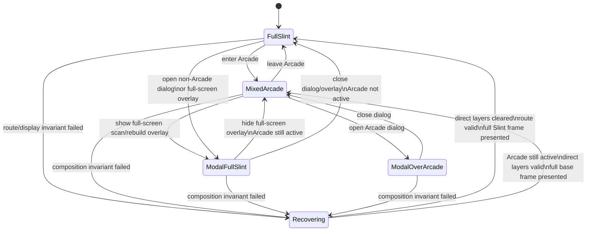
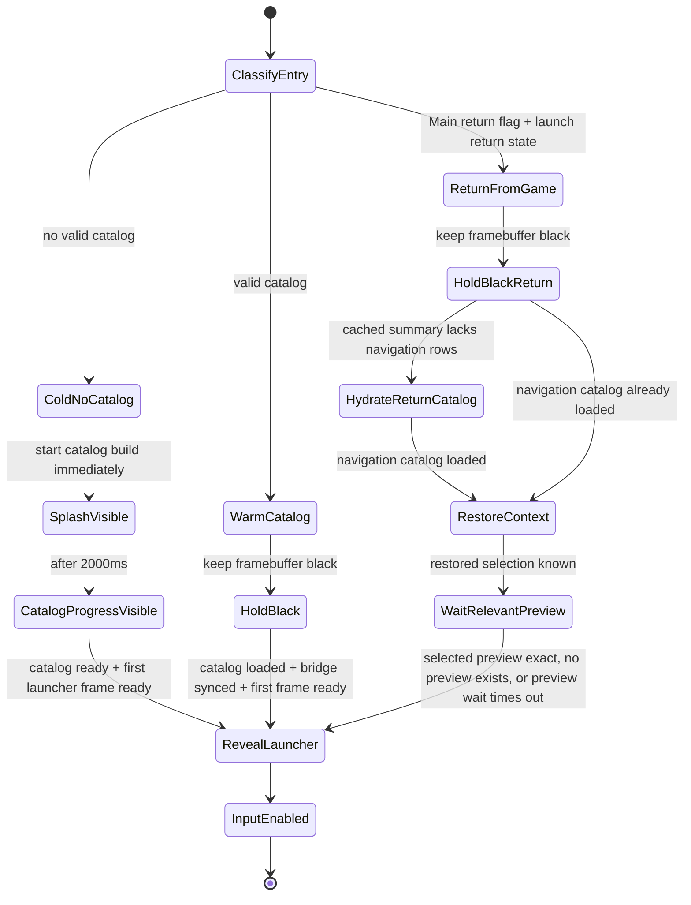
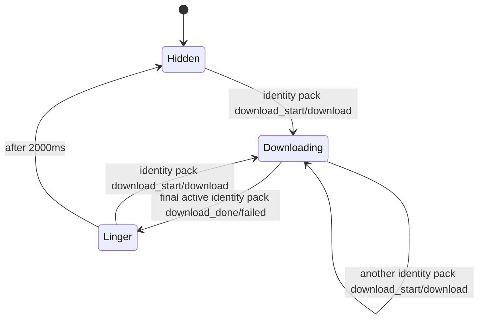

# MiSTer MagiK Architecture

This document describes the current architecture. Dated experiments and older
attempts live in `history/`; treat those as evidence, not policy, unless this
document or `AGENTS.md` links to them as the reason for a current rule.

## Product Shape

MiSTer MagiK is a Rust/Slint frontend for MiSTer FPGA. It aims to make MiSTer
feel like a polished launcher rather than a configuration project: fast game
discovery, controller-friendly navigation, smooth 60fps browsing, and reliable
game launch.

The app repo contains the Rust/Slint frontend and deploy tooling. The
Main_MiSTer fork is maintained separately as `../Main_MiSTer` by default; see
`docs/main-mister-fork.md`.

## Boot And Process Model

Production boot stays compatible with stock MiSTer:

1. `/etc/inittab` starts stock `/media/fat/MiSTer`.
2. Stock Main reads `MiSTer.ini`.
3. `[MiSTer] main=MiSTer_MagiK` re-execs the MagiK Main fork.
4. The fork initializes HDMI/video through the normal Main path.
5. The fork runs `mister-magik-fb early-black` after `video_init()` so Rust
   clears and routes the launcher framebuffer before the full UI starts.
6. The fork starts `/media/fat/mister-magik/mister-magik-fb ui launcher 0` on
   `tty2` and enters dormant launcher mode.

The fork must not write the launcher framebuffer mode, route a generic 8888
framebuffer, draw the stock menu OSD, or keep input grabbed while Slint owns the
launcher.

## Framebuffer Ownership

The launcher path uses a planned Linux framebuffer and FPGA scaling:

- Rust sets `/dev/fb0` to RGB565 for the launcher/UI path.
- Rust derives launcher geometry from `MiSTer.ini` menu output settings before
  startup drawing. 1080p-class outputs use a half-resolution framebuffer such as
  960x540; 720p, direct-video, and lower outputs run native.
- Slint renders the planned launcher framebuffer into cached RAM.
- The Rust frame loop copies dirty regions into the write-combined `/dev/fb0`.
- Rust sends the FPGA `SET_FBUF` route so buffer 0 is scanned to HDMI and scaled
  to the output mode.
- The single-frame `/dev/fb0` dirty-copy path remains the fallback renderer.
  The only current hidden-buffer present experiment is
  `MISTER_PRESENT_BACKEND=fpga-vblank-latch-hidden`, which copies complete
  cached RGB565 frames into plugin-exposed hidden slots, posts the selected
  physical address before vblank, then waits for vblank only as the pacing
  boundary for the next frame. The default `/dev/fb0` path intentionally keeps
  the older order: wait for vblank, then dirty-copy to `/dev/fb0`.
  Latch mode also uses a larger late-frame headroom window than `/dev/fb0`: if
  the frame loop has already consumed too much of the current refresh, it waits
  for the next vblank before rendering so the hidden-buffer copy and latch post
  still land before the following deadline.
  This path requires the experimental Menu RBF to be loaded from the active
  launcher through Main's `mister_magik_launch` command path and the
  stock-kernel plugin probe module to be loaded. A copied RBF artifact alone
  does not activate the fast path, and `load_core` from the launcher state does
  not prove the patched core is running.
  Runtime proof comes from Main's cmdline, the plugin module, passive
  `fpga-latch-report` magic for commands `0x57`/`0x58`, and advancing latch
  `flip_count`/`post_count` while the launcher runs. The JSON
  `composition_state` describes UI composition, not the final present backend.
- The launcher routes the framebuffer during startup and explicit recovery. The
  old periodic route watchdog is disabled by default now that the Main_MiSTer
  fork suppresses stock OSD/menu/framebuffer paths while MagiK owns the UI.
  `MISTER_FB_ROUTE_REASSERT_FRAMES` can re-enable it for attended diagnostics.

Important policy:

- Do not render Slint directly into the live framebuffer for production. The
  cached-RAM plus dirty-copy path is the fallback design; the latch experiment
  exists to remove copy-after-vblank timing pressure once support is proven.
- Do not assume `/dev/fb0` contents are visible on HDMI. The FPGA may be scanning
  another buffer.
- RGB888/8888 UI support and color-route smoke tooling have been removed from
  the app. Do not add framebuffer format selection back to rendering,
  diagnostics, experiments, or benchmarks.
- Main-mediated present experiments (`main-flip-v1`, `main-vsync-hidden`, and
  `plugin-main-vsync-hidden`) are retired. They either blocked the UI frame on
  Main's vblank wait or put present ownership in the wrong process. Do not add
  new launcher paths that depend on Main request/ack present files or FIFO
  present commands.
- Diagnose the fast path by checking the runtime state, not just the files on
  disk: `composition_state=full-slint` means MagiK is on the fallback renderer,
  and absence of `mister_magik_plugin_probe` means hidden plugin slots are not
  available.

## Framebuffer Stream

`framebuffer_stream_v1` is the desktop inspection stream for the launcher. It is
producer-side by design: `mister-magik-fb` publishes frames from its cached
RGB565 render target after successful presents, and the agent only proxies the
binary stream to authenticated desktop clients. The stream must not poll or read
`/dev/fb0` for steady-state frames.

Wire policy:

- The desktop authenticates with the normal agent JSON request, then the socket
  switches to `mister-magik-framebuffer-stream-v1` binary messages.
- Payload pixels are RGB565 little-endian and compressed with LZ4 block
  size-prepended encoding.
- Message kinds are `hello`, `keyframe`, `rect-delta`, `heartbeat`, `end`, and
  `error`.
- Frame messages carry sequence, producer timestamp, geometry, stride, dirty
  rectangle, uncompressed byte count, and compressed byte count.
- A new subscriber receives a full keyframe before any deltas. Geometry changes
  also force a keyframe.
- If the desktop detects a sequence gap or malformed delta, it must discard the
  partial frame and require a fresh keyframe.

Historical evidence:

- `history/2026-5-2/framebuffer-experiments.md`
- `history/2026-6-8/direct-fb-trial.md`
- `history/2026-6-9/direct-framebuffer-sidecar-retrospective.md`
- `history/2026-6-14/launcher-framebuffer-route-reassertion.md`

## Launcher Composition

Normal launcher rendering is governed by a small composition controller. Slint
owns the cached full frame in every state; Rust direct-blitted layers are legal
only while the controller is in `MixedArcade`. `ModalOverArcade` clears direct
layer assumptions and forces a full Slint present before showing the dialog.
Full-screen Slint overlays such as catalog scan/rebuild progress are modeled as
`ModalFullSlint`, even when the underlying navigation screen is Arcade, so they
also suppress Arcade list and preview direct blits without entering recovery.
Full-frame Slint presents also invalidate the live direct Arcade layers. When
recovery, modal transition, screen ownership change, or an opt-in diagnostic
route reassertion forces a full present while Arcade remains active, the list
and preview layers must be repainted in the same frame. This prevents Slint's
cached base frame from silently overwriting a still-truthful `exact` preview
with the blank placeholder area.



`Recovering` is an escape hatch, not normal UI flow. Entering it emits
`ui_composition_invariant_failed`, increments `composition_recovery_count` in
`/tmp/mister-magik/status.json`, records the last invariant kind/detail, clears
direct-layer assumptions, and forces a full Slint present. Device gates should
treat unexpected composition recovery as a failure.

Launcher idle decisions must include custom-layer motion, not just Slint bridge
changes. Arcade rows are Rust-painted and keyed by pixel scroll position; a
selected-index change can finish its nav state on the same loop that moves the
direct layer to its final row alignment. That final visual tick must still be
rendered and copied before the idle path may sleep, otherwise the stale
intermediate row pixels can remain visible until an unrelated redraw.

## Game Launch Handoff

Slint does not directly load cores. It hands launch requests back to Main so the
normal MiSTer loader path controls FPGA/core state and HDMI recovery.

Launcher orchestration runs through an explicit Rust lifecycle state chart:

```text
BootSplash -> CatalogBuilding|CatalogReady -> Idle -> Launching -> Handoff|Recovered
Recovered -> Idle
```

`magik-gui/src/ui_runner/launcher_lifecycle.rs` owns lifecycle policy,
catalog-readiness state, launch staging, recovery transitions, and the small
effect stream that records bridge/render intent. `launcher_scheduler.rs` is the
central adapter for starting and polling catalog, media, launch, and background
jobs. The hot frame loop still owns Slint rendering, row-copy decisions,
framebuffer presentation, route reassertion, and frame accounting.
Lifecycle and scheduler internals should use explicit enum states for startup
readiness, pending launch refs, and worker availability instead of parallel
booleans or `Option` fields that can express impossible combinations.

Startup reveal is part of that lifecycle state system. This Mermaid chart is
the source of truth for whether HDMI should show splash, black, catalog
progress, or the restored launcher:



Only cold boot without a valid catalog shows the `MiSTer MagiK` splash, and it
stays visible for at least two seconds while catalog work starts in the
background. Warm boot and return-from-game keep HDMI black until the first
intended launcher frame is ready. Warm summary startup may defer background
catalog validation so the first visible frame wins, but return-from-game treats
navigation hydration as foreground reveal work: it starts immediately, even when
normal refresh is disabled, because restoring the exact Arcade row requires
hydrated navigation rows. Return-from-game may briefly wait for the selected
preview so the restored Arcade frame is complete, but preview readiness is not a
hard visibility dependency: if the relevant preview never becomes exact, the
launcher must reveal after the bounded preview hold rather than leaving HDMI
black. Return-from-game is authorized by Main's
volatile `MISTER_MAGIK_RETURN_TO_LAUNCHER=1` launcher environment; the
`/tmp/mister-magik/launcher-return-state.json` file is only the restore payload
for screen, system, selection, and filters. A stale return-state file without
Main's flag is consumed and treated as a normal Home startup, so rebooting while
a core is active cannot masquerade as an in-session game return. Input is
accepted only after
`InputEnabled`; lifecycle launch handling must reject launch requests before
that state even if a caller bypasses the normal input loop. Startup timing
events must report `launcher_revealed` and `launcher_input_enabled`.

Screenshot pack download popups are also state-owned. The popup is driven only
by real pack download progress, not by local pack checks, current-pack skips,
index sidecar work, save/sync phases, or worker completion:



The popup may linger on the final downloaded/failed row for two seconds after
the last active pack download finishes. Later verify/save/sync/done messages
must not extend that timer or recreate the popup.

Launch is intentionally two-phase. `Idle -> Launching` first updates the Slint
bridge and presents the loading frame. Only after
`loading_frame_presented(...)` does the scheduler let the existing
`LaunchHandoffSession` start the Main/FIFO handoff. If handoff fails, the
lifecycle enters `Recovered`, the scheduler reasserts the launcher framebuffer
route, the recovery UI is presented, and only then does
`recovery_frame_presented(...)` return the lifecycle to `Idle`.

Current command surface:

```text
mister_magik_launch <absolute .mgl/.mra/.rbf path>
mister_magik_exit_to_menu
```

Older fifo `load_core` flows may appear in history. Current work should prefer
the explicit fork command surface when operating under `MiSTer_MagiK`.

Never use external `rbf_load` from Slint; that path has historically left the
display without valid scan-out.

## Catalog And Preview Model

The runtime catalog is SQLite-backed. The UI should load from the database and
avoid scanning media during hot launcher paths.

See `docs/catalog.md` for the current catalog lifecycle, worker request modes,
root stamp semantics, SQLite publish model, and benchmark gates.

## Launcher Navigation Model

Arcade drawer navigation starts with an A-Z jump list. From the closed Arcade
game list, D-pad left opens the alphabet drawer; selecting a group jumps the
game list to the first title in that group. Pressing left again from the
alphabet drawer opens the hierarchical filter drawer. D-pad right descends into
a filter group or applies the highlighted value; `A` is the same action. D-pad
left backs out one filter level; `B` is the same action except at the filter
top level, where left is a no-op and `B` returns to the Home launcher. `Home`
always jumps back to the Home launcher from Arcade or any open drawer level.
The Rust-painted game list viewport shows ten 48 px rows and is 510 logical px
wide, intentionally borrowing a little space across the old half-screen split
so longer game titles remain visible without covering the centered preview
cabinet.

Arcade search is a top-level filter, but it behaves like its own mode instead
of another hierarchical drawer level. The left pane becomes an on-screen
keyboard and the Rust-painted game list moves to the right pane as search
results. Search results are cached as indexes into the hydrated
`ArcadeCatalog`; queries match normalized title text, MRA basename,
manufacturer, category, year, and decade. Compact forms keep punctuation and
spaces from blocking obvious matches, so `pacman` can match `Pac-Man` and
metadata terms such as `capcom` can match games by manufacturer. The search
keyboard also exposes a one-word autocomplete suggestion above the keys; `Y`
accepts the suggestion by replacing the current partial word and appending a
space. Empty search shows the active system's full game list and must not build
deferred text indexes on the Search entry frame; the launcher prewarms those
indexes after the first visible frame and logs `arcade_search_index_prewarm`.
While search is active, screenshot previews stay suppressed because the right
pane is reserved for result navigation. Launch return state stores the search
query and restores the filtered result list before selecting the returning game.

Current rules:

- Production `mister-magik-fb` exposes the minimal command surface:
  `ui`, `early-black`, `library-refresh`, and `experiment-capabilities`.
  Low-level probes are diagnostic/experiment builds, not release commands.
- Build/update the library cache outside the UI hot path with
  `mister-magik-fb library-refresh` or `scripts/mister` helpers.
- Launcher boot may seed Home/system counts from `library.summary.json` before
  the first usable frame when a usable database exists. Full SQLite row
  hydration then runs through the lifecycle scheduler after the first visible
  copy and configured warm-validation delay, without forcing a rebuild. If the
  stamp is stale, the launcher shows a `Library changed` dialog instead of
  rebuilding automatically. `Rebuild` runs the same full database builder used
  by explicit refresh; `Continue` writes a one-shot marker so the next MagiK
  boot goes directly to the `Updating Library` rebuild screen. Use
  `startup_timing` log lines to separate summary seed, full SQLite hydration,
  catalog construction, Slint bridge sync, stamp check, user choice, and build
  costs.
- Rust launcher owns normal boot-time catalog validation. Main_MiSTer may invoke
  `library-refresh` only for the missing/empty DB first-boot deferral path and
  must not schedule delayed background refreshes when a database already exists.
- When the SQLite catalog is missing or empty, boot must start the Slint
  launcher immediately and let the launcher worker perform the first scan behind
  a visible full-screen scan state. Do not run foreground `library-refresh`
  before UI on first boot or after Reset Database; that regresses to a black
  HDMI screen while the index is built.
- The launcher presents a minimal `MiSTer MagiK` Slint splash immediately after
  `app.show()` and before catalog loading. Keep that path free of catalog,
  preview, media, or controller work so HDMI never sits on a black screen while
  the launcher warms up.
- Do not count helper payloads as games: BIOS ROMs, raw `.rbf` core binaries,
  menu-level computer/console launchers, and known support files are not normal
  launchables.
- Arcade and Neo Geo identities are keyed through MAME set names when metadata
  is available. See `history/2026-6-14/library-identity-model.md`.
- Preview requests use derived archive paths and identity keys. The catalog does
  not index screenshot archives or walk PNG/JPG screenshot folders; missing
  preview entries fail at runtime and show the blank preview state.
- Catalog code must not read `gamelist.xml`; runtime catalog loading goes
  through the SQLite library cache and materialized projections.
- MAME XML and MAME software-list XML are host-side metadata inputs only. Convert
  them to `mame.sqlite3` with `scripts/mister mame-metadata-build`; the runtime
  scanner consumes the SQLite rows, not those XML files.
- Runtime preview loading is raw565-oriented. Build source screenshots, raw565
  caches, fixed LZ4-block `.mmlz4b` preview packs, and `.mmlz4b.idx` seek
  sidecars from the private `private/magik-cloud` submodule. The sidecar is a
  first-preview latency optimization; the whole pack remains the correctness
  fallback. Runtime deploy does not build catalog/media artifacts. Use
  `scripts/magik-cloud path` when a command needs to resolve the checkout.

Relevant docs:

- `docs/console-media-identity.md`
- `history/2026-6-13/arcade-screenshot-cache-workflow.md`
- `history/2026-6-13/preview-zstd-archive-bench.md`
- `history/2026-6-14/library-scanner-preview-archive-pruning.md`
- `history/2026-6-14/mame-metadata-db.md`

## Build And Module Boundaries

`magik-gui/src/lib.rs` holds host-testable logic without the Slint/UI feature.
The binary target in `magik-gui/src/main.rs` owns device-only work: FPGA,
framebuffer, VT, input, audio, and the Slint runtime.

Use `magik-gui/BUILD.md` for build profiles, cross-compilation, FFmpeg, size
tracking, and CI details. Do not duplicate those details here.

## Open Areas

- Return to launcher after game reset without a full reboot.
- Continue controller mapping and hot-plug polish.
- Keep the fork patch surface small and documented in `../Main_MiSTer`
  `MAGIK_PATCHSET.md`.
