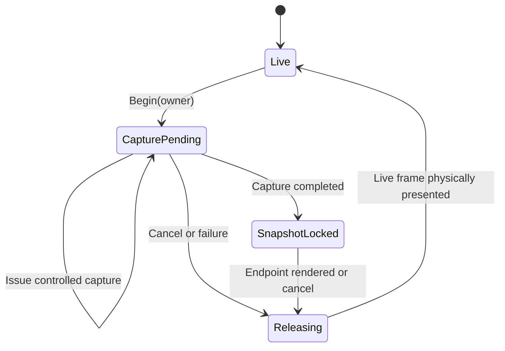

# Full-Screen Orientation Transition 60 FPS Plan

## Status

In progress. This document defines the implementation campaign after the
orientation transition benchmark, RGB565 wave effects, NEON kernels, and dirty
tile rendering were merged to `main`.

The objective is stable, physically presented 60 FPS for both production
full-screen orientation effects at 1280×720/60 Hz while preserving exact
endpoints, lifecycle behavior, settings, latch health, and presentation
correctness.

## Working Rules

- Work in short, single-purpose commits.
- Never rewrite published history. Revert unsuccessful candidates with a new
  commit.
- Every commit names exactly one benchmark scenario.
- A benchmark scenario contains one effect and one launcher pass. It must not
  combine fade and zoom or chain qualification and pprof passes.
- Qualification and pprof remain independent workloads. PMU and Streamline are
  deferred for this campaign.
- Retain performance evidence only. Do not add framebuffer or USB-video
  capture to this campaign.
- Keep the device at `hdmi-1280x720p60` after every workflow.
- Preserve the exact settings file, retained `MiSTer.ini`, boot identity,
  installed manifest, and ordinary launcher restoration contract.
- Use Rust diagnostics during coherent edit batches, preview affected
  assurance with `scripts/agent plan`, commit before delivery, and deliver only
  exact clean commits.

## Reusable Full-Screen Transition State Chart

Slint freezing must not be owned by an orientation-specific Boolean. Add a
shared `FullScreenTransitionStateChart` that controls Slint timer advancement,
Slint raster authorization, snapshot locking, release, and frame-driven motion
for every current full-screen transition owner.

Initial owners:

- Navigation transition
- Orientation transition
- Startup intro/reveal
- Screensaver enter/exit

State policy:

| State | Slint timers | Automatic Slint raster | Controlled capture | Frame-driven motion |
|---|---:|---:|---:|---:|
| `Live` | Yes | Yes | No | No |
| `CapturePending` | Paused | No | One owner-authorized capture | Yes |
| `SnapshotLocked` | Paused | No | No | Yes |
| `Releasing` | Paused | One forced live raster | No | Yes |

Required invariants:

- The chart controls Slint and render policy; individual transition runtimes
  continue to own geometry, visual progress, and input behavior.
- Only one full-screen owner may be active.
- Every activation has a generation token. Events from stale owners or stale
  generations are rejected.
- A pending Slint redraw is retained while snapshot locked.
- Snapshot-locked playback advances through its own scheduler without
  advancing or rasterizing Slint.
- Cancel and failure paths pass through `Releasing`.
- `Releasing` returns to `Live` only after the intended live frame is confirmed
  at a physical refresh. Rendering or latch acceptance alone is insufficient.
- The chart is a render-policy projection of existing product lifecycle state;
  it must not duplicate navigation, startup, or screensaver product state.

## Universal Commit Checklist

Apply this checklist to every commit below:

- [ ] Begin from a clean exact commit on a fresh `nigel/` branch.
- [ ] Make only the named logical change.
- [ ] Preserve unrelated user changes.
- [ ] Add event-sequence tests and applicable pixel-equivalence tests.
- [ ] Refresh Rust diagnostics for the affected files.
- [ ] Run `scripts/agent plan`.
- [ ] Stage only intentional paths.
- [ ] Commit before delivery.
- [ ] Deliver the exact clean commit.
- [ ] Run only the benchmark scenario named for the commit.
- [ ] Retain evidence even when a gate fails.
- [ ] Verify ordinary launcher restoration, settings hash, installed identity,
  boot identity, and health.
- [ ] Verify the final display remains `hdmi-1280x720p60`.
- [ ] Promote only with preserved lifecycle, endpoint, latch, and presentation
  correctness.
- [ ] Revert failed performance candidates with a new commit.
- [ ] Do not run a second benchmark scenario to rescue an inconclusive commit.

## Commit 1: Isolate Benchmark Workloads

Commit: `bench(agent): isolate orientation transition workloads`

Replace the current combined fade-plus-zoom benchmark and chained profile
suite with closed, single-effect, single-pass scenarios.

Checklist:

- [ ] Add `orientation-transition-fade`.
- [ ] Add `orientation-transition-zoom`.
- [ ] Make each qualification scenario run the fixed six directed legs once.
- [ ] Add `orientation-transition-fade-pprof`.
- [ ] Add `orientation-transition-zoom-pprof`.
- [ ] Retire the combined twelve-leg qualification workload.
- [ ] Retire the chained pprof-plus-PMU profile suite and the combined
  orientation Streamline scenario.
- [ ] Give every profile trigger and completion schema one explicit effect.
- [ ] Keep route, geometry, endpoint holds, cadence gates, and cleanup
  unchanged.
- [ ] Store evidence beneath the selected scenario name.
- [ ] Retain telemetry, logs, summaries, folded stacks, or flamegraphs as
  appropriate to that one scenario.
- [ ] Do not retain endpoint image captures.
- [ ] Test parsing, command construction, effect isolation, exact six-leg
  completion, schema validation, cleanup, and reporting.
- [ ] Update `docs/benchmarking.md`.

Benchmark: `scripts/agent benchmark orientation-transition-zoom`

## Commit 2: Centralize Full-Screen Transition State

Commit: `refactor(ui): centralize full-screen transition state`

Add the shared state chart and migrate navigation transitions, the existing
snapshot-lock user, first.

Checklist:

- [ ] Add `launcher_runtime/full_screen_transition.rs`.
- [ ] Define explicit states, owners, events, and generation tokens.
- [ ] Expose policy outputs for timer advancement, automatic raster,
  controlled capture, snapshot lock, release, and frame-driven motion.
- [ ] Reject nested ownership and stale events.
- [ ] Require physical presentation acknowledgement before returning to
  `Live`.
- [ ] Replace the launcher loop's use of
  `NavigationTransitionRuntime::snapshot_locked()` as policy authority.
- [ ] Keep navigation geometry, reversal, and queued input inside the
  navigation runtime.
- [ ] Preserve navigation destination capture and reversal semantics.
- [ ] Document the state chart in `docs/architecture.md`.
- [ ] Test begin/capture/lock/release, cancellation during capture,
  cancellation during playback, reversal, stale generations, retained redraw,
  suppressed Slint work, and physical release confirmation.

Benchmark: `scripts/agent benchmark navigation-transitions`

## Commit 3: Freeze Orientation Playback Through Shared State

Commit: `refactor(ui): freeze orientation playback through transition state`

Make orientation the second state-chart consumer.

Checklist:

- [ ] Enter `CapturePending` before applying the destination orientation
  layout.
- [ ] Authorize exactly one controlled destination Slint raster.
- [ ] Capture the destination and enter `SnapshotLocked`.
- [ ] Suppress Slint timers and base raster during wave playback.
- [ ] Preserve pending redraw without consuming it.
- [ ] Schedule orientation frames independently of Slint animation.
- [ ] Enter `Releasing` only after rendering the exact destination endpoint.
- [ ] Return to `Live` only after the endpoint sequence is physically active.
- [ ] Route rollback, reduce-motion, cancellation, and failure through the
  chart.
- [ ] Remove orientation-specific Slint-freeze booleans.
- [ ] Add chart owner and state to telemetry.
- [ ] Test one destination raster per leg, immutable snapshot playback,
  endpoint equality, rollback, reduce motion, cancellation, six-leg completion,
  and ownership cleanup.

Benchmark: `scripts/agent benchmark orientation-transition-zoom`

## Commit 4: Govern Startup Reveal Through Shared State

Commit: `refactor(ui): govern startup reveal with transition state`

Reuse the chart for startup intro/reveal without duplicating the launcher
lifecycle chart.

Checklist:

- [ ] Project lifecycle reveal events into the shared state chart.
- [ ] Enter capture only when `launcher_reveal_ready` authorizes it.
- [ ] Allow exactly one controlled live-launcher raster.
- [ ] Lock Slint while the intro owns the complete screen.
- [ ] Preserve CPU0 snapshot preparation and the existing hidden-slot renderer.
- [ ] Release only after the final launcher sequence is physically visible.
- [ ] Route snapshot preparation failure and cancellation through
  `Releasing`.
- [ ] Remove redundant launcher-render suppression flags now owned by the
  chart.
- [ ] Document that lifecycle owns product state while the chart owns Slint
  and render policy.
- [ ] Test cold catalog, warm launcher, return-from-game, preparation failure,
  final sequence confirmation, input gating, and dormant Slint behavior.

Benchmark: `scripts/agent benchmark cold-boot`

This remains the one bounded supervised reboot permitted by benchmark policy.

## Commit 5: Govern Screensaver Transitions Through Shared State

Commit: `refactor(ui): govern screensaver transitions with transition state`

Migrate the remaining full-screen transition owner.

Checklist:

- [ ] Enter capture when retaining the launcher snapshot.
- [ ] Lock Slint during screensaver playback and crossfade.
- [ ] Keep render-ahead ownership and CPU affinity unchanged.
- [ ] Release through one forced live launcher raster when restoration requires
  it.
- [ ] Confirm the restored frame physically before returning to `Live`.
- [ ] Route starvation, renderer disconnect, and cancellation through the
  chart.
- [ ] Remove overlapping screensaver-specific Slint suppression state.
- [ ] Restore direct Arcade layers in the same release frame.
- [ ] Test normal activation/exit, Arcade activation, starvation, disconnect,
  geometry failure, suppressed Slint raster, and physical release confirmation.

Benchmark: `scripts/agent benchmark screensaver`

## Commit 6: Attribute Complete Transition Preparation

Commit: `perf(trace): cover complete full-screen transition preparation`

Correct attribution before further optimization.

Checklist:

- [ ] Start transition timing before layout application.
- [ ] Measure source ownership/copy separately.
- [ ] Measure destination bridge preparation separately.
- [ ] Measure the controlled Slint raster separately.
- [ ] Measure portrait rotation separately.
- [ ] Measure destination snapshot copy separately.
- [ ] Measure effect rendering separately.
- [ ] Measure damage normalization separately.
- [ ] Measure hidden-slot copying separately.
- [ ] Measure stream snapshot work separately when active.
- [ ] Record exact bytes read, written, and copied.
- [ ] Populate mapped-pixel telemetry accurately.
- [ ] Associate records with chart owner, chart state, effect, and leg.
- [ ] Keep instrumentation dormant outside profile builds.
- [ ] Version the completion and aggregate schemas.
- [ ] Test phase coverage, non-transition zero values, non-overlap, and
  destination attribution.

Benchmark: `scripts/agent benchmark orientation-transition-zoom-pprof`

## Commit 7: Classify Playback as Frame-Driven Motion

Commit: `perf(ui): classify full-screen playback as frame-driven motion`

Test the lowest-complexity cadence hypothesis first.

Checklist:

- [ ] Derive frame-driven motion from the shared state chart.
- [ ] Replace the Home-only late-start exception with the general predicate.
- [ ] Disable pre-render late-start deferral during active full-screen
  playback.
- [ ] Preserve adaptive headroom calculation and telemetry.
- [ ] Keep ordinary idle and non-motion pacing unchanged.
- [ ] Record whether deferral was eligible, selected, or bypassed.
- [ ] Test orientation, navigation, startup reveal, and screensaver playback.
- [ ] Test capture preparation and ordinary idle behavior.
- [ ] Test starts around the headroom threshold without protocol regression.

Promotion requires fewer physical dropped frames with no latch, sequence,
presentation, or whole-frame P99 regression.

Benchmark: `scripts/agent benchmark orientation-transition-zoom`

## Commit 8: Avoid Identical Boundary Redraws

Commit: `perf(ui): avoid identical orientation boundary redraws`

Remove deterministic full-screen work at the black midpoint and settled
endpoint.

Checklist:

- [ ] Represent base-image identity separately from visible tile state.
- [ ] Emit no raster damage at the midpoint when the previously presented
  state is proven fully black.
- [ ] Emit no raster damage at completion when the destination is already
  exact.
- [ ] Continue posting every refresh even when pixel damage is empty.
- [ ] Render the required delta if a delayed frame crosses the midpoint before
  reaching black.
- [ ] Allow existing two-slot debt to complete normally.
- [ ] Never substitute render completion for physical presentation.
- [ ] Test 1,419, 1,420, 1,499, and 1,500 ms.
- [ ] Test 2,919, 2,920, 2,999, and 3,000 ms.
- [ ] Test skipped progress, empty-damage posting, both-slot coherence, and
  fade/zoom equivalence.

Benchmark: `scripts/agent benchmark orientation-transition-zoom`

## Commit 9: Merge Overlapping Same-Row Slot Damage

Commit: `perf(fb): merge overlapping same-row slot damage`

Remove duplicate write-combined copies from alternating-slot debt.

Checklist:

- [ ] Normalize rectangles with identical `y0/y1`.
- [ ] Merge only overlapping or adjacent x intervals.
- [ ] Do not form bounding boxes across different row bands.
- [ ] Normalize before capacity fallback and hidden-slot copying.
- [ ] Preserve exact covered-pixel semantics.
- [ ] Report pre/post rectangle counts and byte totals.
- [ ] Preserve generic non-transition damage behavior.
- [ ] Test overlap, adjacency, disjoint intervals, different row bands, two
  consecutive orientation masks, alternating slots, capacity, and coverage
  properties.

Benchmark: `scripts/agent benchmark orientation-transition-zoom`

## Commit 10: Update Zoom Using Incremental Rings

Commit: `perf(ui): update zoom using incremental rings`

Stop restoring complete tiles when only a nested rectangle boundary changes.

Checklist:

- [ ] Derive previous and current centered rectangles from tile levels.
- [ ] During hide, zero only the newly added ring.
- [ ] During reveal, restore only the newly exposed ring.
- [ ] Express rectangle subtraction as at most four non-overlapping strips.
- [ ] Keep strip processing inside one fused tile kernel.
- [ ] Add a scalar reference implementation first.
- [ ] Add Cortex-A9 NEON strip kernels only after scalar equivalence.
- [ ] Preserve the one-pixel centre, easing, and RGB565 output exactly.
- [ ] Keep compositor strip count separate from presentation damage so the
  generic rectangle capacity cannot silently force full damage.
- [ ] Inspect the exact delivered ARM binary when NEON is enabled.
- [ ] Test all 33 levels, every consecutive pair, both phases, odd/even tiles,
  irregular geometry, untouched pixels, scalar equivalence, NEON equivalence,
  midpoint, and endpoint.

Promotion requires at least 5% lower zoom effect-render P99 or fewer repeated
vblanks, supported by lower rendered bytes.

Benchmark: `scripts/agent benchmark orientation-transition-zoom`

## Commit 11: Eliminate Orientation Setup Buffer Churn

Commit: `perf(ui): eliminate orientation setup buffer churn`

Address transition-start work as one ownership hypothesis.

Checklist:

- [ ] Remove the destination clear that complete capture overwrites.
- [ ] Retain the portrait target across transitions.
- [ ] Transfer complete buffers through existing swap primitives when geometry
  matches.
- [ ] Keep source and destination immutable during playback.
- [ ] Start the visible animation clock only after destination capture is
  ready.
- [ ] Swap the exact destination into presentation ownership at completion
  when safe.
- [ ] Retain a full-copy fallback for partial capture, mismatch, or failure.
- [ ] Keep retained memory within the device budget.
- [ ] Test stable pointers/capacities, every orientation pairing, failure,
  rollback, reduce motion, endpoint hashes, warm allocation behavior, and
  preparation-clock separation.

Benchmark: `scripts/agent benchmark orientation-transition-zoom`

## Commit 12: Rotate Portrait Composition in Cache-Sized Tiles

Commit: `perf(ui): rotate portrait composition in cache-sized tiles`

Attempt only if corrected attribution proves portrait rotation remains
material.

Checklist:

- [ ] Add a host-neutral blocked RGB565 rotation helper.
- [ ] Begin with scalar 8×8 or 16×8 tiles.
- [ ] Preserve clipped damage mapping.
- [ ] Support clockwise and counterclockwise rotation.
- [ ] Handle incomplete edge tiles.
- [ ] Select one tile size before committing.
- [ ] Attempt a NEON transpose only if rotation remains at least 10% of
  preparation cycles.
- [ ] Retain the scalar fallback.
- [ ] Verify actual vector/transpose instructions using `nm` and `objdump`.
- [ ] Test supported geometry, odd dimensions, edge tiles, clipped damage,
  both directions, reference equivalence, NEON equivalence, and bounds safety.

Benchmark: `scripts/agent benchmark orientation-transition-zoom`

## Deferred Candidates

Do not add these without supporting evidence:

- Adaptive stream-motion classification. It matters only with a live
  framebuffer subscriber and needs its own single-effect subscribed benchmark.
- Direct hidden-slot transition rendering. It has higher ownership and recovery
  risk and should follow the bounded changes above.
- Diagonal easing lookup. Attempt only if corrected pprof attribution shows the
  arithmetic is material.
- Additional fade NEON work. Profile fade independently before changing a
  comparatively inexpensive kernel.

## Promotion And Revert Policy

A performance candidate is promoted only when its named benchmark demonstrates
at least one of:

- at least 5% improvement in the targeted P99 phase;
- fewer protocol-v5 physical dropped frames;
- removal of a deterministic over-budget boundary frame.

It must also retain:

- exact RGB565 endpoints;
- zero latch drops;
- zero sequence gaps;
- continuous accepted hidden-slot presentation;
- unchanged settings and lifecycle behavior;
- unchanged installed platform identity;
- clean ordinary-launcher restoration;
- no material regression in the other measured phases.

An unsuccessful candidate receives an explicit revert commit. The revert uses
the same one benchmark scenario to demonstrate restoration of the prior
behavior.

## Final Qualification

Fade and zoom qualify independently and are never combined into one workload.
Each effect requires three clean unprofiled qualification runs. Every directed
leg must have:

- zero protocol-v5 physical dropped frames;
- zero latch-protocol drops;
- zero sequence gaps;
- continuous accepted hidden-slot presentation;
- physical FPS of at least 59.9;
- P99 whole-frame work below 15,917 microseconds;
- maximum whole-frame work below 16,667 microseconds.

Any final pprof attribution is run as a separate single-effect, single-pass
scenario and is never used as cadence qualification.
Do not record 60 FPS success until both effects meet their independent
three-run gates.
