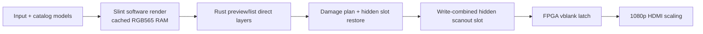

# Production Performance Review — 2026-07-12

Scope: the complete production MiSTer MagiK path: Slint/Rust rendering,
framebuffer presentation, catalog discovery and persistence, preview/media
loading, launch handoff, the maintained Main_MiSTer fork, host/device tooling,
and the real dual-core Cortex-A9 target. Experimental effect scenes,
mega-transition work, fault injection, destructive reset testing, wider-color
routes, and video-lab fallbacks are excluded.

This review was performed in two phases:

1. A code-only review split across independent renderer/UI, catalog/storage,
   runtime/Main, benchmark-inventory, artifact-audit, and optimization-roadmap
   workstreams.
2. An attended real-device sweep of production tests, gates, profiles, and
   low-level probes. Device work was serialized so CPU and SD-card results were
   not contaminated by another benchmark.

## Baseline and reproducibility

The source tree moved while this long review was running:

- The initial review/build point was `02935ba5` (`Remove arcade cabinet
  screenshot frame`).
- The user-owned branch advanced during profiling to `49816bf4`
  (`Add state-charted library load recovery`). Nothing was reset or reverted.
- The maintained sibling Main_MiSTer fork was at `86a63e5`.
- The final deployed MagiK binary was 7,524,644 bytes with SHA-256
  `9d186777b38b43bbc91d8f7d508331e78789c0ccea5dc252eabb44c3b833e210`.
- Later `--skip-build` harnesses correctly described the deployment as
  `deployed-unknown` because source HEAD no longer identified the already
  deployed binary. Treat the hardware results as an exact-binary baseline,
  not as a git-only baseline.
- Code line references in this document refer to the final local tree at
  `49816bf4`; the reviewed hot paths were present at the initial review point
  unless explicitly described as a tooling contract.
- Slint is pinned to 1.17.0.

The original sweep implemented no production optimization. A 2026-07-13
host-only follow-up now implements the first P0 contract subset in the working
tree:

- schema 64 embeds the finalized, stamped navigation payload in SQLite and a
  recovery test proves exact games, systems, platform kinds, preview identity,
  and structured launch-target parity after both adjacent sidecars are removed;
- materialized compatibility tables remain populated pending migration of
  release checks, diagnostics, and benchmark selectors to canonical navigation;
- joined-SQL recovery is explicitly marked unsafe for projection repair, and
  every repair path refuses to publish that degraded result;
- the formal desktop benchmark fixes its renderer identity to compiled
  `winit-skia`, installs the notifier after `show()`, requests a redraw, and
  treats actual `RenderingSetup` plus applied-image `AfterRendering` callbacks
  as lifecycle evidence rather than treating notifier registration as proof.

This follow-up has host test evidence only. It has not been deployed to the
MiSTer and does not supersede any Cortex-A9 or exFAT numbers in this report.

## Executive conclusion

The RGB565 render/latch path is healthy. Home and Arcade both retain ample
compute headroom and produced no visual latch failures or FPGA drop increments.
The largest production problems are outside the core renderer:

1. **Cold catalog creation is a release blocker; its gate contract was
   inconsistent during the sweep.** Reconstructed launcher markers put RAM usability at 103.380
   seconds and durable save at 143.021 seconds. Those miss the current script
   thresholds (94.650/121.336 seconds) by 8.730/21.685 seconds. At the time of
   the sweep, older documentation still listed 57.094/72.573 seconds; the
   project explicitly ratified 94.650/121.336 seconds on 2026-07-13. The run
   was not an official gate result: the harness timed out because it parsed an
   empty standalone-builder log while the integrated launcher log held the
   events. The final 11.66 MB exFAT publish took only 1.350 seconds; the time is
   in discovery/metadata, runtime projection, search, and SQLite construction.
2. **Search indexing is deliberately sleeping for a large fraction of its
   15.9–35.1 second runtime and blocks the builder event reader.** It walks
   67,235 games twice and sleeps 1 ms after every 16 games in both passes.
   During a fresh build, `send_ready_catalog()` performs that work synchronously
   before reading the builder's `Persisted` event, while SQLite persistence is
   also active on CPU0. Fusing the passes and keeping the event pipe drained is
   the clearest low-risk CPU0 win.
3. **The single SQLite-file exFAT publish path is already efficient and
   durable.** SQLite is built in `/tmp`, then copied to exFAT once, synced,
   renamed, and parent-synced. Five 11.66 MB publishes took 0.766–1.434 seconds.
   Do not trade those durability steps for benchmark speed. This conclusion
   does not cover the separate database/sidecar generation handoff.
4. **Visible media downloads accidentally inherit CPU0-only affinity.** The
   real four-pack run reached 71.8–93.8 Mb/s, but every `media-download` thread,
   curl child, and verifier was restricted to CPU0 while search/catalog work
   was also using CPU0. The policy says `Inherit`; the parent is already pinned.
5. **Preview rendering is not the frame-time bottleneck.** Sustained preview
   profiles had 2.52–4.29 ms p99 work and no selected-preview decode failures.
   The apparent 4/8 “misses” were the intentional no-preview game
   `Computer Space`. The real issues are 45–128 ms prefetch queue tails,
   duplicated string/LRU work, and a 167.1 MiB RSS high-water mark
   (171,140 KiB).
6. **The optional Analytics stream is not release-ready.** The RAM-only scalar
   decimator takes about 1 ms, but the real half-size snapshot from the hidden
   write-combined scanout measured 9.675 ms p95 and 12.774 ms max versus 4/6 ms
   gates. A null consumer still sustained 59.58 fps with a valid latch trace.
   The focused desktop received 59.45 fps and applied 51.15 fps, yet emitted
   zero Slint `AfterRendering` callbacks, invalidating the end-to-end gate.
7. **The catalog projection migration is incomplete.** The current launcher
   works from a stamped navigation sidecar while SQLite UI projection tables
   are empty, but documentation says that sidecar is derived from materialized
   SQLite and several release, diagnostic, preview, and destruction tools still
   query the empty tables. The database is published before a RAM-derived
   sidecar; interruption falls back to a slower, degraded joined-SQL catalog
   whose parity is unproven, rather than one generation-atomic projection.

The most valuable sequence is:

1. repair benchmark identity, gate parsing, and the catalog projection contract;
2. instrument and reduce cold discovery/metadata and SQLite stamp/row costs;
3. collapse and time-budget search indexing;
4. make foreground media work preempt the CPU0 background lane;
5. bound preview memory and remove linear/string-heavy planning;
6. take the low-risk Home full-width copy win;
7. move streaming snapshots away from write-combined scanout memory.

## Device facts established by the sweep

| Property | Measured value |
|---|---|
| CPU | dual ARM Cortex-A9, ARMv7, NEON/VFPv3 |
| Linux-visible RAM | `MemTotal: 504096 kB` (about 492 MiB) |
| UI contract | 960×540 RGB565, 1,036,800 bytes per complete frame |
| Display | `/dev/fb0`, `MiSTer_fb`, no DRM/KMS |
| Main | `MiSTer_MagiK`, CPU1, dormant while launcher owns the display |
| SD mount | kernel `exfat`, not FUSE |
| mount options | `rw,sync,dirsync,noatime,nodiratime,...` |
| block read-ahead | 128 KiB |
| final state | `tty2`, 960×540 RGB565, launcher Home, no crash/invariant |
| reset safety | no `direct-reset-no-sync`; one profiler direct reset only after explicit `sync`; stale stream-only env removed and launcher normally restarted; final arming check empty |

The repository documentation still says “exFAT/FUSE”. The live mount is the
kernel exFAT driver. The important production consequence remains the same:
small synchronous namespace operations are expensive, while large sequential
copy/rename publication is efficient. For background on what would constitute
a FUSE filesystem, see the [Linux kernel FUSE documentation](https://www.kernel.org/doc/html/latest/filesystems/fuse/fuse.html).

## Host validation

All validation was run before hardware profiling at the initial source point.

| Command | Result |
|---|---:|
| `scripts/dev-rust test` | 256 passed |
| `cargo test --manifest-path crates/catalog/Cargo.toml` | 350 passed |
| UI-enabled MagiK tests | 532 passed |
| `scripts/dev-rust host-tools` | 79 host-tool tests passed |
| `scripts/dev-rust check` | passed |

The clean ARM build initially exposed a stale shared target-cache failure:
generated enum variants from an older dependency remained in the Apple
container target. A clean device build fixed it. This is a build-system
reproducibility issue, not a source failure; release measurements should
require the production binary target to be compiled or content-addressed.

## Runtime architecture and core allocation

The production frame path is:



The current scheduler intentionally protects CPU1 for the UI and places most
background work on CPU0:

| Work | Observed policy | Assessment |
|---|---|---|
| Slint/UI/input/latch | CPU1, nice -10 | retain |
| foreground first scan | CPUs 0–1, nice 0 | fixed since the previous review; retain |
| background catalog validation | CPU0, nice 5 | retain, but make work delta-based |
| search indexes | CPU0, nice 10 | correct core, inefficient yielding |
| preview prefetch | CPU0, nice 10 | retain |
| selected preview | inherits CPU1, nice 0 | A/B CPU0 nice 0 |
| media coordinator/index | CPU0, nice 10 | retain |
| visible media download | inherits CPU0, nice 0 | change to explicit foreground policy |
| framebuffer stream worker | CPU0, nice 10 | retain after snapshot is moved off UI |
| launch handoff | inherits CPU1 and UI priority | give an explicit CPU0/normal policy |

`crates/catalog/src/runtime_thread.rs:45-60` defines these policies.
`MediaDownload` and `PreviewSelected` both use `ThreadAffinity::Inherit`.
The media worker is already CPU0 at
`apps/mister/src/ui_runner/media_worker.rs:91-97`, and it spawns the download at
`media_worker.rs:454-474`; the real trace consequently reported
`allowed_cpus=0`.

The recommended rule for a two-core machine is not “parallelize everything”.
It is:

- reserve CPU1 for presentation while an interactive catalog exists;
- use both cores at full priority only when no usable catalog exists;
- treat CPU0 as a single background lane after reveal;
- allow only user-visible foreground work to preempt that lane;
- pause or coalesce search, preview prefetch, pack indexing, and validation
  while a visible download or selected-preview miss is active.

This avoids oversubscribing a two-core processor while still using the second
core when it changes user-visible latency. The recommendation is derived from
the device traces; [Arm’s processor fundamentals overview](https://developer.arm.com/community/arm-community-blogs/b/architectures-and-processors-blog/posts/arm-fundamentals-introduction-to-understanding-arm-processors)
is useful architectural background but is not a substitute for the gates.

## Phase 1: code review findings

### 1. Cold catalog: discovery/metadata and persistence dominate

The foreground pipeline now correctly applies `AllOnline` to both coordinator
and walker. The cold log showed:

```text
catalog-foreground       allowed_cpus=0-1
library-walker-foreground allowed_cpus=0-1
```

That closes the major affinity defect from the 2026-07-10 review. Remaining
costs are structural:

- `library_indexer.rs:225-235` builds a prepared-payload index before the main
  scan. It recursively captures `_DOS Games` and `games/AO486`; the main walk
  can then inspect overlapping namespace.
- The fd-relative namespace backend captures a complete target before handing
  it to the consumer. Its bounded fallback restarts a large target through
  WalkDir after 65,536 entries or 16 MiB of path storage.
- MRA metadata discovery performed 2,821 small parses and consumed 24.110
  seconds in the cold run. DOS MGL metadata added 1.802 seconds.
- The reported 81.798-second `classify_total` is not classifier CPU time. Its
  timer starts before `rx.recv()` and therefore includes waiting for the walker.
  It ended only about 3.67 seconds after the 78.225-second discovery span.
- The walker reported 75.405 seconds of producer work but only 44.794 ms in
  synchronous sends across 13,726 messages, with three slow sends. There is no
  evidence that channel backpressure was a material bottleneck in this run.
- The builder constructs a 67,235-game runtime catalog in 10.314 seconds, then
  converts/encodes/compresses an 11.50 MB navigation payload in another 2.728
  seconds.
- SQLite inserts 69,571 source rows in 19.487 seconds. Metadata insertion costs
  2.921 seconds and stamp/checkpoint insertion costs 8.283 seconds even though
  the database is being built in tmpfs.

The scan already retains `installed_cores` and `game_dir_facts` at
`crates/catalog/src/library_db.rs:131-149`, and deferred coverage audit
correctly consumes those facts at `library_db.rs:295-313`. Persistence still
calls the filesystem form of checkpoint computation at
`sqlite_catalog.rs:2965-2983`. The measured checkpoint computation itself was
only 0.436 seconds; most of the 8.283-second stage is row/string/SQLite work, so
reusing facts is worthwhile but not sufficient.

The best cold-scan experiments are therefore:

1. separate receive wait, file I/O, parsing, enrichment, and insertion timing,
   and make the library-I/O profiler sample the real child;
2. a bounded two-worker metadata parser A/B, measured against the same cold SD
   state only after that attribution exists;
3. streaming fd-relative entries rather than whole-target capture;
4. integrating prepared-payload observation into the main namespace pass;
5. storing the stamp/checkpoint as one compact generation blob or otherwise
   reducing thousands of tiny SQLite operations;
6. A/B 1, 4, and 8 KiB SQLite pages;
7. eliminating repeated metadata/software-identity enrichment between the RAM
   catalog and SQLite rows.

### 2. Launcher sidecar works; the catalog contract migration is incomplete

The production builder currently calls
`save_sqlite_scan_with_progress_and_stamp_and_catalog_projection` with
`materialize_runtime_catalog=false` at
`crates/catalog/src/sqlite_catalog.rs:1353-1393`. The comment explicitly
states that SQLite retains source facts and the builder publishes the finalized
runtime catalog as the durable navigation projection.

Consequently:

- `games` contains 69,571 source facts;
- `launcher_catalog_rows` and `ui_arcade_preferred` are empty by design;
- `library.nav.lz4b` contains the 67,235 collapsed launcher games;
- the live UI loads the stamped sidecar successfully.

The different counts are expected under the current code and are not evidence
of database corruption. The launcher sidecar path is internally usable, but it
does not match the repository-wide documented contract:

- `docs/catalog.md:128-132` says summary/navigation are derived from the
  materialized SQLite catalog after database publication and must match those
  rows exactly;
- `docs/architecture.md:366-370` still describes the runtime catalog as
  SQLite-backed;
- release acceptance, prepared-collection acceptance, drift/destruction
  checks, asset diagnostics, and preview selection still query
  `launcher_catalog_rows` or `ui_arcade_preferred`;
- current code publishes SQLite first, then writes the sidecar from the
  pre-save RAM catalog. Interruption between those publications is recoverable
  through `load_joined_launcher_catalog()` and explicit sidecar repair, but the
  fallback has blank preview keys and may not reproduce the finalized RAM
  catalog's variant/order semantics.

This needs an explicit architectural decision. If the RAM-derived sidecar is
retained, update documentation and every selector/acceptance tool, prove
sidecar/joined-fallback parity, and make generation handoff plus degraded
recovery explicit and tested. If SQLite remains the owner, materialize its
projection and derive the sidecar from it as documented. Treating this as only
a stale benchmark fixture would leave release, parity, and recovery holes.

### 3. Search indexing performs two throttled full passes

`crates/catalog/src/arcade_catalog.rs:818-866`:

- constructs every `ArcadeSearchKey`;
- sleeps 1 ms every 16 games;
- starts a second full pass for autocomplete;
- sleeps at the same cadence again.

For 67,235 games the code requests at least 8.404 seconds of sleep before
scheduler amplification and allocation/string work. Measured totals were:

- 22.858 seconds during the human-turbo overlap run;
- 35.109 seconds on the cold first scan;
- 15.861 seconds on the final warm launcher.

Build search keys and autocomplete in one pass and yield by elapsed work budget
(for example 3–5 ms of CPU work), not by row count. If global readiness still
matters, publish the active system first and build other systems later.

There is also an ordering defect at
`apps/mister/src/ui_runner/catalog_worker.rs:12-42`: `send_ready_catalog()` waits
for UI publication, changes the same thread to the CPU0 search role, and builds
the indexes synchronously. On a fresh build this is the child-stdout reader, so
it stops draining builder events for 35.109 seconds while the child persists
SQLite on CPU0. Move search to a separate worker after publication or defer it
until `Persisted`; in either design, keep reading builder events continuously.

### 4. Preview planning is string-heavy and memory-unbounded by bytes

The UI cache at `apps/mister/src/preview_state.rs:120-199` is a linear
`VecDeque<(String, Arc<PreviewImage>)>`. Turbo retention can grow to 512 entries
(`preview_state.rs:24`). The code repeatedly creates string keys, preview-window
vectors, and `HashSet<String>` membership state.

The worker has a second linear decoded cache at
`crates/catalog/src/preview_worker.rs:600-649`. It holds up to 96 decoded
entries, removes from the middle/front of a `Vec`, and clones pixel payload
metadata on hits. Archive resolution occurs before lookup at
`preview_worker.rs:746-770`, so media-state/path work can precede a decoded hit.

Recommended shape:

- assign a stable numeric `PreviewAssetId` during catalog hydration;
- build one `PreviewWindowPlan` per selection change and reuse it for selected
  lookup, prefetch, retention, cancellation, and trace output;
- use O(1) maps plus a clock/generation queue;
- cap decoded memory by bytes, not entry count;
- pin only the visible item and directional runway;
- cache resolved archive paths by media-state generation;
- deduplicate selected and prefetch requests for the same asset.

The objective is lower memory and queue tails, not a new codec. Index `pread`
and LZ4 decode are already fast enough.

### 5. Home scroll damages almost the whole rail

`apps/mister/ui/views/home.slint:59-87` moves the parent rail rectangle containing
six delegates. A normal pan therefore invalidates a 924×448 region: 827,904
RGB565 bytes. The hidden-slot presenter loops over rectangles at
`launcher_present/latch.rs:247-257`, and `scanout_slots.rs:364-376` copies each
rectangle row by row.

The low-risk first step is to promote a sufficiently broad rectangle to a
full-width y-band. With equal 960-pixel strides that becomes one contiguous
copy. It adds only 3.9% bytes versus the observed 924-pixel band while avoiding
448 row operations.

Moving the rail to a custom cached RGB565 layer could save more Slint work, but
Home already passes. That is a later, higher-risk change because modal,
recovery, stream, and return-to-launcher composition would all need the new
layer state.

### 6. Media foreground work inherits the background core

`RuntimeThreadRole::MediaDownload` is nice 0 but `Inherit`.
`start_screenshot_media_worker` pins the parent to CPU0, then the download
thread and curl/SHA children inherit CPU0. This was confirmed in all four real
pack traces.

Change the role to `AllOnline` only with workload coordination:

- pause search and preview prefetch while a visible pack is downloading;
- keep one active pack;
- keep staging/hash in `/tmp`;
- preserve single-file sequential publication using 256 KiB chunks,
  `sync_all`, rename, and parent sync;
- repeat the media profile plus an Arcade interaction trace.

If network rather than hashing is limiting, the affinity change may provide
little throughput benefit; its more important effect is preventing visible
work from queueing behind CPU0 background jobs.

### 7. Stream snapshot work remains on the UI thread

`mister/platform/runtime/src/framebuffer/stream.rs:349-400` copies or downsamples the source
pixels before queueing the worker. The source is a memory-mapped hidden scanout
slot (`scanout_slots.rs:148-179`), which is write-combined device memory.

The low-priority worker only compresses/sends after the synchronous snapshot.
The transform-only microbench took about 1 ms, but a real half-size snapshot
from the hidden scanout took 9.675 ms p95 and 12.774 ms max. This directly
fails the existing 4/6 ms snapshot gates even though average producer
throughput and latch correctness are adequate. The isolated 33 ms launcher
interval is diagnostic scheduler jitter, not itself a cadence-gate failure.

Maintain an exact normal-RAM committed shadow and let CPU0 stream from that
shadow. Update it from the same Slint damage and direct-layer operations used
for the hidden slot. This costs roughly 2 MiB for two RGB565 shadows. It is a
high-risk hypothesis because every composition path must remain bit-identical;
the desktop callback failure is separate and will not be fixed by faster
readback alone.

### 8. Launch handoff inherits the UI policy

`apps/mister/src/ui_runner/launch_handoff_session.rs:422-462` creates the worker
without applying a runtime role. It inherits CPU1 and the UI’s high priority,
then performs filesystem metadata work, preparation, FIFO/status polling, and
potential descriptor creation.

Add an explicit `LaunchHandoff` role at CPU0, nice 0. Cache immutable
generation-scoped roots, prepared collection descriptors, and parsed launch
metadata, but still revalidate the selected payload at launch.

### 9. Lower-priority code opportunities

- Reuse the Arcade row scratch buffers. A miss currently allocates about 98 KiB
  of 32-bit scratch then about 49 KiB of RGB565 output.
- Stop unconditional 60 Hz wakeups on a settled Search screen; wake for input,
  cursor animation, index publication, or real dirt only.
- Cache preview media-state JSON/path resolution by generation.
- Give full-pack background warm loads an explicit background policy.
- A/B video decode/audio placement; do not accidentally inherit both onto CPU1.
- Test Main with Cortex-A9/FPU flags, section GC, and LTO. Keep only measured
  improvements.
- Runtime status/boot analytics open and append individual events. Idle
  profiling found no measurable cost, so this is below catalog/search/stream.

## Phase 2: benchmark matrix

| Area | Result | Verdict |
|---|---|---|
| Home idle, 20 s | 0.60% of one core, 74.5 MiB RSS | pass |
| Arcade idle | harness timed out because row 0 has no preview | invalid fixture |
| Home max scroll, 30 s | p99 work 7.029 ms; zero visual/latch/FPGA drops | pass |
| Arcade human turbo, 30 s | p99 work 6.631 ms; zero visual/latch/FPGA drops | pass |
| held/fade preview | p99 work 2.521 ms; selected failures 0 | render pass; wrapper false negative |
| turbo preview | p99 work 4.286 ms; selected failures 0 | diagnostic pass |
| first selected preview | one expected placeholder, then 478 exact | wrapper false negative |
| warm catalog, 5 runs | first frame 80–81 ms; full ready 1.332–1.356 s | pass |
| warm unchanged validation | 3.47 s on final ordinary boot | fails documented 2 s hard gate |
| library CPU/I/O profile | 67 s cold-ish; 55 s warmed | completed; CPU sampler flawed |
| library save, 5 runs | publish median 1.144 s | completed; no threshold defined |
| cold first scan | reconstructed ready 103.380 s; saved 143.021 s | misses script and documented thresholds; harness invalid |
| cold preview, 3 systems | selector entered Acorn/Altair/Amstrad instead | stale positional Home-input fixture |
| analytics idle overhead | 0.55% in every mode at sample resolution | pass for idle only |
| scalar stream transform | p95 1.061–1.095 ms | RAM-only transform pass |
| real WC half snapshot | p95 8.959–9.675 ms; max 12.774–12.859 ms | fails 4/6 ms gates |
| real media cold boot | four packs downloaded/published; target systems in UI model | trace pass; blank capture gives no visual proof |
| stream no subscriber | p99 work 5.844 ms, no presentation failure | pass; wrapper placeholder false negative |
| stream null drain | 59.58 fps, valid latch; p95 interval 20.5 ms | producer/latch pass; isolated jitter diagnostic |
| stream desktop display | ~9.5 s; received 59.45 fps, applied 51.15, rendered callbacks 0 | incomplete and invalid end-to-end |
| launch prep/pack/index wrappers | process-exclusive command without safe supervisor suspension | not run |
| launch handoff | current selector emits no useful sample | not run |
| video | required local production fixture absent; would deploy another binary | not run |
| CPU flamegraph | would replace the exact hash-only production binary | deferred |
| stream resolution matrix | display callback evidence already invalid | not run |
| startup-reveal acceptance | destructive backup/removal plus reboots/handoffs not interruption-safe after incident | not run |

The remaining production wrappers were deliberately not forced through unsafe
or misleading preconditions:

- standalone screenshot download/save, preview pack decode, launch preparation,
  and preview-index refresh use process-exclusive commands without a verified
  launcher-supervisor suspension path; preview-index refresh also lacks the
  `magik_path` SQL registration its query expects;
- cold-turbo preview deletes the navigation projection and then invokes an
  exclusive repair path while the launcher is active;
- startup-reveal acceptance temporarily backs up/removes production catalog
  artifacts and crosses multiple reboot/handoff boundaries, so it was not
  interruption-safe enough immediately after the reported video-state incident;
- the stream-resolution matrix would only repeat an already invalid desktop
  rendering-observer path;
- a CPU flamegraph build would replace the frozen deployed binary, and the
  available video benchmark had no local production fixture.

These are coverage gaps in the current benchmark surface, not passing results.
They need safe supervisor-aware wrappers before becoming release evidence.

### Home

Primary artifact:
`build/launcher-home-scroll-profiles/PERF-REVIEW-20260712-HOME-launcher-home-scroll-drops.tsv`.

| Metric | Result |
|---|---:|
| measured frames | 1,762 |
| p99 / max work | 7.029 / 8.823 ms |
| p99 / max wall | 16.723 / 27.344 ms |
| p99 Slint render | 5.448 ms |
| p99 hidden copy | 1.541 ms |
| minimum latch margin | 7.763 ms |
| typical damage | 827,904 bytes, one 924×448 rectangle |
| latch deadline / visual / FPGA drops | 0 / 0 / 0 |

There were 860 strict cadence misses and 68 wall intervals above 16.667 ms.
They were classified as low-work scheduler wake jitter, not visual drops.
“Zero drops” must not be reported as “zero cadence misses”.

### Arcade navigation, search, and memory

Primary artifacts:
`build/arcade-scroll-profiles/PERF-REVIEW-20260712-ARCADE-HUMAN-*`.

| Metric | Result |
|---|---:|
| first Arcade present | 33 ms |
| first exact preview | 50 ms |
| first navigation input-to-present | 8 ms |
| p99 / max work | 6.631 / 13.507 ms |
| p99 / max wall | 17.253 / 33.293 ms |
| p99 Slint | 0.517 ms |
| p99 hidden compose | 2.191 ms |
| p99 Arcade compose | 1.633 ms |
| p99 preview compose | 0.605 ms |
| latch deadline / visual / FPGA drops | 0 / 0 / 0 |
| RSS high-water | 171,140 KiB |

Search started at 4.623 seconds and became ready at 27.474 seconds:
22.858 seconds while selection advanced through 360 unique values. The UI
remained correct, but the background search thread used 6.60 CPU-seconds on
CPU0 during the 40-second sample.

As with Home, 968 strict cadence misses and 219 wall intervals over budget were
scheduler jitter; no latch or FPGA failure occurred.

### Preview

Primary artifacts:

- `build/preview-scroll-profiles/PERF-REVIEW-20260712-PREVIEW-FADE-VEL-*`
- `build/preview-scroll-profiles/PERF-REVIEW-20260712-PREVIEW-TURBO-*`
- `build/preview-scroll-profiles/PERF-REVIEW-20260712-FIRST-PREVIEW-IDX6-*`

| Profile | Exact / intentional empty | p99 work | Queue/decode observation |
|---|---:|---:|---|
| fade velocity | 1,792 / 8 | 2.521 ms | prefetch queue p99 44.861 ms |
| turbo | 1,793 / 4 | 4.286 ms | prefetch queue p99 128.496 ms, max 155.263 ms |
| first preview | 478 exact after frame-0 placeholder | all later frames exact | selected total 8.473 ms |

The empty frames all select `Computer Space`, which has `has_preview=0`, an
empty asset key, and `cache_state=no_candidate`. They are valid content states.
The generic visibility wrapper incorrectly treats them as missing previews.

Turbo decoded 579 indexed entries: average 4.829 ms, maximum 26.176 ms, six
slow reads, and zero selected failures. Nineteen failed prefetches were missing
pack keys. The optimization is to avoid futile/late prefetch and excessive
retention, not to replace the production fade or codec.

The first-preview log interleaved two threads in the middle of the selected
decode line. The standard summary therefore under-reported its aggregate.
Reconstructing the split line gives selected total 8.473 ms and decode
7.123 ms. This is an instrumentation-serialization defect.

The three-system cold-preview gate did not measure Arcade, Neo Geo, or Saturn.
Its Home input scripts are fixed positional sequences (`a`, two rights + `a`,
and five rights + `a`) from an older tile order. The logs actually entered
Acorn Atom, Altair 8800, and Amstrad. First frame was 352–480 ms and full
catalog hydration 4.313–4.390 seconds, but no target-system preview timing can
be inferred. This fixture must select by stable system identity, not Home
position. That defect is separate from the old SQLite-table selectors used by
other first/cold-preview helpers.

### Warm catalog startup

Five runs appended to
`history/toolchain-bench/results-warm-catalog.tsv`.

| Metric | Range |
|---|---:|
| first frame | 80–81 ms |
| summary load | 39.375–39.767 ms |
| bridge sync | 4.931–5.168 ms |
| full catalog ready | 1.332–1.356 s |
| navigation load | 0.910–0.930 s |
| catalog construction | 0.420–0.424 s |

The first frame already had a usable catalog summary. Full hydration remained
off the pre-loop path. A later ordinary boot showed search indexing continuing
for 15.861 seconds after navigation readiness; warm reveal is good, warm search
readiness is not. That boot's unchanged-catalog validation took about 3.47
seconds, exceeding the documented 2-second hard gate despite the valid
navigation sidecar.

### Cold first scan

Primary artifact:
`build/first-scan-profiles/PERF-REVIEW-20260712-FIRST-SCAN-launcher.log`.

The profiler’s live detector reported both gates as missing and timed out at
240 seconds. Its only parsed builder source,
`/tmp/mister-magik-library-refresh.log`, existed but was zero bytes. The
integrated supervised build emitted TSV markers in the launcher log instead;
`profile-first-scan.sh:298-325` neither waits on nor derives gates from those
markers. Therefore the harness result is invalid and the following values are
reconstructed diagnostics from the raw launcher log, not an official gate:

| Stage | Time |
|---|---:|
| first frame | 0.206 s |
| scan-plan construction | 1.060 s |
| prepared-payload index | 1.547 s |
| first candidate / discovery | 6.229 / 6.284 s |
| per-file discovery/enrichment work | 26.725 s |
| of which MRA metadata | 24.110 s |
| classify wall span, including receive wait | 81.798 s |
| deferred coverage audit | 2.637 s |
| runtime catalog projection | 10.314 s |
| navigation conversion/encode/compress/write | 2.728 s |
| RAM catalog ready | **103.380 s** |
| SQLite metadata load | 3.562 s |
| insert 69,571 games | 19.487 s |
| insert meta | 2.921 s |
| insert stamp/checkpoint | 8.283 s |
| total SQLite build stage | 34.771 s |
| publish 11.66 MB to exFAT | 1.350 s |
| durable database saved | **143.021 s** |
| search indexes ready | 138.510 s |

Stages overlap and must not be summed as a serial critical path.

In particular, `classify_total` starts before the consumer's `rx.recv()` loop.
The run reported 78.225 seconds of discovery and 81.898 seconds in the higher
level classify field, while the walker spent only 44.794 ms sending 13,726
events and recorded three slow sends. This instrumentation cannot separate
classifier CPU from receive wait and does not support the earlier hypothesis
that the walker was frequently channel-blocked.

The current, ratified thresholds are 94.650 seconds for RAM readiness and
121.336 seconds for durable save. The reconstructed UI markers miss them by
8.730 and 21.685 seconds. At sweep time `docs/benchmarking.md` still defined
57.094/72.573 seconds; that older contract was superseded by the explicit
2026-07-13 decision. The
script's historical standalone-builder markers would instead describe builder
elapsed time (about 101.829/142.648 seconds here). Decide whether the repaired
gate owns user-visible `library_ready`/`library_db_saved` or builder elapsed
markers, ratify one threshold set, and only then make a release comparison.

The event order exposes a separate critical-path defect: RAM readiness was at
103.380 seconds, then the parent stdout-reader synchronously built search on
CPU0 until 138.510 seconds while the child persisted SQLite, and the UI did not
observe durable save until 143.021 seconds. Search must not prevent the parent
from draining persistence events or compete uncoordinated with the child.

### Library scan/import and exFAT publication

The independent cold-ish profile reported:

| Metric | Default production temp plan |
|---|---:|
| scan | 26.116 s |
| discovery | 17.221 s |
| classify wall span, including receive wait | 25.739 s |
| import | 24.872 s |
| whole command | 67 s |
| final publish | 0.808 s |

An explicit `--sqlite-build-dir /tmp` run finished in 55 seconds with a
1.098-second publish, but this is not a valid tmpfs-versus-exFAT A/B: the
default production plan already builds under `/tmp/mister-magik/sqlite-build`,
and the second run inherited warm page/directory cache.

Five repeated save runs published the same 11,662,336-byte database in:

```text
0.766 s, 1.434 s, 1.287 s, 1.144 s, 1.086 s
```

Median and mean were both approximately 1.144 seconds. Each full warm rebuild
still took 53–54 seconds. Optimizing the large sequential copy cannot recover
the tens of seconds spent before it.

The library-I/O harness samples the PID of a `sh -c` wrapper rather than the
actual `library-refresh` child. Its process ticks and `/proc/<pid>/io` fields
were zero, so it does not currently support process-level CPU/I/O attribution.
System counters remain useful but are confounded by page-cache warmth.

### Real media download/save

Primary artifacts:
`build/media-cold-boot/PERF-REVIEW-20260712-MEDIA-COLD*`.

The label-scoped temporary asset directory was removed after the run.

| Pack | Bytes | Download | Sequential save/sync to done |
|---|---:|---:|---:|
| Amiga | 42,489,033 | 71.76 Mb/s | ~7.400 s |
| Arcade | 24,529,459 | 93.76 Mb/s | ~2.799 s |
| Neo Geo | 4,973,975 | 74.80 Mb/s | ~0.433 s |
| Saturn | 9,067,049 | 87.18 Mb/s | ~0.649 s |

Arcade, Neo Geo, and Saturn were discovered, queued, downloaded, verified,
published, and observed in the UI model. The trace marked the profile valid,
but the captured PNG reported `nonblank=false`; because a framebuffer capture
does not prove the HDMI scanout route anyway, this run is not visual-output
acceptance. Every `media-download` line showed `allowed_cpus=0`; this is direct
evidence for the affinity recommendation.

The per-pack save rate varies substantially, especially for the first/largest
write. Keep the existing large sequential copy and durability operations. If
write progress needs smoothing, coalesce UI progress events; do not split packs
into small exFAT files.

### Analytics and framebuffer stream

Idle analytics baseline, wall, thread, and process modes all measured 0.55% of
one core for MagiK and 0.00% agent CPU at the profiler’s resolution. No stream
frames were active, so this is only an idle instrumentation result.

The exact scalar half-scale transform in ordinary RAM:

| Case | p50 | p95 | max |
|---|---:|---:|---:|
| 960×540 contiguous | 0.852 ms | 1.095 ms | 2.315 ms |
| 960×540 padded | 0.844 ms | 1.061 ms | 1.327 ms |
| 959×539 odd | 0.864 ms | 1.077 ms | 1.425 ms |

That microbench excludes the expensive source read. End-to-end snapshots from
the write-combined hidden scanout measured:

| Consumer | p50 | p95 | max | Existing half-snapshot gate |
|---|---:|---:|---:|---:|
| warm null drain | 8.920 ms | 9.675 ms | 12.774 ms | 4 ms p95 / 6 ms max |
| desktop display | 8.332 ms | 8.959 ms | 12.859 ms | 4 ms p95 / 6 ms max |

Both fail the real snapshot gate; the transform-only result must not be used as
a stream-readback pass.

The official stream gate did not complete:

1. The no-subscriber profile was valid at the render/latch level but exited on
   one expected initial placeholder.
2. The first drain attempt spent the consumer window compiling a second Slint
   feature set.
3. The warm drain delivered 1,789 frames in 30.027 seconds (59.58 fps), p95
   interval 20.5 ms. Its launcher trace was valid with zero latch, visual, or
   FPGA drops. Launcher p99 work was 6.431 ms with no work-budget overruns;
   eleven isolated intervals exceeded 20 ms and one reached 33.431 ms. That is
   a scheduler-jitter concern but would pass the proposed `<34 ms`/no-consecutive
   cadence criterion.
4. The focused, unoccluded release desktop received 566 frames (59.45 fps),
   applied 487 (51.15 fps), and coalesced 79 (13.96%). Despite advertising a
   30-second window, its cadence artifact ended at about 9.511 seconds with
   `completed=0`. It reported zero `AfterRendering` callbacks and was invalid
   as a display cadence proof.

Producer throughput and launcher latch correctness pass. Real snapshot latency
and desktop render-observer correctness do not.

### Idle launcher

Home idle used 0.60% of one core over 20 seconds, with five threads and about
74.5 MiB RSS. The Arcade half of the audit did not run because it hard-coded
row 0 plus `preview_cache_state=exact`; row 0 has no preview candidate.

## Ranked production optimization plan

| Rank | Change | Evidence-backed target | Risk |
|---|---|---|---|
| P0 | repair benchmark identity/gates and catalog contract | trustworthy, generation-coherent release comparisons | medium |
| P0 | discovery/metadata + SQLite cold path | meet the ratified gate; measured deficit is 8.7/21.7 s | medium/high |
| P0 | merge/time-budget search indexes | remove most of the observed 15.9–35.1 s delay | medium |
| P0 | coordinate CPU0 foreground/background work | lower visible media/selected-preview queue tails | medium |
| P1 | stable preview IDs + byte-bounded caches | ≥25% lower RSS high-water, shorter prefetch tail | medium/high |
| P1 | contiguous Home y-band copy | 0.3–0.8 ms lower hidden-copy p99 hypothesis | low |
| P1 | cached-RAM committed stream shadow | get real half snapshot below 4/6 ms gates; valid ≥55 fps display | high |
| P1 | persisted warm-validation facts | fix current 3.47 s failure of the 2 s hard gate | medium |
| P1 | explicit launch-handoff role/cache | establish and then reduce real launch latency | medium |

### P0. Repair measurement contracts before accepting optimizations

2026-07-13 status: this host-only follow-up completes embedded catalog recovery,
retains selector compatibility tables while their migration remains open,
completes the code-side renderer lifecycle fix in item 7, and resolves item 8 by
ratifying 94.650/121.336 seconds. Real-hardware evidence remains pending; the
other checklist items are not reclassified by this follow-up.

Fix these first:

1. Record source commit, build profile/features, binary hash, and deployed hash
   in every run; reject `deployed-unknown` for release comparisons.
2. Make first-scan marker collection parse the captured launcher log when the
   standalone builder log is absent/empty, and choose one canonical pair of UI
   or builder elapsed markers for gating.
3. Resolve the catalog ownership decision, then migrate docs, release and
   prepared-collection acceptance, drift/destruction checks, diagnostics,
   preview-index refresh, and cold/first-preview selectors together.
4. Permit one expected initial placeholder and intentional `no_candidate`
   preview rows.
5. Sample the actual `library-refresh` child PID, not the shell wrapper.
6. Prebuild every stream consumer variant outside its timed window.
7. Fix desktop `AfterRendering` observation before using rendered-fps gates.
8. Reconcile and explicitly ratify benchmark gate values in script and
   documentation; do not silently relax the documented release target.
9. Serialize trace output so multi-thread log lines cannot interleave.
10. Make every normal and aborted profile exit assert that persistent
    `launcher.env` is gone. Final QA found and removed a stale, non-destructive
    `MISTER_FRAMEBUFFER_STREAM_SCALE=full` file.

Without this work, valid changes can fail and invalid comparisons can pass.

### P0. Cut cold catalog readiness and save time

Interim investigation milestone: RAM ready below 90 seconds and durable save
below 115 seconds. These are not release gates. Release acceptance uses the
explicitly ratified 94.650/121.336-second limits; any future distribution-based
contract requires another explicit decision.

Incremental slices:

The binary-frozen `370ce765` C2 BEFORE triplicate measured `library_ready` at
95.846–96.905 seconds and `library_db_saved` at 175.356–176.033 seconds. All
three runs used identical verified launcher and catalog-builder hashes. The
first run recorded a clean profile-time source state, while the build receipts
recorded `source_dirty=1` and later runs also contained tracked benchmark-result
changes. Treat this as stable binary evidence, not as a clean-build receipt. The
durable stage repeated the same shape in all three runs: Arcade compatibility
SQL 36.346–36.535 seconds, console compatibility insertion 2.535–2.585
seconds, the `launcher_launch_plans` view count 9.955–10.114 seconds, and the
stamp/checkpoint stage 5.390–5.437 seconds. Detailed checkpoint telemetry was
only 0.278–0.285 seconds; the remaining ~5.1 seconds was a second filesystem
discovery before checkpoint formatting.

0. **Overlap exact post-scan preparation.** After the walker has joined, build
   the RAM catalog on the foreground coordinator while a scoped
   `catalog-audit` worker computes the deferred coverage audit and stamp from
   the same immutable `LibraryScan`. Both branches retain nice `0` and
   all-online affinity and join before the stamped snapshot/`CatalogReady`
   boundary. `builder_catalog_prepare_overlap` reports the wall time and the
   component durations. This is a ready-time optimization only; retain it only
   after the real-device AFTER run preserves exact catalog/audit/stamp output
   and improves `library_ready` without regressing durable save or peak memory.
1. **One retained-facts checkpoint path.** Use
   `compute_catalog_discovery_checkpoint_from_facts` during persistence.
   The stamp and checkpoint are already compressed single-row BLOBs; the
   measured opportunity is the redundant discovery, not SQLite row batching.
   Expected gain from the C2 BEFORE evidence: ~5.1 seconds; low risk.
2. **Canonical compatibility insertion.** Keep the physical compatibility
   tables required by Desktop, release checks, diagnostics, and benchmark
   selectors, but populate them from the exact current-generation RAM catalog
   and compact Arcade discovery rows. This removes the 36-second text-view/path
   decompression traversal and uses canonical order, preferred variants,
   preview flags, and structured plans. Carry launch-plan count from that same
   insertion pass instead of evaluating the 10-second compatibility view.
   Stable identity is `(launch_ref,title,system_id)`, because collection games
   may intentionally share a launch reference. Reject a scan/catalog generation
   mismatch rather than publishing partially mapped rows.
3. **One enrichment artifact.** Continue carrying resolved MAME/software
   identities, preview IDs, launch plans, stamp facts, and metadata from RAM
   projection into SQLite insertion. The current slice avoids constructing and
   sorting 66k duplicate `CatalogProjectionRow` values; deeper interning remains
   a separate measured optimization.
4. **Fix attribution before parallelism.** Measure real child CPU/I/O and split
   receive wait from metadata read, parse, enrichment, and classification.
5. **Bounded two-core metadata parsing.** Then A/B one versus two MRA/MGL
   parsing workers. The measured MRA component is 24.110 seconds, but random SD
   reads may limit scaling. Retain only a real cold win.
6. **Stream the namespace pipeline.** Avoid whole-target capture and integrate
   prepared-payload indexing. Require at least the documented 8-second cold
   improvement before accepting added complexity.
7. **SQLite layout A/B.** Test 1, 4, and 8 KiB pages; compare DB bytes,
   insertion, warm hydration, and direct query latency. There is no current
   evidence that a secondary-index deferral is available or beneficial.

Required gates:

```bash
scripts/profile-first-scan.sh LABEL --skip-build --replace-label --thread-sample --namespace-backend auto
scripts/profile-library-save.sh LABEL --iterations 5 --replace-label
scripts/profile-warm-catalog-start.sh LABEL --replace-label --iterations 5
scripts/device-catalog-acceptance.sh
```

### P0. Collapse and time-budget search indexing

First detach index construction from the child-stdout reader, or delay it until
`Persisted`, so persistence events remain drained and CPU0 work is coordinated.
Then build both index families in one pass and yield based on elapsed CPU time
rather than every 16 games. Publish current-system readiness first only if the
fused global pass still exceeds the product target.

Acceptance:

- search-ready <5 seconds globally, or <1 second for the active system;
- catalog/navigation reveal unchanged;
- selection advances during the build;
- no Home/Arcade latch regression;
- same search/autocomplete results in equivalence tests.

### P0. Coordinate visible work on the CPU0 background lane

Introduce a small work-class coordinator, not a general thread pool:

```text
selected preview / visible media / launch prep
        preempts
search / preview prefetch / media index / validation / stream refinement
```

Make media download explicit `AllOnline`, but pause the CPU0 background lane
while it is active. A/B selected preview at CPU0 nice 0. Keep the first catalog
build on both cores and full priority.

Acceptance:

- real media profile retains or improves throughput;
- concurrent Arcade preview trace stays under 14.5 ms p99 work;
- selected preview queue tail decreases;
- no new CPU1 frame/latch tail.

### P1. Make preview planning O(1) and byte-bounded

Implement stable asset IDs, one reusable window plan, byte-bounded caches, and
selected/prefetch deduplication. Do not increase lookahead or replace the fade.

Targets:

- reduce the 167.1 MiB RSS high-water by at least 25%;
- prefetch p99 well below 45 ms;
- zero selected decode failures;
- no increase in index reads;
- preserve exact/no-candidate semantics.

### P1. Promote broad Home damage to a contiguous copy

Promote the observed 924×448 band to a 960×448 band and add a dedicated
contiguous full-width y-band copy path; the existing contiguous special case is
full-frame only. A 0.3–0.8 ms hidden-copy p99 reduction is a hypothesis to
validate on device, not an established gain. Implementation risk is low.

Only consider a custom cached Home rail if the quick win is insufficient.

### P1. Move stream capture to a normal-RAM committed shadow

Update a double-buffered RGB565 shadow from the exact composition operations,
then let CPU0 snapshot/encode the committed shadow. Keep newest-wins queueing.

Acceptance:

- null-drain >=58 fps;
- no >34 ms launcher gaps and no consecutive >20 ms gaps;
- real half snapshot p95 <=4 ms and max <=6 ms, plus the existing full-frame
  gates;
- focused desktop rendered >=55 fps with valid `AfterRendering` evidence;
- pixel equivalence for Slint, Arcade, preview, modal, recovery, and return.

### P1. Make warm validation truly delta-based

Persist top-level directory/core facts in SQLite and reuse unchanged entries.
Deep-probe only new, changed, or unknown directories. Preserve current drift
semantics and run catalog-drift acceptance.

The final ordinary warm validation took about 3.47 seconds despite a usable
navigation sidecar. Target <500 ms soft and <2 seconds hard.

### P1. Give launch handoff an explicit policy and valid benchmark

Move launch preparation/handoff to CPU0 normal priority and cache immutable
generation-scoped metadata. Fix the selector, then require both synthetic and
real core launch/return evidence.

## Storage policy for synchronous exFAT

Retain:

- tmpfs for SQLite builds and download staging;
- single-file sequential publication using 256 KiB chunks;
- immutable screenshot packs plus sidecar index and `pread`;
- atomic rename, file sync, and parent sync;
- generation-stamped summary/navigation artifacts.

Avoid:

- per-game cache files;
- runtime PNG/JPEG decode caches on the SD card;
- repeated `exists`, JSON, and metadata probes on frame/selection paths;
- rebuilding preview packs on device;
- direct SQLite construction on exFAT;
- tiny progress/status writes;
- disabling `sync`, `dirsync`, `fsync`, or atomic publication.

For warm rebuilds, a signature-keyed metadata cache in SQLite can avoid
reparsing unchanged MRA/MGL files. It will not improve a truly empty first
catalog, so it must be reported separately from first-install performance.

## Explicitly rejected or excluded

- Experimental effects and mega transitions.
- Direct Slint rendering into live write-combined framebuffer memory.
- Previously rejected zero-copy routes; historical evidence regressed Home by
  about 17% and Arcade by about 120%.
- Wider-color paths; production remains RGB565.
- Replacing the production fade with a hard cut.
- Increasing turbo lookahead as the main preview fix.
- Individual on-device screenshot caches or pack rebuilds.
- Pinning or lowering priority of the first catalog builder.
- Blanket NEON rewrites. Existing exact fade/decimator experiments lost to
  scalar code; retain SIMD only after a device win.
- External `rbf_load`, stopping Main, or bypassing FIFO handoff.
- Removing durability operations for benchmark speed.
- Destructive reset/fault/resource-exhaustion tests.

## Artifact index

Key raw evidence:

- Home:
  `build/launcher-home-scroll-profiles/PERF-REVIEW-20260712-HOME-*`
- Arcade:
  `build/arcade-scroll-profiles/PERF-REVIEW-20260712-ARCADE-HUMAN-*`
- Preview:
  `build/preview-scroll-profiles/PERF-REVIEW-20260712-*`
- Idle:
  `build/idle-audit/PERF-REVIEW-20260712-CURRENT/`
- First scan:
  `build/first-scan-profiles/PERF-REVIEW-20260712-FIRST-SCAN-*`
- Warm startup:
  `build/warm-catalog/PERF-REVIEW-20260712-WARM-*`
- Media:
  `build/media-cold-boot/PERF-REVIEW-20260712-MEDIA-COLD*`
- Stream:
  `build/arcade-scroll-profiles/PERF-REVIEW-20260712-STREAM-*`
- Tracked result rows:
  `history/toolchain-bench/results-library-io.tsv`,
  `results-library-save.tsv`, `results-media-cold-boot.tsv`, and
  `results-warm-catalog.tsv`.

## P0 C02 production result (2026-07-13)

The clean immediate parent `370ce765` measured 96.597 seconds to canonical
readiness and 177.068 seconds to durable save in the verified
`P0-C02-CLEAN-BEFORE-1` cold run. The exact C02 candidate measured median
93.714 seconds and 119.485 seconds respectively (`P0-C02-AFTER-1..3`),
satisfying the ratified
94.650/121.336-second gates. The confirmed costs were repeated exFAT audit and
checkpoint walks, duplicate runtime/SQLite projection construction, and
redundant launch-plan ownership during navigation snapshot conversion.

Five final-binary warm validations completed unchanged in 0.443–0.513 seconds.
Median first
frame remained 129 ms (the same as the immediate-parent median, so the older
100 ms aspirational threshold is not a valid regression gate for this
taxonomy/navigation baseline); median full hydration was 1.438 seconds versus
1.429 seconds before, a 0.6% change within the allowed 5%. Catalog acceptance
passed with 69,571 durable discoveries and 67,235 launcher-visible games.

Raw logs are under `build/first-scan-profiles/P0-C02-*`,
`build/warm-catalog/P0-C02-WARM-*`, and the tracked summary rows in
`history/toolchain-bench/results-first-scan.tsv`,
`results-library-save.tsv`, and `results-warm-catalog.tsv`.

## Release posture

Production rendering and media publication are in good shape. This exact
baseline should not be called release-performance clean until:

1. the first-scan marker definition is fixed and the cold catalog meets the
   ratified 94.650/121.336-second gate;
2. code, documentation, degraded recovery, selectors, and acceptance tools
   share one generation-coherent catalog projection contract;
3. the optional Analytics stream meets real snapshot gates and obtains valid
   rendered-cadence evidence;
4. source/build/deployment identity is frozen for the comparison.

At handoff the launcher was restored to Home on `tty2`, RGB565 960×540, the
temporary media directory and six disposable benchmark databases were removed,
the stale stream environment had been removed and cleared by a supervised
launcher restart, the Analytics lease was absent, and no persistent or volatile
fault-injection arming file existed.
