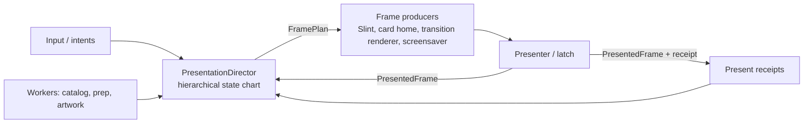

# Presentation And Transition Refactor Roadmap

Status: proposal (2026-10-06). Goal: full-screen transitions that are
(a) reliable by construction and (b) cheap to add, with one state chart that
owns what is on screen, who produces the next frame, and how much of it must
be repainted.

## Why the same glitches keep returning

Two current bugs, both traced to code:

1. **Home → Arcade: cards jump at the start of the reveal (HDMI landscape).**
   The device-card reveal snapshots `target.cached_565()` as its source
   (`launcher_loop.rs`, the `begin_device_card(...)` call in the
   `OpenCollection` branch). Card-home motion presents directly into scanout
   slots, so that cache can still hold an older carousel pose. The transition
   therefore starts from pixels the user never saw. The geometry is patched
   with `cards.selected_card_rect()`, but the pixels are not. The Settings cog
   path hit exactly this in #190 and fixed it locally by rendering
   `launcher_card_home.render()` as the source ("the generic cache may still
   contain a neighbour"). The fix never became a shared rule.

2. **Arcade → game → return → Back: no card animation, just a fade.**
   Reverse transitions get their geometry from
   `NavigationTransitionRuntime::geometry_for_reverse`, an in-memory stack
   pushed by forward transitions. Returning from an FPGA game is a new launcher
   process (`StartupMode::ReturnFromGame`). `LaunchReturnState` restores
   navigation but not that stack, so the reverse lookup returns `None`, no
   transition starts, and the intent is committed as an instant cut. The only
   motion left is ordinary preview/layer settling, which reads as a crossfade.
   (Root cause comes from reading the code. The exact source of the visible
   fade still needs confirmation on the device.)

Both bugs are the same class: **each transition chooses its own source pixels,
geometry, and lifetime rules**. Nothing enforces continuity with the frame
that is actually on screen.

## What exists today

| Concern | Owner today | Problem |
| --- | --- | --- |
| Frame-loop coordination | `run_launcher_loop`, about 8,900 lines (`launcher_loop.rs` 5193–14051), about 150 top-level `let mut` locals | Transition lifetime is spread across locals such as `pending_navigation_transition`, `navigation_transition_generation`, `orientation_transition_generation`, and `full_screen_transition_live_endpoint_rendered` |
| Render policy (timers, capture, lock, release) | `FullScreenTransitionStateChart` | Good kernel, but only Navigation and Orientation use it. The `StartupReveal` and `Screensaver` owners are declared and never used. It controls policy, not lifecycle |
| Navigation playback | `NavigationTransitionRuntime` + `NavigationTransitionController` (phases Idle/Capture/Expand/Covered/Reveal/Reversing/Settled) | Seven `begin_*` entry points (`begin`, `begin_physical`, `begin_device_card`, `begin_system_panel`, `begin_arcade_card`, `begin_settings_page[_physical]`, `begin_settings_cog_physical`), each with its own source, space, start-immediately vs deferred, and history rules. `begin_arcade_card` / `ArcadeCard` was reached only from tests (now deleted) |
| Card level trick | `launcher_card_home` + `CardLevelHandoff` | A separate transition system that presents straight into scanout and bypasses the shared chart |
| Orientation | `orientation_transition.rs` | Separate crossfade/zoom implementation |
| Screensaver | `blend_screensaver_crossfade` in the compositor | Separate crossfade |
| Startup reveal / particle morph | `startup_intro.rs` + lifecycle startup chart | Separate handoff rules |
| Composition / direct layers | `UiCompositionController` (8 states) + retirement region | Sound, but independent of the transition chart. The loop keeps them in sync by hand |
| Damage / partial render | Decided inline per path (`full_frame_present`, `NavigationDestination` full raster, card `chrome_copy_damage`, CRT overlay deltas) | No single declaration of what each state must repaint |

The codebase already has the right instincts, with typed enum charts, generations,
and physical-present receipts. What's missing is **one owner above them**, and
a **transition protocol** that every full-screen effect implements.

## Target architecture



### 1. One presentation chart with parallel regions

`PresentationDirector` owns a single hierarchical chart. It is hand-rolled typed
enums, allocation-free, and pure: `handle(event) -> Effects`, like
`lifecycle.rs`.

```mermaid
stateDiagram-v2
    state Launcher {
    state Presentation {
        [*] --> Live
        Live --> Transition: Begin(spec)
        Transition --> Live: released + physically presented
        Live --> Screensaver
        Screensaver --> Transition: Begin(screensaver exit spec)
        Live --> Modal
        Modal --> Live
        Live --> Handoff: launch game
        state Transition {
            [*] --> AcquireSource
            AcquireSource --> Preparing: source = last presented frame
            Preparing --> Playing: destination ready / start-immediately
            Playing --> Covered
            Covered --> Revealing: destination captured
            Playing --> Reversing: reverse / cancel / timeout
            Revealing --> Reversing
            Reversing --> Settled
            Revealing --> Settled
            Settled --> Releasing
        }
    }
    --
    state Route {
        Home --> Arcade
        Arcade --> Home
        Home --> Settings
    }
    --
    state Composition {
        FullSlint --> MixedArcade
        MixedArcade --> FullSlint
    }
    --
    state DirectLayerRetirement {
        Idle --> Pending
        Pending --> Idle
    }
    }
```

The existing `FullScreenTransitionStateChart`, `UiCompositionController`,
`NavigationTransitionController` phases, and direct-layer retirement become
**regions or substates of this one chart** rather than separate objects the
loop reconciles. Owners, generations, and physical-present confirmation stay
exactly as they are today.

### 2. A transition protocol, not per-transition plumbing

```rust
struct TransitionSpec {
    kind: TransitionKind,          // CardReveal, SystemPanel, SettingsSlide, SettingsCog,
                                   // CardLevelTrick, Orientation, Screensaver, StartupMorph
    direction: Direction,
    space: RasterSpace,            // Logical | Physical(axis) — decided once
    start: StartPolicy,            // Immediate | AfterDestinationReady { timeout }
    geometry: TransitionGeometry,  // derived, never remembered (see 3)
    duration: FrameCount,          // FrameClock periods
}

trait TransitionRenderer {
    fn prepare(&mut self, spec: &TransitionSpec, assets: &Assets);
    fn render(&mut self, t: Progress, src: &Frame, dst: Option<&Frame>, out: &mut Frame) -> Damage;
}
```

The shared machinery owns everything the renderers keep re-implementing: source
acquisition, destination capture, start/deferral, reversal, cancel, timeout,
CPU quiescence, Slint timer freeze, release confirmation, benchmarks, and
telemetry. One `begin(spec)` replaces the seven `begin_*` variants. A renderer
only draws.

### 3. Three invariants that kill the recurring bugs

- **Source continuity:** the source of every transition is the
  `PresentedFrame` the presenter last confirmed, whichever producer drew it
  (Slint cache, card-home slot, direct layers composed). No call site passes
  `cached_565()` directly. *Fixes bug 1 and the whole "jump at start" class.*
- **Derived geometry:** forward and reverse geometry come from one pure function
  `transition_geometry(edge, route_snapshot, layout, card_rects)`. Reverse never
  depends on history in process memory, so it survives game return, orientation
  changes, and a cleared stack. *Fixes bug 2 and the whole "fell back to a cut"
  class.* If something truly can't be derived, it goes in `LaunchReturnState`.
- **Endpoint continuity:** the last transition frame equals the first live frame
  of the destination. This is already enforced for navigation via
  `NavigationDestination`. It becomes a chart rule for every kind.

### 4. Damage policy is declared by state, not decided per path

Every chart state declares its `DamagePolicy`, and producers obey it:

| State | Policy |
| --- | --- |
| Live / FullSlint | Slint damage (partial) |
| Live / MixedArcade | Slint damage + direct-layer regions; full Slint present repaints layers in the same frame |
| Live / card browsing | Card band + chrome damage |
| Transition / AcquireSource, Playing, Reversing | Renderer-reported damage over a full-frame transition buffer; Slint frozen |
| Transition / Covered → Revealing (destination capture) | One forced full raster of the destination (today's `NavigationDestination`) |
| Transition / Releasing | One forced full live raster, then back to partial |
| Screensaver | Full-frame owner, direct layers cleared |

A host test asserts **damage soundness**: for any event sequence, the
incremental result equals a forced full raster of the same state. That turns
"doesn't understand partial rendering" into a failing test, not a device
surprise.

## Progress

Phase 0 and the first slice of Phase 1 are implemented on
`nigel/presentation-director-phase0`:

- `launcher_runtime/transition_plan.rs` holds the shared rules. `transition_source_owner` picks
  the producer of the visible frame, and `derive_navigation_geometry` gives geometry for both
  directions from committed state. The loop and `ui_preview` both call them.
- `LauncherNav::menu_tile_view` is the tile a transition collapses into. Inside a collection
  `nav.selected` is a catalog-system index ("transitional compatibility"), not the menu tile, so
  geometry must use the level's remembered view, which is also what Back restores.
- The remembered geometry stack (`geometry_history`, `geometry_for_reverse`,
  `clear_geometry_history`) is deleted.
- `launcher_runtime/transition_scenarios.rs` drives every card-capable edge in both directions from
  a cold runtime: source continuity, endpoint continuity, mid-flight reversal, and reuse.
- The unused Arcade-card renderer is deleted from the navigation runtime (`begin_arcade_card`,
  `NavigationTransitionRenderer::ArcadeCard`, its buffers and test). Production already used the
  device-card reveal. The cabinet artwork and `ArcadeCardRenderer` stay: the device cards, the
  settings cog and `visual-concepts` use them.
- Not done yet: the Home to Arcade source is chosen by a pure rule but not asserted against a real
  card-home frame (that needs the loop-level harness).

## Phased plan

Each phase ships on its own and is checked with `scripts/magik check` on
device. There is no big-bang rewrite.

### Phase 0: fix both bugs the way the target architecture would (small)

- Add `presented_source()` in the loop that returns the card-home render when
  card home owns scanout, else the composed cache. Use it at **every**
  `begin_*` call site, not just the Arcade one.
- Make reverse geometry derived: compute it with the same
  `hdmi/crt_navigation_geometry` + `selected_card_rect()` path as forward, and
  keep `geometry_history` only as a temporary cross-check (log on mismatch),
  then delete it.
- Regression tests: (a) first reveal frame equals the last presented
  card-home frame; (b) a launcher seeded from `LaunchReturnState`, then
  `NavigateBack` from Arcade, starts a `HomeToArcade` reverse transition.

### Phase 1: scenario harness and continuity invariants

- A host-side scenario runner drives the real loop state (the macOS
  `ui_preview` shares the runtime) through scripted event sequences: every
  route in both directions; reverse mid-flight; cancel; timeout; screensaver
  during and after; modal; orientation; return-from-game seeding; cold vs warm
  destination.
- Assert on every run: source continuity, endpoint continuity, no
  `Recovering`, damage soundness, and release confirmed.
- Add a property-based sweep over random event sequences. This is the
  safety net for every later phase.

### Phase 2: one transition protocol for navigation

- Introduce `TransitionSpec` / `TransitionRenderer`. Port super-scaler, device
  card, system panel, settings slide/segmented, and settings cog behind one
  `begin(spec)`.
- Fold `NavigationTransitionController` phases into the shared transition
  substate. `FullScreenTransitionStateChart` becomes the lifecycle owner, not
  just a policy table.
- `navigation_transition_for_intent` + `settings_page_transition` become a single
  route-to-spec table.

### Phase 3: move the other effects onto the protocol

- Orientation (fade/zoom), screensaver enter/exit crossfade, startup particle
  morph (activating the unused `StartupReveal` / `Screensaver` owners), and
  the card level trick.
- The card level trick is the hardest because it presents straight into
  scanout. It should still go through the chart as an owner with a
  `CardBand` damage policy, so other transitions can see what's on screen.

### Phase 4: PresentationDirector and loop extraction

- Merge `UiCompositionController`, the transition chart, and direct-layer
  retirement into one `PresentationDirector` with parallel regions and
  per-state `DamagePolicy`.
- Move the transition, composition, and present-receipt locals out of
  `run_launcher_loop` into the director. The loop shrinks to: collect events →
  `director.handle` → run effects → produce `FramePlan` → present →
  `director.on_presented(receipt)`.
- Update `docs/architecture.md`: the Mermaid charts become one chart. Add a
  test that every `(state, event)` pair in the code is listed in the doc table.

### Phase 5: a recipe for the next transition

Adding a full-screen transition should mean:

1. A `TransitionKind` variant and a row in the route-to-spec table.
2. A geometry function (pure, tested).
3. A `TransitionRenderer` (draw only).
4. One row in the scenario matrix. The continuity, damage, reverse, cancel, and
   release tests then apply automatically.

Document this in `apps/mister/src/ui_runner/AGENTS.md`.

## Risks and guardrails

- **Frame budget:** the protocol must stay allocation-free with no extra copies.
  `PresentedFrame` should reference the existing slot or cache, not copy it.
  Check every phase with the existing dropped-frame and motion benchmarks.
- **CRT vs HDMI vs portrait:** `RasterSpace` must be decided once in the spec.
  Today it is split across `begin` and `begin_physical`, which is the next likely
  source of one-off bugs.
- **Physical truth:** the host harness proves logic and pixels. Cadence and
  scanout still need device evidence, as the repo already requires.
