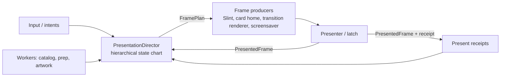

# Presentation And Transition Refactor Roadmap

Status: proposal (2026-10-06). Goal: full-screen transitions that are
(a) reliable by construction and (b) cheap to add, with one state chart that
owns what is on screen, who produces the next frame, and how much of it must
be repainted.

## Why the same glitches keep returning

Two current bugs, both traced to code:

1. **Home → Arcade: cards jump at the start of the reveal (HDMI landscape).**
   The device-card reveal snapshots `target.cached_565()` as its source
   (`launcher_loop.rs`, the `begin_device_card(...)` call in the
   `OpenCollection` branch). Card-home motion presents directly into scanout
   slots, so that cache can still hold an older carousel pose. The transition
   therefore starts from pixels the user never saw. The geometry is patched
   with `cards.selected_card_rect()`, but the pixels are not. The Settings cog
   path hit exactly this in #190 and fixed it locally by rendering
   `launcher_card_home.render()` as the source ("the generic cache may still
   contain a neighbour"). The fix never became a shared rule.

2. **Arcade → game → return → Back: no card animation, just a fade.**
   Reverse transitions get their geometry from
   `NavigationTransitionRuntime::geometry_for_reverse`, an in-memory stack
   pushed by forward transitions. Returning from an FPGA game is a new launcher
   process (`StartupMode::ReturnFromGame`). `LaunchReturnState` restores
   navigation but not that stack, so the reverse lookup returns `None`, no
   transition starts, and the intent is committed as an instant cut. The only
   motion left is ordinary preview/layer settling, which reads as a crossfade.
   (Root cause comes from reading the code. The exact source of the visible
   fade still needs confirmation on the device.)

Both bugs are the same class: **each transition chooses its own source pixels,
geometry, and lifetime rules**. Nothing enforces continuity with the frame
that is actually on screen.

## What exists today

| Concern | Owner today | Problem |
| --- | --- | --- |
| Frame-loop coordination | `run_launcher_loop`, about 8,900 lines (`launcher_loop.rs` 5193–14051), about 150 top-level `let mut` locals | Transition lifetime is spread across locals such as `pending_navigation_transition`, `navigation_transition_generation`, `orientation_transition_generation`, and `full_screen_transition_live_endpoint_rendered` |
| Render policy (timers, capture, lock, release) | `FullScreenTransitionStateChart` | Good kernel, but only Navigation and Orientation use it. The `StartupReveal` and `Screensaver` owners are declared and never used. It controls policy, not lifecycle |
| Navigation playback | `NavigationTransitionRuntime` + `NavigationTransitionController` (phases Idle/Capture/Expand/Covered/Reveal/Reversing/Settled) | Seven `begin_*` entry points (`begin`, `begin_physical`, `begin_device_card`, `begin_system_panel`, `begin_arcade_card`, `begin_settings_page[_physical]`, `begin_settings_cog_physical`), each with its own source, space, start-immediately vs deferred, and history rules. `begin_arcade_card` / `ArcadeCard` was reached only from tests (now deleted) |
| Card level trick | `launcher_card_home` + `CardLevelHandoff` | A separate transition system that presents straight into scanout and bypasses the shared chart |
| Orientation | `orientation_transition.rs` | Separate crossfade/zoom implementation |
| Screensaver | `blend_screensaver_crossfade` in the compositor | Separate crossfade |
| Startup reveal / particle morph | `startup_intro.rs` + lifecycle startup chart | Separate handoff rules |
| Composition / direct layers | `UiCompositionController` (8 states) + retirement region | Sound, but independent of the transition chart. The loop keeps them in sync by hand |
| Damage / partial render | Decided inline per path (`full_frame_present`, `NavigationDestination` full raster, card `chrome_copy_damage`, CRT overlay deltas) | No single declaration of what each state must repaint |

The codebase already has the right instincts, with typed enum charts, generations,
and physical-present receipts. What's missing is **one owner above them**, and
a **transition protocol** that every full-screen effect implements.

## Target architecture



### 1. One presentation chart with parallel regions

`PresentationDirector` owns a single hierarchical chart. It is hand-rolled typed
enums, allocation-free, and pure: `handle(event) -> Effects`, like
`lifecycle.rs`.

```mermaid
stateDiagram-v2
    state Launcher {
    state Presentation {
        [*] --> Live
        Live --> Transition: Begin(spec)
        Transition --> Live: released + physically presented
        Live --> Screensaver
        Screensaver --> Transition: Begin(screensaver exit spec)
        Live --> Modal
        Modal --> Live
        Live --> Handoff: launch game
        state Transition {
            [*] --> AcquireSource
            AcquireSource --> Preparing: source = last presented frame
            Preparing --> Playing: destination ready / start-immediately
            Playing --> Covered
            Covered --> Revealing: destination captured
            Playing --> Reversing: reverse / cancel / timeout
            Revealing --> Reversing
            Reversing --> Settled
            Revealing --> Settled
            Settled --> Releasing
        }
    }
    --
    state Route {
        Home --> Arcade
        Arcade --> Home
        Home --> Settings
    }
    --
    state Composition {
        FullSlint --> MixedArcade
        MixedArcade --> FullSlint
    }
    --
    state DirectLayerRetirement {
        Idle --> Pending
        Pending --> Idle
    }
    }
```

The existing `FullScreenTransitionStateChart`, `UiCompositionController`,
`NavigationTransitionController` phases, and direct-layer retirement become
**regions or substates of this one chart** rather than separate objects the
loop reconciles. Owners, generations, and physical-present confirmation stay
exactly as they are today.

### 2. A transition protocol, not per-transition plumbing

```rust
struct TransitionSpec {
    kind: TransitionKind,          // CardReveal, SystemPanel, SettingsSlide, SettingsCog,
                                   // CardLevelTrick, Orientation, Screensaver, StartupMorph
    direction: Direction,
    space: RasterSpace,            // Logical | Physical(axis) — decided once
    start: StartPolicy,            // Immediate | AfterDestinationReady { timeout }
    geometry: TransitionGeometry,  // derived, never remembered (see 3)
    duration: FrameCount,          // FrameClock periods
}

trait TransitionRenderer {
    fn prepare(&mut self, spec: &TransitionSpec, assets: &Assets);
    fn render(&mut self, t: Progress, src: &Frame, dst: Option<&Frame>, out: &mut Frame) -> Damage;
}
```

The shared machinery owns everything the renderers keep re-implementing: source
acquisition, destination capture, start/deferral, reversal, cancel, timeout,
CPU quiescence, Slint timer freeze, release confirmation, benchmarks, and
telemetry. One `begin(spec)` replaces the seven `begin_*` variants. A renderer
only draws.

### 3. Three invariants that kill the recurring bugs

- **Source continuity:** the source of every transition is the
  `PresentedFrame` the presenter last confirmed, whichever producer drew it
  (Slint cache, card-home slot, direct layers composed). No call site passes
  `cached_565()` directly. *Fixes bug 1 and the whole "jump at start" class.*
- **Derived geometry:** forward and reverse geometry come from one pure function
  `transition_geometry(edge, route_snapshot, layout, card_rects)`. Reverse never
  depends on history in process memory, so it survives game return, orientation
  changes, and a cleared stack. *Fixes bug 2 and the whole "fell back to a cut"
  class.* If something truly can't be derived, it goes in `LaunchReturnState`.
- **Endpoint continuity:** the last transition frame equals the first live frame
  of the destination. This is already enforced for navigation via
  `NavigationDestination`. It becomes a chart rule for every kind.

### 4. Damage policy is declared by state, not decided per path

Every chart state declares its `DamagePolicy`, and producers obey it:

| State | Policy |
| --- | --- |
| Live / FullSlint | Slint damage (partial) |
| Live / MixedArcade | Slint damage + direct-layer regions; full Slint present repaints layers in the same frame |
| Live / card browsing | Card band + chrome damage |
| Transition / AcquireSource, Playing, Reversing | Renderer-reported damage over a full-frame transition buffer; Slint frozen |
| Transition / Covered → Revealing (destination capture) | One forced full raster of the destination (today's `NavigationDestination`) |
| Transition / Releasing | One forced full live raster, then back to partial |
| Screensaver | Full-frame owner, direct layers cleared |

A host test asserts **damage soundness**: for any event sequence, the
incremental result equals a forced full raster of the same state. That turns
"doesn't understand partial rendering" into a failing test, not a device
surprise.

## Progress

PR numbers below follow the phases: PR 0 is Phase 0, PR 1 is Phase 1, and so on.

**PR 0 (merged, #234): fix both bugs and start the shared planning module.**

- `launcher_runtime/transition_plan.rs` holds the shared rules: `card_home_owns_source` picks the
  producer of the visible frame, and `derive_navigation_geometry` gives geometry for both
  directions from committed state.
- `LauncherNav::menu_tile_view` is the tile a transition collapses into. Inside a collection
  `nav.selected` is a catalog-system index ("transitional compatibility"), not the menu tile, so
  geometry must use the level's remembered view, which is also what Back restores.
- The remembered geometry stack (`geometry_history`, `geometry_for_reverse`,
  `clear_geometry_history`) is deleted, as is the unused Arcade-card navigation renderer. The
  cabinet artwork and `ArcadeCardRenderer` stay: device cards, the settings cog and
  `visual-concepts` use them.
- `launcher_runtime/transition_scenarios.rs` drives every card-capable edge in both directions
  from a cold runtime: source continuity, endpoint continuity, mid-flight reversal, and reuse.

**PR 1 (merged, #235): scenario harness at navigation level.**

- The route table (`navigation_transition_for_intent`) and the geometry assembly
  (`navigation_geometry`, `crt_navigation_layout`, `NavigationDisplay`, `TileView`) live in
  `transition_plan.rs`. The device loop and the macOS preview both call them.
- Navigation scenarios run the real `LauncherNav` and assert that every reverse reveal replays its
  forward geometry, with and without the carousel's card rectangle.
- A review found that portrait transitions could begin from the logical card-home frame; fixed.

**PR 2 (merged, #236): the transition start path runs from a test.**

- `ui_runner/launcher_transition_start.rs` holds `begin_navigation_transition`, extracted from
  `run_launcher_loop` with no behaviour change. It takes plain inputs (navigation state, layout, the
  card-home session, the composed cache) and chooses the source pixels, the geometry and the renderer.
- Host tests drive it with a real card-home session: Home to Arcade begins from the card-home frame
  and not the stale cache; portrait and reverse-from-Arcade begin from the composed cache. Making
  either choice wrong fails a test.
- A seeded random walk over the real `LauncherNav` (200 walks, 40 steps, with simulated process
  restarts between a collection and Back) checks every reverse reveal against its forward geometry.
- Still to do in Phase 1: damage soundness (incremental result equals a forced full raster); see PR 4. The preview still has its own start path, since
  it wraps a different card-session type; folding it in is a Phase 2 task.

**PR 3 (merged, #237): dither parity for CRT and portrait cards (Phase 3b step 1).**

- Responsive faces now dither their rotated poses at projection, as HDMI landscape does. The
  face-on resting pose stays exact, because those faces are already dithered once when baked and
  the resting labels must reach the output without resampling.
- `Face.dithered: bool` becomes `Face.dither: Dither { Off, MovingPoses, Always }`.
- Evidence: a resting selected card is pixel-identical before and after; receding and moving cards
  now show the same fine dither texture as HDMI landscape instead of flat, banded surfaces. All 21
  HDMI landscape review frames are byte-identical. The approved raster hashes for the portrait and
  CRT scenes are refreshed in all four feature combinations.
- Not measured: projection cost on the device. The dithered kernels already run at HDMI landscape's
  raster size; the CRT and portrait rasters are no larger, but a CRT or portrait device run of
  `scripts/magik check motion` is still owed.
- `examples/launcher_layout_review.rs` no longer compiled on `main`; it is fixed so the review
  renders can be reproduced.

**PR 4 (merged, #238): ownership scenarios for composition and the transition chart.**

- `composition/scenarios.rs`: seeded random walks over `UiCompositionController` with a model of
  the physical presenter acknowledging each frame. Checks the documented precedence (screensaver,
  full-screen overlay, confirmation, navigation, Arcade, Slint), that direct layers exist only in
  `MixedArcade` and a layer still owned when its state ends is always retired under a generation,
  that a stale generation is refused, that every state change repaints and the navigation
  destination forces a full raster, and that an invalid route recovers. Five injected faults are
  each caught.
- `full_screen_transition/scenarios.rs`: random walks over `FullScreenTransitionStateChart`
  against an independent model, for all four owners and with live, older and never-issued
  generations from every state. Five injected faults are caught; a sixth (the `active` clause in
  `begin`) was redundant with the state check and is removed.
- Orientation endpoints and cancellation already have exhaustive per-case tests, so no new
  orientation scenarios were added.
- Still to do in Phase 1: damage soundness (incremental result equals a forced full raster), which
  needs the Slint software-renderer damage path driven from a test.

**PR 5 (in progress): one `TransitionStart` for every navigation transition (Phase 2, first half).**

- `launcher_runtime/transition_spec.rs` holds `TransitionStart` (request, route, raster space, clock
  policy, assets, source) and one constructor per kind. `NavigationTransitionRuntime::begin` is the
  only way to start: the seven `begin_*` entry points are gone. `begin` refuses a disabled or playing
  runtime before touching any buffer, so the defensive restore-on-no-start branch is deleted.
- The Settings zoom/slide decision moves out of `run_launcher_loop` into
  `launcher_transition_start::begin_settings_transition`, next to the navigation one, and both run from
  host tests with a real card-home session.
- One behaviour change, preview only: `configure_preview`'s duration override now also stretches the
  system-panel slide, which used to ignore it.
- Still to do in Phase 2: give `FullScreenTransitionStateChart` the lifecycle that
  `NavigationTransitionController` still keeps (phases Capture to Settled).

**PR 6 (in progress): the macOS preview starts transitions through the shared function.**

- `launcher_transition_start::start_navigation_transition` holds the start rules (system panel, card
  reveal, physical portrait, logical super-scaler, CRT reverse image). The device wrapper
  `begin_navigation_transition` only picks the card-home rectangle and source pixels from its session;
  the preview passes its own rectangle and pixels in a `TransitionSource`. The preview's copy of the
  rules is deleted.
- `TransitionSource::physical` records which raster the source is in: the preview composes logically, so
  its portrait transitions stay logical; the device composes physically.
- Preview CRT geometry now comes from the layout's content rect, as on the device.

**PR 7 (in progress): the chart owns the transition generation.**

- `FullScreenTransitionStateChart::generation_for(owner)` returns the active generation to the owner
  holding it. The loop's two copies (`navigation_transition_generation`,
  `orientation_transition_generation`) and the parameter that plumbed one through the orientation start
  are deleted; release and snapshot-lock go through the chart by owner.
- Not merged here: the motion timeline (`NavigationTransitionController`: Capture, Expand, Covered,
  Reveal, Reversing, Settled). Merged flat it would only couple the two. The plan is to nest it
  inside the chart as the Navigation owner's substate (Phase 4), after the chart is simple and
  orientation uses the same protocol.

**PR 8 (in progress): the chart has one representation of its state.**

- The chart kept `state` and `active` side by side and relied on a comment that `active` is set exactly
  while the state is not `Live`. `Live` is now "no active transition" and the state of the active one
  lives inside it, so the two cannot disagree. `state()` is derived; `is_live()` replaces
  `state() == Live` comparisons and `full_screen_transition_owns_cpu1` in the loop.
- `release` lost an `InvalidState` branch that could not be reached.
- The `StartupReveal` and `Screensaver` owners are deleted: nothing started them. Phase 3 adds an owner
  when its transition moves onto the chart.

**PR 9 (in progress): orientation and navigation start and end through the same chart helpers.**

- Orientation was already a chart owner (begin, controlled capture, snapshot lock, release, live frame).
  What was repeated was the pairing of the effect's own call with the chart's: cancel plus release at
  three places, take-completion plus release at two, and a second copy of the begin-and-log helper.
- `begin_full_screen_transition(chart, owner)` serves both owners; `abort_orientation_transition` and
  `end_orientation_transition` hold the two pairings. Host tests check each leaves the effect and the
  chart in step.

**PR 10 (in progress): the navigation timeline and the chart move together through one module, and the
mapping between them is measured.**

- `launcher_runtime/presentation_director.rs` holds the operations that pair the navigation runtime with
  the chart: `begin_full_screen_transition`, `release_full_screen_transition`,
  `capture_navigation_destination`, `finish_navigation_transition` and
  `unwind_navigation_transition` (since PR 12 the last three are methods on the director). The loop
  calls them instead of pairing the two by hand (five sites).
- A seeded walk drives the real runtime and chart through those operations, including a chart that
  refuses a transition the runtime already started. It found that **the chart's state is not a function
  of the timeline's phase**: an immediate start plays Expand through Settled while the chart is still
  `CapturePending` (the destination is prepared while the source already moves), and a locked snapshot
  spans every phase from Expand on. The only fixed relations are that nothing playing means `Live` or
  `Releasing`, playing means `CapturePending` or `SnapshotLocked`, and a destination is never revealed
  before the snapshot is locked. The walk asserts exactly that set of pairs.
- Consequence for the plan: the chart's states answer "who may render", the timeline's phases answer
  "how far has the motion got", and they are independent axes. Nesting the timeline in the chart
  (Phase 4) therefore means a chart state **and** a motion phase, not replacing one by the other.
  Dropping the chart's `CapturePending`/`SnapshotLocked` in favour of the phase would change the render
  policy during an immediate start.

**PR 11 (in progress): the chart and composition measured together.**

- A seeded walk over the navigation runtime, the chart and `UiCompositionController`, driven as the loop
  drives them (including the exclusive-view cancel). It asserts that composition shows a navigation
  state exactly while the runtime plays, that the chart then holds the frame for navigation, that a
  chart waiting on navigation implies a playing runtime, and that the destination is only awaited
  before the snapshot is locked. Dropping the exclusive-view cancel, or its release, fails it.
- The design of the director, from those measurements, is under Phase 4 below.

**PR 12 (in progress): the `PresentationDirector` exists and the loop drives it (Phase 4, first slice).**

- `launcher_runtime/presentation_director.rs` (renamed from `transition_lifecycle.rs`) holds
  `PresentationDirector { navigation, chart, composition }`. `run_launcher_loop` owns one director
  instead of three locals; its pairings are methods: `hold_frame_for_navigation`,
  `unwind_navigation`, `capture_navigation_destination`, `finish_navigation` and the exclusive-view
  rule as `cover_navigation(destination_committed)`, which the loop and both walks now share.
- The renaming in the loop is mechanical (`navigation_transition` is `director.navigation`,
  `full_screen_transition` is `director.chart`, `composition` is `director.composition`). Behaviour is
  unchanged.
- Not yet: the releasing-chart question from the PR 11 finding.

**PR 13 (in progress): the director supplies composition's transition facts and owns the pending
navigation.**

- `PendingNavigation` (the intent a playing transition will commit, the state to restore, whether it
  has committed) moves from a loop local into `director.pending`. It is set exactly when the director
  adopts a transition (`adopt_navigation`, which also has the chart hold the frame) and cleared when the
  transition is covered; the loop reads it through the director. `cover_navigation` now reads the
  committed flag itself.
- `director.compose(CompositionRequest)` replaces the loop's call to `composition.tick`. The request has
  only what the loop knows about the screen; the director adds whether a navigation transition plays,
  whether its destination is committed, and whether it is ready, all from its own state, so the loop can
  no longer pass those inconsistently.
- Decision: the chart is **not** an input to composition. The PR 11 walk shows composition already
  determines a navigation state from exactly the facts the director now supplies, and the chart adds
  none; the relation between them is asserted instead.

**PR 14 (in progress): bundle A, the director takes presentation acknowledgement and the orientation
effect.**

- The orientation runtime is now `director.orientation`. `begin_orientation` (chart holds the frame,
  then the effect takes its snapshot), `end_orientation` and `abort_orientation` are director methods;
  the loop's own copies and their tests are gone. The orientation begin helper takes the director
  instead of three runtime parameters.
- Presentation acknowledgement: `PresentationOutcome` (`Confirmed`, `Visible`, `Unacknowledged`) with
  `resolve` (the latch's confirmation when the frame was accepted and active, else a visible-frame
  acknowledgement when no latch trace flush is deferred, else none), `director.on_presented(decision,
  outcome)` (builds the receipt with the carrier the decision names and retires the layers) and
  `director.presentation_failed(decision)` (marks the retirement uncertain). The loop's receipt local and
  its selection are replaced by these. A test drives a retirement through unacknowledged, failed and
  acknowledged frames and checks the controller's own status.
- Deletion: six copies of "cancel the screensaver render-ahead pipeline and keep it until it stops" in
  the loop are one `retire_screensaver_pipeline`.
- **Decision on a per-state `DamagePolicy`:** not added. `full_frame_present` is the sum of about twelve
  causes (orientation redraw, an unpublished cached frame, the display session, startup reveal, the CRT
  backdrop leaving, six screensaver failure paths, the composition's `force_full_slint_present`, the
  navigation compositor). Two of them are derivable from the director's state, but the navigation
  compositor sets the flag *after* earlier calls in the same frame have read it, so folding it into one
  early decision would change what those calls see during a transition. A policy type with no safe
  consumer would be dead weight. Consolidating the causes needs the renderer-side damage harness
  (Phase 1's "incremental equals forced full raster"), so it moves there.
- Still open: what a releasing chart means per composition state (needs a device), the loop shrink to
  events, plan and present (`run_launcher_loop` is still the owner of everything that is not
  transition, composition or presentation acknowledgement), and `architecture.md`.

**PR 15 (in progress): bundle B, orientation goes through the same director protocol as navigation.**

- `OrientationIntent` (Confirm, Rollback, Benchmark) and `director.orientation_intent`: set when an
  animated effect begins, cleared when it is aborted, handed back by `end_orientation`. The loop's
  intent local, its plumbing through four call sites and its enum are gone. A redundant
  `take_completion` after an unanimated begin is deleted.
- `capture_orientation_destination` (capture, then the chart's snapshot lock, aborting on either
  refusal) and `abort_stalled_orientation_capture` replace two hand-written blocks.
- `navigation_needs_source_carrier(policy)` and `orientation_needs_source_carrier(policy)` replace two
  loop predicates that were handed the director's own owner, phase and effect state by the caller; their
  tests now drive a real runtime and chart, including the cases the old pure tests could not state
  (wrong owner, logical raster, effect not playing, past Capture).
- **Measured:** unlike navigation, the orientation effect maps one-to-one onto the chart: awaiting its
  destination is `CapturePending`, a captured one is `SnapshotLocked`, an ended one leaves the chart
  `Releasing`, and the intent lives exactly while the effect plays. The walk asserts exactly that. The
  effect's `destination_ready` flag is left stale after it ends; nothing reads it then.

**PR 16 (in progress): the card row is composed by one pair of functions, and its raster is pinned.**

- `clear_card_rows` and `draw_card_strips` replace four hand-written copies (the HDMI landscape tile
  renderer, the whole-frame renderer, `Layout::render` and `Layout::draw_plan`/`clear_carousel`, which
  the level trick also uses). No pixel changes.
- Guard: `card_row_raster_hashes_are_pinned` renders six output sizes (960x540, 1280x720 fitted, HDMI
  portrait, CRT 640x480, 640x288 and portrait) at two levels (root, nested) in five frames each, 60
  hashes taken from the code before the change; `tile_rendering_matches_frame_rendering_in_the_card_row`
  checks the production tile renderer against the frame renderer for every frame and three ways of
  splitting the carousel into tiles. The pinned test is off under the pixel-changing experiment
  features (`card-axis-filter`, `card-fast-quantisation`), which have their own output.

**PR 17 (in progress): the card row's rows and columns are one value.**

- `CardRow { rows, clip }` is what the card row owns of an output. The 960x540 canvas has named
  constants for it (`ROWS` 120..495, `RIGHT` 934, `LEFT` 296, `LEFT_SLIDING` 268 for levels that slide
  their cards) and `Layout::card_row()` derives one from its margins. `clear_card_rows` and
  `draw_card_strips` take it, so the tile renderer, the frame renderer, the responsive layout and the
  level trick all name the same thing; the level trick's own clear-and-strip loop (a fifth copy) is gone.
  The base poses' clips and the sliding-row poses use the same constants. No pixel changes.

**PR 18 (in progress): a harness for the two card face bakes.**

- `launcher/face_parity.rs` compares the fixed canvas's faces with the responsive layout's at the same
  size, per region (border ring, label band, interior), and pins the 27 current differences
  (`Layout::for_card_size` is a test-only constructor). A second test pins one relationship rather than a
  count: the responsive compact face of a card without an icon (Arcade, Favourites, Settings) is drawn in the detail colours. Results are in
  Phase 3b above.

**PR 19 (in progress): every output uses the HDMI landscape card renderer.**

- Decision (yours): CRT and portrait share the renderer optimised for HDMI landscape. Faces are baked
  once per card at 180x252 (or taken from prepared `.cardtex` artwork) and the projection scales them
  to each output's card size, which `Layout::map_pose` already did. `Layout::faces`, `native_surface`,
  the native body cache, the narrow CRT font, `Dither::MovingPoses` and the face-parity harness are
  deleted; the responsive path no longer has a face renderer of its own.
- CRT and portrait now get the HDMI faces' prepared-artwork path and dither every projection.
  A reflection stays a quarter of the card height: its fade is 64 rows under a 252-row card and
  scales with the card on smaller outputs (without that, small cards showed an oversized reflection).
- Measured: the 20 pinned card-row hashes for 960x540 and 1280x720 are unchanged, and so are the
  first ten of the four approved-raster tables (HDMI landscape with real artwork); the 40 CRT and
  portrait hashes changed on purpose. In the repository's visual baselines only `crt-home` and
  `crt-240p-home` change on this machine (HDMI home and every other scene are identical to main);
  those two need re-approving on a machine where the baselines match.
- Visible: card titles and counts on CRT and portrait use the HDMI label style scaled to the card, so
  they are larger than the old small CRT bitmap labels. `write_card_previews` (an ignored test) renders
  every output so the change can be looked at.

**PR 20 (in progress): the shared card renderer bakes at the size each output shows its cards.**

- Found on the device after PR 19: CRT cards lost fidelity and 240p landscape ran at about 30 fps.
  Cause of the first: the shared 180x252 faces were resampled to the CRT card size (a second filtering
  step) with the HDMI label style scaled up, where the old bake drew small bitmap titles on the output's
  own pixel grid. Part of the second: larger faces on a path that only ever runs on one thread (below).
- The HDMI landscape bake is now sized: `surface_sized`, `face_sized`, `faces_rgb888(w, h)` and
  `reduce_rgb888(w, h)` replace the 180x252-only versions, and `Layout` supplies the card size and the
  CRT label fonts (the scaled bitmap font, with the native-width font for titles the doubled cell cannot
  fit). The artwork is reduced straight from the 360x504 source to the card size; at 180x252 the
  reduction is the old 2x2 mean (a test proves the general area filter equals it at 2:1), so HDMI
  landscape is bit-identical: its 20 card-row hashes and the first ten entries of all four
  approved-raster tables are unchanged. Prepared `.cardtex` artwork is used at 180x252 only; the device
  asks for it only for 960x540, and CRT and portrait load the source.
- Symbol scales shrink to fit narrow cards (5 and 4 at 180 wide, as before). A generic card's reverse
  stays 180x252.
- Cost, host release, microseconds per flip frame: CRT 640x240 440 (before PR 19) / 526 (PR 19) / 430
  now; CRT 640x288 542 / 618 / 528; CRT portrait 549 / 578 / 540. Resting frames stay 8-11% above the
  original because every projection is dithered. `bench_card_row_render` (ignored) and
  `write_card_previews` (ignored) reproduce the numbers and the images.
- **Two bands on every output.** `ParallelLauncherRenderer` (a primary and a helper thread, each drawing
  part of the carousel) used to run only for exactly 960x540 HDMI landscape. The tile path now takes its
  geometry (stride, card rows, column clip) and responsive layout from the `LauncherFramePreparer`, so
  CRT and portrait render in two bands too (`PreparedLauncher::supports_parallel`). The first split is
  the native proportion of the carousel, and the minimum band shrinks on narrow carousels. A test
  checks every responsive output, root and nested, against the serial render at three splits. Host
  release, microseconds per flip frame, serial / two bands: CRT 640x240 437 / 252; 640x288 538 / 316;
  640x480 721 / 409; CRT portrait 548 / 317; HDMI portrait 660 / 378; HDMI landscape 872 / 494
  (`bench_parallel_card_row`). Still HDMI-only: level-change trick bands and helper render-ahead.
- **HDMI portrait takes the direct path.** Device profile (portrait, before): 149 presentations in
  5 s, 29 ms in the Slint raster (`BackgroundOverlayLines::process_line`, 42% of samples), the cards
  about 35%, 151 dropped frames all attributed to Slint. Portrait never reached the direct path (it
  was gated to 960x540 landscape), so each frame re-rastered the carousel through Slint, rotated, over a
  home screen with no Slint content. The direct path now serves HDMI portrait outside a level change:
  `LauncherCardHomeSession::direct_physical_bands` rotates the chrome (only when its content or the
  rotation changes) and each band (`Rgb565OutputLayout::gather_logical_rect`) into scanout order, and
  the presenter copies them like landscape tiles. Device, after: 300 presentations in 5 s, 0-1 dropped,
  frame-to-present 16.0 ms (was 32.9), 299 of 300 delivered by the direct path. CRT, and portrait level
  changes, still use the Slint path.
- **Level changes in two bands on every output (PR 21).** The level-change card trick drew on one thread
  everywhere except HDMI landscape. A level-change plan already holds the output's own poses, so the tile
  renderer now draws it unmapped on a responsive layout (as the serial path does), and the gate on the
  trick's parallel render is `supports_parallel` instead of "exactly 960x540". A test renders gather and
  deal frames for six outputs (landscape, three CRT sizes, CRT portrait, HDMI portrait) in two bands and
  compares each with the serial render. Still serial and on the Slint path: the trick's presentation on
  rotated and CRT outputs, and the CRT Arcade list, which have not been profiled.

**PR 22 (in progress): the base card and its row are named once.**

- The 180x252 base card and where the HDMI landscape canvas puts its row (`ROW_LEFT` 292, `CENTRE_X` 610,
  `CENTRE_Y` 284) were bare numbers repeated across `responsive.rs` (pose mapping), `row.rs` (the nested
  slots), `launcher.rs` (slot geometry, face bake, fade rows) and `artwork.rs` / `prepared_artwork.rs`
  (the 2x2 reduction, back face, prepared bake). They are now `CARD_W`, `CARD_H`, `ROW_LEFT`,
  `CENTRE_X` and `CENTRE_Y` in `launcher.rs`. No pixel changes: all pinned raster hashes pass unchanged.
  This finishes Phase 3b step 1's "card size, row centre and pitch".

**PR 23 (in progress): Phase 4 loose ends.**

- The transition chart in `docs/architecture.md` is tested against the code
  (`the_documented_chart_is_the_chart_the_code_runs`): every state change an operation can make is drawn
  and every drawn edge is one the code can make.
- What a releasing chart means for composition is written down (see Phase 4) instead of left to the
  render ladder's order.
- The `prepared-artwork` tests pointed at a card file that no longer exists (`console-nes.rgb888`), so
  they could not build and CI never enabled the feature. They use `02_consoles.rgb888` and CI's
  framebuffer-scenes step now runs them.

**PR 24 (in progress): portrait level changes take the direct path, and the harness drives the CRT.**

- A level change on HDMI portrait presents through the rotated bands like browsing does. Only the
  chrome regions the level change fades are rotated and copied each frame; the card bands are the
  two-band render from PR 21. Rotation uses the shared tiled/NEON kernel (`Rgb565SurfaceMut`), not a
  per-pixel gather: the first version's gather was 19% of all samples and held the route at about
  30 fps. One predicate, `can_render_direct`, now gates the direct path, the helper's render-ahead
  and the bands, so portrait gets the same render-ahead as landscape instead of a lesser copy. Device,
  HDMI portrait, Home to Consoles and back (`check animation-app`, route consoles): dropped frames 234
  of 478 presentations before, 35 of 450 after. Per step that is 4, 11, 3 and 9 dropped of about 60
  frames for the four level changes; the 72 presentations that still go through Slint are the hub and
  games-list steps of the route, not card frames. What remains on a level change is the primary band
  drawn on the main thread (render-ahead only hides the helper's band) and software integer division
  in the shared projection (`__udivsi3`, 5% of samples).
- `check journeys` could not open the Arcade list on CRT: the CRT shows the Arcade hub first, with GAMES
  selected, so the list needs a second Enter (`_open_arcade_games`). Found with the framebuffer capture.
  The journeys pass on CRT 240p.
- New `check arcade-scroll` (and `--profile`) holds Down in the Arcade list for a measured window, via a
  `launcher_hold_direction` option on the tooling measure request. CRT 240p: 481 presentations in 8 s
  (60 fps), 0 dropped, 15.8 ms frame to present, 44% process CPU. The CRT Arcade list needs no direct
  path.

## Phased plan

Each phase ships on its own and is checked with `scripts/magik check` on
device. There is no big-bang rewrite.

### Phase 0: fix both bugs the way the target architecture would (done, #234)

See Progress.

### Phase 1: scenario harness and continuity invariants

- A host-side scenario runner drives the real navigation state and transition
  runtime (the loop's per-frame state is not drivable from a test yet; making it
  so is part of this phase) through scripted event sequences: every
  route in both directions; reverse mid-flight; cancel; timeout; screensaver
  during and after; modal; orientation; return-from-game seeding; cold vs warm
  destination.
- Assert on every run: source continuity, endpoint continuity, no
  `Recovering`, damage soundness, and release confirmed.
- Add a property-based sweep over random event sequences. This is the
  safety net for every later phase.

### Phase 2: one transition protocol for navigation

- Introduce `TransitionSpec` / `TransitionRenderer`. Port super-scaler, device
  card, system panel, settings slide/segmented, and settings cog behind one
  `begin(spec)`.
- Fold `NavigationTransitionController` phases into the shared transition
  substate. `FullScreenTransitionStateChart` becomes the lifecycle owner, not
  just a policy table.
- `navigation_transition_for_intent` + `settings_page_transition` become a single
  route-to-spec table.

### Phase 3: move the other effects onto the protocol

- Orientation (fade/zoom), screensaver enter/exit crossfade, startup particle
  morph (activating the unused `StartupReveal` / `Screensaver` owners), and
  the card level trick.
- The card level trick is the hardest because it presents straight into
  scanout. It should still go through the chart as an owner with a
  `CardBand` damage policy, so other transitions can see what's on screen.

### Phase 3b: one card pipeline for HDMI and CRT

Principle: the bridge already feeds both display types the same data. Differences between HDMI
and CRT should be explicit presentation parameters (safe insets, pixel aspect, fonts, geometry),
not separate implementations. Every card improvement must reach both for free.

Today there are two card pipelines, selected by `LauncherScene::uses_responsive_layout`
(`launcher.rs`), which is true for CRT and for portrait (including HDMI portrait):

| Stage | HDMI landscape (960x540) | CRT and portrait (`launcher/responsive.rs`) |
| --- | --- | --- |
| Artwork | `.cardtex` or 360x504 art, kept high precision | `native_surface`: filtered to the native card size, reduced to RGB565 once |
| Face dithering | `Dither::Always`: ordered dither at projection | `Dither::MovingPoses` (since PR 3): dithered when rotated, exact when face-on |
| Layout and text | fixed canvas, role fonts | native raster, `Fonts::Uniform` / `Roles`, bitmap labels baked at output size |

The newer performance work (cardtex, fast quantisation, dithered projection kernels) lives on the
HDMI landscape side, so CRT and portrait do not get it.

Plan: keep `responsive::Layout` as the one geometry and text description (it already covers
CRT, portrait and 5:4), and make it produce the same face type the HDMI path does: high-precision
texels, `dithered = true`, `.cardtex` support at native sizes. Then HDMI landscape becomes one more
`Layout` rather than a special case, and `responsive.is_none()` branches in `prepare` disappear.

Order: (1) dither parity for responsive faces, behind the existing benchmark and the layout review
renders; (2) native-size `.cardtex`; (3) route HDMI landscape through `Layout`; (4) delete the
fixed-canvas path. Each step is gated by `scripts/magik check motion` and card fixtures, since the
projection kernels are on the 60 fps budget.

**Measured before step 3 (so the plan follows the numbers):**

- `responsive::Layout::for_scene` returns `None` for non-CRT landscape on purpose. Forcing it to
  accept 960x540 (a scratch experiment, not committed) and rendering the same data both ways changes
  **172,681 of 518,400 pixels (33%)**, so "route HDMI landscape through `Layout`" is not a switch. The
  two paths are different designs, not two implementations of one: the fixed canvas has its own
  library sidebar, breadcrumb and group sidebar (`render_logical`), fixed 180x252 cards and a fixed
  top inset, while `Layout` derives card size, inset, library row and bottom from the scene.
- `.cardtex` is produced by `examples/prepare_card_artwork.rs` from the 360x504 RGB888 sources into
  one 180x252 landscape encoding (`PreparedArtwork::encode`); the runtime ignores it for responsive
  faces (`prepared_landscape_payload_does_not_override_responsive_faces`). The encoded files live in
  the separate private assets repository, so native-size artwork means an encoder change, regeneration
  and a commit there, then a device motion run, not a change in this repository alone.

**Revised order, from those numbers:**

1. Separate card geometry from chrome. Faces and projection need only a card rectangle set (card
   width and height, row centre, pitch); chrome (sidebars, breadcrumb, labels) does not. **Done in
   part (see PR 16):** the carousel plan and the projection kernels were already shared, and the
   responsive layout only maps the landscape poses (`Layout::map_pose`); what was duplicated was the
   clear-the-rows and draw-in-strips composition, four copies. They are now `clear_card_rows` and
   `draw_card_strips`, used by the HDMI landscape tile renderer, the whole-frame renderer, the
   responsive layout and the level trick, with 60 pinned raster hashes and a tile-versus-frame
   equivalence test as the guard. The rows and columns the card row owns are now one value,
   `CardRow` (see PR 17). Still to do: the card size, row centre and pitch, which the fixed canvas keeps
   in `slot_geometry` and the base poses and the responsive layout re-derives in `Layout::map_pose`.
2. **Revised after measuring (replaces "make `Layout` express the fixed canvas's geometry"):** the
   geometry composition is already one pipeline: plan, optional pose mapping (`Layout::map_pose`, which
   the fixed canvas simply skips), strips. Nothing is gained by teaching the mapping to be an identity.
   What actually differs is the **face bake**, and `launcher/face_parity.rs` now measures it on real
   `Face` pixels (the fixed canvas's `face_cached`/`faces_rgb888` against `Layout::faces`, both at
   180x252, 27 cases, pinned). Findings: (a) the border ring (outer 8 px) differs on 65-70% of its
   pixels for generic cards and on essentially all of them for artwork cards, so the frame is drawn
   differently; (b) about 2,000-5,300 interior pixels differ even for plain generic faces (not counting the
   compact faces of the cards without an icon, see (d)) and about 16,600 for artwork cards; (c) label bands differ (the title and count sit at different rows and with
   different spacing); (d) for the **generic fallback** faces (cards drawn without their artwork), the responsive
   **compact** face of the cards without an icon (Arcade, Favourites, Settings) is drawn in the detail
   (selected-card) colours: `native_surface` builds a generic card's body from the *detail* surface
   whatever face it is for, so for Arcade it is about 11,000 pixels from the fixed detail face but about
   41,000 from the fixed compact face. **This is not what a device shows**: with the card artwork
   installed there is no such gap (the artwork cases' compact and detail comparisons come out within a
   percent of each other), and nobody has seen a card change brightness when selected. It is a property
   of the fallback drawing only, recorded because the test pins it, not a defect to fix.
   Consequence: sharing the face bake for HDMI landscape is a **choice of which renderer is right**, and
   either choice changes visible pixels on the primary HDMI UI. The harness is the instrument for that
   decision; the pinned table will show exactly what a change moves. It is relative by design: a change
   to the shared `surface` moves both faces equally and is guarded by the pinned card-row hashes.
3. **Decided: one renderer for every output, the HDMI landscape one** (see PR 19). Native-size
   `.cardtex` is no longer needed: every output uses the 180x252 faces (and `.cardtex` where supplied)
   and the projection scales them.
4. Unify chrome last, or keep `render_logical` as the HDMI landscape chrome indefinitely: it is not
   on the motion path, and it is the part where the two designs genuinely differ.
5. The responsive face bake (`Layout::faces`, `native_surface`, `Dither::MovingPoses`) is deleted
   (PR 19). What remains of "the fixed canvas" is chrome and the 960x540 logical canvas.

### Phase 4: PresentationDirector and loop extraction

- Merge `UiCompositionController`, the transition chart, and direct-layer
  retirement into one `PresentationDirector` with parallel regions and
  per-state `DamagePolicy`.
- Move the transition, composition, and present-receipt locals out of
  `run_launcher_loop` into the director. The loop shrinks to: collect events →
  `director.handle` → run effects → produce `FramePlan` → present →
  `director.on_presented(receipt)`.
- Update `docs/architecture.md`: the Mermaid charts become one chart. Add a
  test that every `(state, event)` pair in the code is listed in the doc table.
  (The transition chart's edges are now tested against the doc, PR 23; the charts are not one chart yet.)

What the walks in PR 10 and PR 11 say the director has to be (measured, not assumed):

- **Three independent axes, one owner each.** The chart's state says who may render (Live,
  CapturePending, SnapshotLocked, Releasing); the owner's timeline says how far its motion got
  (navigation: Capture to Settled; orientation has its own); composition says what is on screen
  (full Slint, mixed Arcade, navigation, screensaver, modal, recovering). A director holds all three
  and keeps the relations between them, rather than collapsing one into another. The relations that
  hold in every walk are in `presentation_director.rs` and `presentation_director/presentation_scenarios.rs`.
- **Composition never sees the chart today.** The loop derives `navigation_transition_active` from the
  runtime and the chart is consulted separately. The director takes the chart as a composition input, so
  "a navigation composition state implies the chart holds the frame for navigation" is true by
  construction instead of by the loop's ordering. Both directions are asserted now.
- **The exclusive-view rule is load-bearing.** A screensaver or confirmation over a playing navigation
  transition must cancel the runtime and release the chart before composition is asked; the walk fails
  if either half is dropped. That rule belongs inside the director.
- **Resolved (PR 23): what a releasing chart means in each composition state.** The chart can be
  `Releasing` (it asks for a forced live Slint raster) while composition shows the screensaver, a modal,
  or Mixed Arcade. The loop's render ladder serves that view first, so the release waits until it ends.
  A new transition begins only from `Live` (a start over a releasing chart is refused) and composition
  never shows a navigation transition while the chart is `Releasing`; both are asserted by the seeded
  walks. The rule is now in `docs/architecture.md`. Not measured: how long a refused start waits after the
  screensaver ends.
- **First slice (done in PR 12):** the director is a struct that owns the three, with the existing
  paired operations as its methods. Behaviour stays the same; its tests are the two walks above.
  Done in PR 13: the director supplies composition's transition facts and owns the pending navigation
  (the chart is deliberately not a composition input; see PR 13). Next: define what a releasing chart
  means per composition state.

### Phase 5: a recipe for the next transition

Adding a full-screen transition should mean:

1. A `TransitionKind` variant and a row in the route-to-spec table.
2. A geometry function (pure, tested).
3. A `TransitionRenderer` (draw only).
4. One row in the scenario matrix. The continuity, damage, reverse, cancel, and
   release tests then apply automatically.

Document this in `apps/mister/src/ui_runner/AGENTS.md`.

## Risks and guardrails

- **Frame budget:** the protocol must stay allocation-free with no extra copies.
  `PresentedFrame` should reference the existing slot or cache, not copy it.
  Check every phase with the existing dropped-frame and motion benchmarks.
- **CRT vs HDMI vs portrait:** `RasterSpace` must be decided once in the spec.
  Today it is split across `begin` and `begin_physical`, which is the next likely
  source of one-off bugs.
- **Physical truth:** the host harness proves logic and pixels. Cadence and
  scanout still need device evidence, as the repo already requires.
