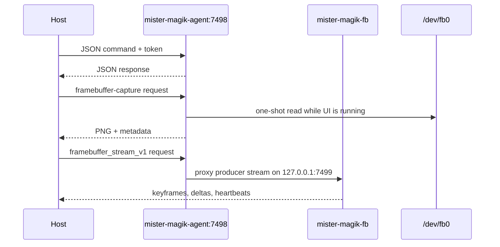

The MiSTer-side agent is a development backplane. It exposes token-protected JSON commands on TCP `7498`, diagnostics, deployment helpers, reboot helpers, telemetry, still captures, and the framebuffer stream proxy.

Still captures use `mister --capture-buffer`. A human terminal receives
a timestamped PNG on the Mac Desktop; a programmatic caller receives an
MCP-style base64 PNG image object. The live stream is different: it proxies
frames produced by the running UI and must not poll `/dev/fb0`.
