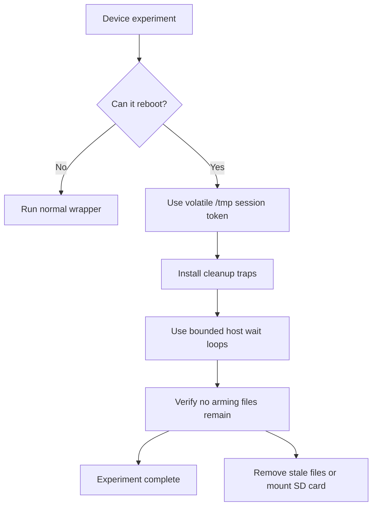

Performance claims should come from documented benchmark scenarios, not ad hoc row jumps or visual impressions. Use the scenario scripts in the repository and read `docs/benchmarking.md` before drawing conclusions.

The highest safety rule is never leaving the MiSTer in a persistent reboot loop. Destructive reset-fault tests must use volatile arming, cleanup traps, bounded waits, and post-test verification.
