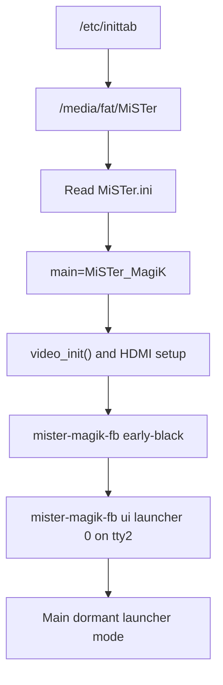

MiSTer MagiK keeps production boot compatible with stock MiSTer. Stock Main starts first, reads `MiSTer.ini`, and re-execs the `MiSTer_MagiK` fork. The fork initializes HDMI through the normal Main path before Rust touches the launcher framebuffer.

The fork must not draw the stock menu OSD, keep input grabbed, or change the launcher framebuffer behind Rust while MagiK owns the UI.
