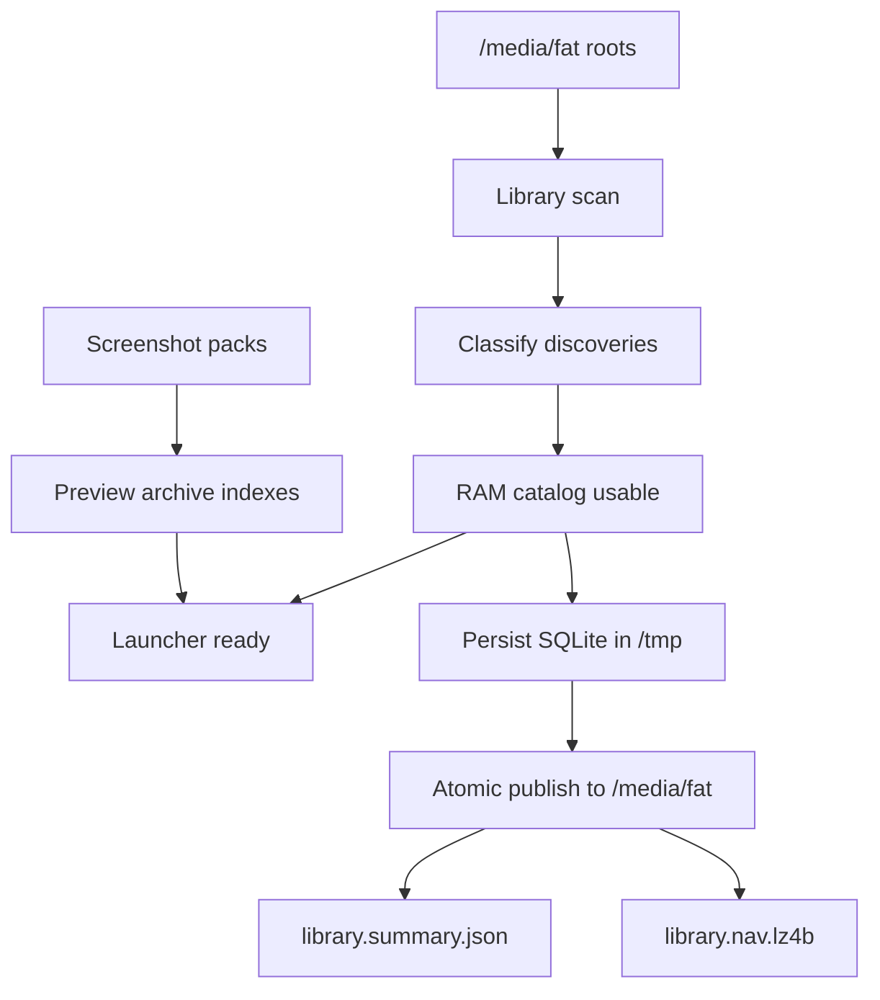

The catalog builder treats first usable RAM catalog readiness separately from durable SQLite persistence. This lets cold first scan reveal the launcher as soon as the catalog can be used, while the durable database finishes in the background.

Warm startup can use `library.summary.json` for Home counts before full rows hydrate. The Arcade screen must pause list and preview requests until the full navigation rows are available.
