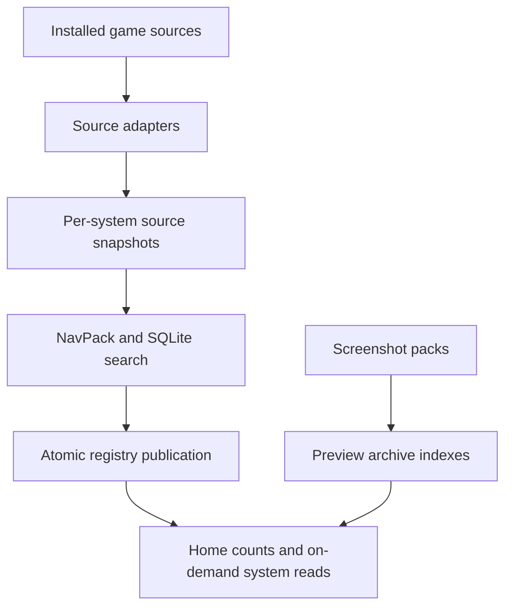

MiSTer MagiK uses the fast catalog under `catalog-fast-v1`. Source adapters discover installed games and publish immutable per-system NavPacks and SQLite search databases. A small registry provides Home counts without opening every system artifact.

Warm startup is load-only. Entering a system opens its NavPack; searching opens its SQLite database. Missing catalog state triggers a fresh build while the first frame remains responsive. Explicit refresh checks source watches and republishes only changed systems. The previous generation remains usable until publication succeeds.

Screenshot packs are independent media. Installing a pack reconciles preview availability in memory without rewriting catalog artifacts or source snapshots. The retired monolithic SQLite catalog, summary/navigation sidecars, and scanner caches are not startup or refresh inputs.
