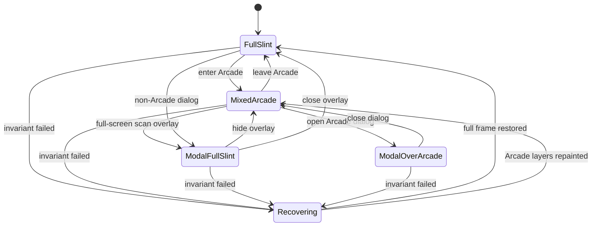

Slint owns the cached full frame in every state. Rust direct-blitted Arcade layers are valid only in `MixedArcade`. Full-screen overlays and recovery clear direct-layer assumptions and force a full Slint present.

Unexpected composition recovery is a gate failure. It records status details under `/tmp/mister-magik/status.json` for diagnostics.
