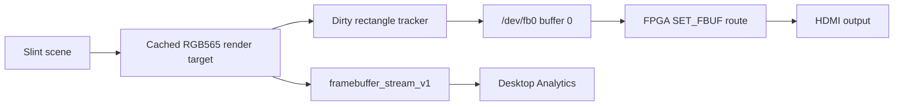

Rust owns framebuffer setup while the launcher is active. Slint renders into
cached RAM, then Rust copies dirty regions into the small write-combined
`/dev/fb0`. The FPGA route selects which buffer is visible on HDMI.

The `/dev/fb0` dirty-copy path is the supported fallback. The current
hidden-buffer experiment is `fpga-vblank-latch-hidden`, which uses
plugin-exposed hidden slots plus the experimental vblank-latched Menu RBF.

Important contracts:

- Production rendering is RGB565 only.
- Slint does not render directly into live framebuffer memory.
- `/dev/fb0` pixels are not proof of HDMI visibility.
- The desktop live stream comes from the producer-side cached frame, not repeated
  `/dev/fb0` polling.
- Main-mediated present request/ack experiments are retired and should not be
  used for new rendering work.
