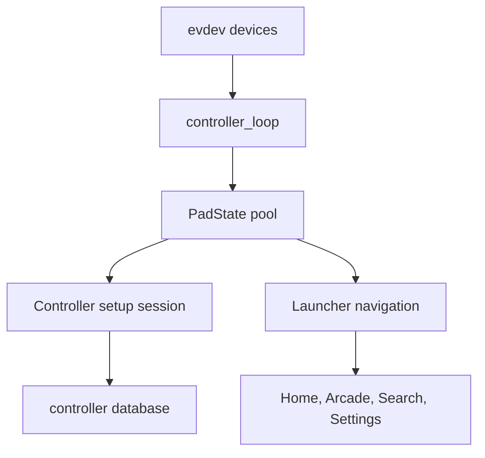

Input is routed through the Rust controller loop into launcher navigation and optional setup state. The setup flow handles new controller identities and known controllers that appear on a changed port.

The UI exposes a Controller Test screen for live state inspection and a setup overlay for registration or rebinding.
