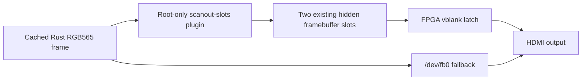

MiSTer MagiK uses a small kernel plugin for one reason: `/dev/fb0` exposes the
live framebuffer, but not the two hidden framebuffer slots used to prepare the
next variable-size RGB565 frame before a vblank switch. Each qualified slot can
hold up to a 1366x768 frame with a 2736-byte aligned stride. Output modes above
1280x720 render at half width and height, so 1920x1080 uses a 960x540 hidden
framebuffer.

The FPGA latch can select a completed hidden slot at vblank. It cannot give the
Rust process a safe CPU mapping of that memory. Giving the launcher general
`/dev/mem` access would expose unrelated physical memory, while maintaining a
custom Linux kernel would make updates and recovery substantially harder.

## Exactly what the plugin does

`/dev/mister-magik-scanout-slots` reports one immutable, versioned layout and
maps either complete hidden slot with shared, read/write, non-executable,
write-combined attributes. The device is mode `0600`, so only root can open it.

The plugin does **not** allocate or copy memory. It does not select a framebuffer,
wait for vblank, post a frame, recover the display, or control the FPGA. Those
responsibilities remain in Rust, Main, and the small FPGA latch.

Earlier investigations tried direct `/dev/mem`, cacheable aliases, DMA
allocation, ownership and fence APIs, and an FPGA mailbox. They added states and
failure modes without improving the production copy path, so none of those
interfaces remain in the plugin. The cacheable zero-copy trial also initially
omitted cache synchronization from its timing, overstating the improvement by
roughly 2 ms. Comparisons must include that work and validate physical output.

## Failure and fallback

The stock device tree describes the visible 8 MiB framebuffer aperture, not the
whole hidden scanout layout. The two hidden regions are instead bound to a
reviewed, pinned kernel/driver/DT/Main/RBF platform contract. At load time the
plugin requires the qualified kernel, machine, and framebuffer identity, then
reserves both complete ranges exclusively before registering the device. The
exclusive reservations reject System RAM and any occupied resource range.

The Rust and Agent clients reject any ABI, geometry,
address, mapping-size, or reserved-field mismatch. If the module is missing or
rejected, MiSTer MagiK uses the supported `/dev/fb0` dirty-copy fallback; the
plugin is never required to recover or boot the machine.

## How it is tested

The current automated gates verify the exact C/Rust/Agent contract, reject
retired source and binary surfaces, test the userspace layout and copy logic,
and record module build provenance. A checked-in, manually invoked device runner
performs deterministic mapping and rejection checks on the MiSTer. It uses
bounded cleanup and never uses destructive reset-fault injection.

The broader release assurance programme also calls for independent standards
and contract review, dual-compiler kernel analysis, model and boundary checks,
an instrumented ARM kernel under QEMU, sanitizer runs, short coverage-guided
fuzzing, lifecycle repetition, and physical HDMI evidence. Fuzzing belongs only
in QEMU on GitHub Actions or an optional local Linux runner—never on the MiSTer.
Those layers are described as release gates, not as completed certification.

See the [assurance contract](https://github.com/NigelBreslaw/MiSTer-MagiK/blob/main/docs/kernel-scanout-plugin-assurance.md),
and [current architecture](https://github.com/NigelBreslaw/MiSTer-MagiK/blob/main/docs/architecture.md#rendering-decisions)
for the detailed requirements and rendering rationale.
