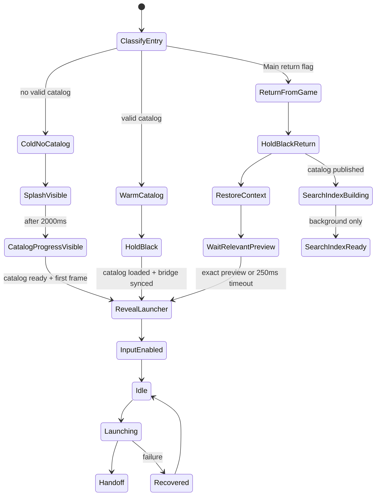

The lifecycle code owns startup readiness, reveal timing, launch staging, and recovery transitions. Input is accepted only after the first intended launcher frame has been presented and the lifecycle reaches `InputEnabled`.

Cold boot without a valid catalog shows the splash for at least two seconds. Warm boot and return-from-game keep HDMI black until a deliberate launcher frame is ready.

Search keys and autocomplete form an independent background lifecycle. The navigation catalog, reveal, and input become ready first. Search can open and accept a query while indexing, showing “Preparing search…” until results become available.
