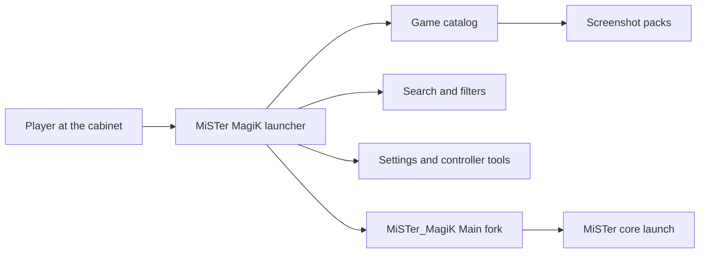

import { Card, CardGrid } from '@astrojs/starlight/components';

MiSTer MagiK is a Rust and Slint frontend for MiSTer FPGA. It is designed to make MiSTer feel like a polished launcher instead of a configuration project: quick game discovery, controller-friendly browsing, smooth arcade-style navigation, and reliable handoff into games.

<CardGrid>
  <Card title="User Guide" icon="open-book" href="/user-guide/getting-started/">
    Learn how to browse, search, configure controllers, update the library, and launch games.
  </Card>
  <Card title="Architecture" icon="seti:rust" href="/architecture/boot-and-process/">
    Understand boot, framebuffer ownership, catalog lifecycle, media, launch handoff, and the agent.
  </Card>
  <Card title="Contributing" icon="github" href="/contributing/workflow/">
    Follow the safe command set, device rules, benchmark policy, and naming conventions.
  </Card>
</CardGrid>

The existing repository `docs/` directory remains the low-level policy and evidence source. This Starlight site curates that knowledge into a navigable guide for people using or changing MiSTer MagiK.
