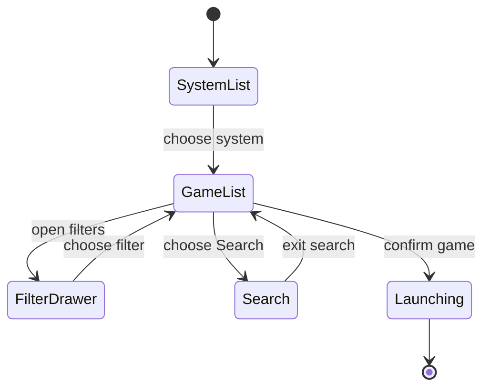

import Screenshot from '../../../components/Screenshot.astro';

<Screenshot src="/screenshots/arcade-list.png" alt="Arcade list with a visible preview" />

The Arcade list is the main game browsing surface. The left side is a fast Rust-painted game list. The right side shows the selected game's preview inside the cabinet frame when screenshot media is available.

Filters are built from catalog metadata:

- `Games A-Z` shows the normal sorted list.
- `Search` opens the on-screen keyboard and result list.
- Decade, manufacturer, and category filters use catalog metadata where available.
- Preview status may briefly be empty, loading, approximate, or exact while media workers catch up.

The list keeps per-system navigation state, so returning to a system should restore the previous row and filter context.
