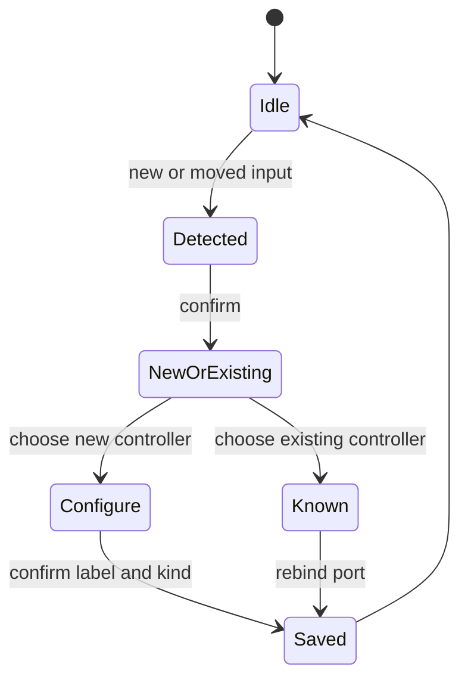

import Screenshot from '../../../components/Screenshot.astro';

<Screenshot src="/screenshots/controller-test.png" alt="Controller Test screen" />

Controller Test shows the current state of the connected controller. Use it to confirm directional input, face buttons, shoulder buttons, start/select, and home-style buttons.

<Screenshot src="/screenshots/controller-setup.png" alt="Controller setup overlay" />

The setup overlay appears when MagiK detects a new controller identity or a known controller on a changed port.

The setup flow can register a new controller, recognize an existing controller, and save the selected kind. Keyboard rename is not part of the current setup UI.
