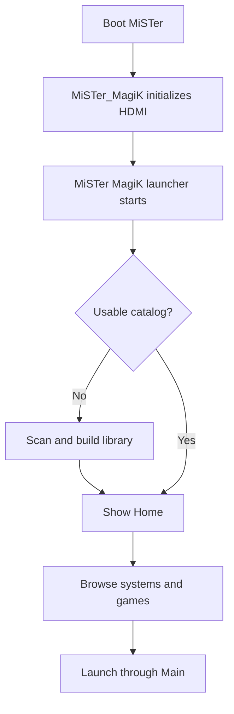

MiSTer MagiK starts after the MiSTer video path is initialized by `MiSTer_MagiK`. The launcher owns the visible UI while it is active and hands game launch requests back to Main so HDMI and core loading stay on the normal MiSTer path.

Core controls are intentionally simple:

- Use directional input to move focus.
- Confirm opens a system, chooses a game, or activates the focused setting.
- Back returns to the previous screen.
- The settings cog on Home opens device and library actions.

If the library is missing or reset, MiSTer MagiK shows scan progress before the first usable catalog appears. Warm boots with a valid catalog should reveal the first usable UI quickly, then validate the library in the background.
