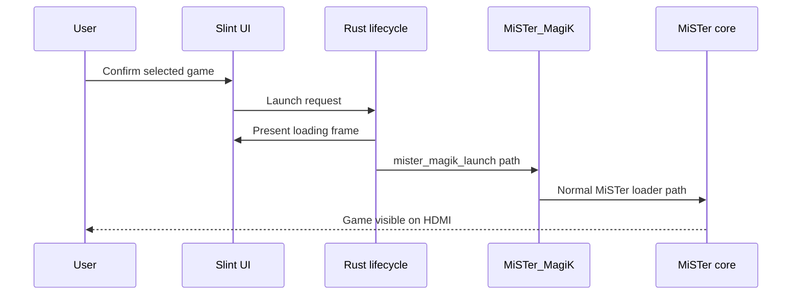

import Screenshot from '../../../components/Screenshot.astro';

<Screenshot src="/screenshots/launch-loading.png" alt="Game launch loading overlay" />

Launch is two phase. MiSTer MagiK first presents a loading frame, then starts the Main-owned handoff. Slint does not directly load cores and does not call external `rbf_load`.

If launch handoff fails, the launcher should reassert the framebuffer route, present recovery UI, and return to idle instead of leaving HDMI wedged.
