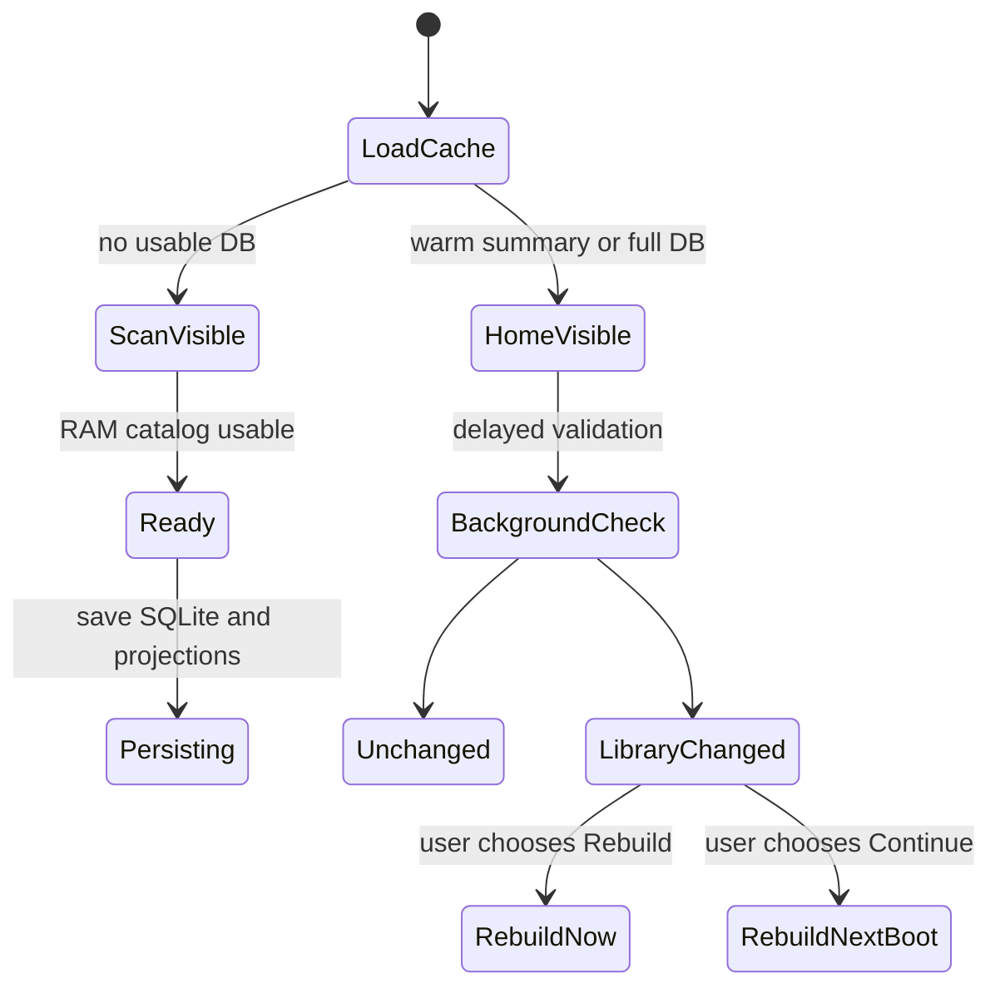

import Screenshot from '../../../components/Screenshot.astro';

<Screenshot src="/screenshots/catalog-scan.png" alt="Catalog scan or update progress" />

The library builder scans launchable content, classifies games, creates an in-memory catalog, then persists SQLite and adjacent warm-start projections. Cold first scan is foreground work because showing a usable catalog quickly matters more than perfect scan-screen animation.

<Screenshot src="/screenshots/media-progress.png" alt="Screenshot or media pack download popup" />

Screenshot pack progress appears only for real pack download progress. Local checks, skips, sidecar work, save/sync phases, and worker completion should not recreate the popup.
