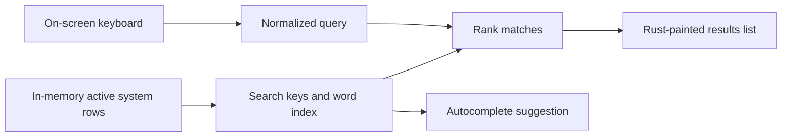

import Screenshot from '../../../components/Screenshot.astro';

<Screenshot src="/screenshots/search.png" alt="Search keyboard or results pane" />

Search is a runtime UI index. It does not query SQLite while you type. When a system hydrates, MiSTer MagiK builds searchable keys from title, launch path basename, manufacturer, category, year, and decade.

Use the keyboard pane to enter text. Suggestions appear above the keys when a useful completion exists. Switch to the results pane to move through matches and launch a highlighted game.

Punctuation is treated as whitespace. Metadata is first class, so a manufacturer or category search can match games whose titles do not contain the typed word.
