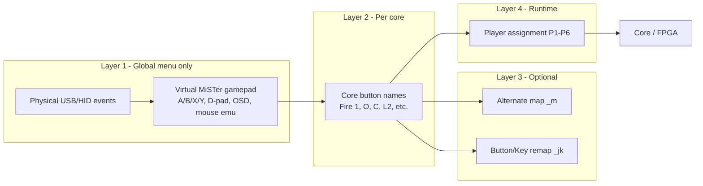

# MiSTer joystick mapping — how it actually works

**Date:** 2026-06-03  
**Goal:** Explainer for why MiSTer's mapping UX feels confusing, and where settings
live on disk. No code changes — reference for Slint UI / support work.

**Sources:** [Main Joystick Mapping wiki](https://github.com/MiSTer-devel/Wiki_MiSTer/wiki/Main-Joystick-Mapping),
[Controllers docs](https://mister-devel.github.io/MkDocs_MiSTer/basics/input/),
[Multi-Button Mapping](https://mister-devel.github.io/MkDocs_MiSTer/advanced/multibutton/),
upstream [`input.cpp`](https://github.com/MiSTer-devel/Main_MiSTer/blob/master/input.cpp)
/ [`joymapping.cpp`](https://github.com/MiSTer-devel/Main_MiSTer/blob/master/joymapping.cpp),
live inventory from `192.168.1.117` (2026-06-03).

---

## TL;DR

MiSTer is **not** one mapping. It is a **pipeline** of up to five layers:

1. **Global (menu core):** physical USB events → virtual "MiSTer gamepad"
2. **Per core:** virtual gamepad → that core's button names (Fire 1, O, L2, …)
3. **Alternate map (optional):** combo buttons / duplicate bindings (`_m` files)
4. **Button/Key remap (optional):** pad button → keyboard scancode (`_jk` files)
5. **Player assignment (runtime):** which pad is P1, P2, … after a core loads

Each layer has a similar-looking wizard, different file names, and different save
behaviour. That is the confusion.

---

## The pipeline



**Hidden shortcut:** if layer 2 does not exist, Main_MiSTer **auto-guesses** mapping
via `map_joystick()` in `joymapping.cpp` (button name matching + optional
`gamepad_defaults` INI mode + community gamecontrollerdb). Pads can "mostly work"
without ever opening "Define NES buttons" — until they do not.

---

## The five layers (reference table)

| Layer | What it does | Where you configure | Saved to | Scope |
|-------|--------------|---------------------|----------|-------|
| **1. Define joystick buttons** | Physical → virtual MiSTer gamepad (+ D-pad cal, sticks, OSD, mouse emu) | **Menu core only** — F12 → System Settings → "Define joystick buttons" | `config/inputs/input_{id}_v3.map` | **Global** — one file per controller ID |
| **2. Define {Core} buttons** | Virtual gamepad → this core's buttons | **Inside a core** — OSD → "Define … buttons" | `config/inputs/{Core}_input_{id}_v3.map` | **Per core + per controller** |
| **3. Alternate mapping** | Extra physical → same core button, or one physical → A+B combo | Offered after layer 2 in core OSD | `config/inputs/{Core}_input_{id}_m_v3.map` | Per core |
| **4. Button/Key remap** | Pad button → **keyboard key** (computer cores) | Core OSD → "Button/Key remap" | `config/inputs/{Core}_input_{id}_jk.map` | Per core (persistent in recent Main_MiSTer) |
| **5. Player assignment** | Which pad is P1, P2, … | Press a button on each pad after core starts; reset via OSD secondary menu | Usually **not a file** | Per core session |

**Separate:** keyboard **key** remapping (`Remap keyboard` in menu) →
`config/kbd_{id}.map` — system-wide, menu core only.

**Controller `{id}`:** normally `VID_PID` in hex (e.g. `2563_0575`). With
`controller_unique_mapping=1` in `MiSTer.ini`, the id can include USB port / MAC so
two identical pads get different maps.

---

## File naming cheat sheet

All user saves live under **`/media/fat/config/inputs/`** (code: `JOYMAP_DIR = "inputs/"`).

| File pattern | Meaning |
|--------------|---------|
| `input_2563_0575_v3.map` | Global: physical → MiSTer gamepad |
| `NES_input_2563_0575_v3.map` | NES core: gamepad → NES buttons |
| `NES_input_2563_0575_m_v3.map` | NES alternate / combo map |
| `AO486_input_2563_0575_jk.map` | AO486: button → keyboard scancode |
| `kbd_2563_0575.map` | Keyboard key remapping |

Community pre-baked maps (optional) go in **`/media/fat/Inputs/`** (capital **I**,
different folder) — see wiki "Preconfigured MiSTer mappings".

---

## Menu core vs game cores

| Context | What mapping controls |
|---------|----------------------|
| **Menu core** (startup) | Layer 1 for file browser / OSD / Back / mouse emu. Uses `input_*_v3.map`. |
| **Game core** | Layers 1→2→(3/4) + player assignment. Remapping **inside a core** writes `{Core}_input_*_v3.map`, **not** the global file. |
| **Keyboard as joystick** | Must define in **both** menu core **and** each game core (wiki warning). |

**Common failure modes:**

- Pad works in menu (layer 1 done) but wrong in SNES → layer 2 missing or wrong core file.
- Core feels fine but OSD button dead in menu → layer 1 never done for that VID:PID.
- Second identical pad behaves like the first → shared VID:PID maps unless `controller_unique_mapping` or `player_N_controller` in INI.

---

## Which menu do I need? (decision tree)

```
Controller not recognized at all in any core?
  └─ Menu core → F12 → "Define joystick buttons" (layer 1)
     Do this once per VID:PID (or per USB port if unique_mapping on)

Works in menu / some cores but wrong buttons in THIS core?
  └─ Launch core → OSD → "Define {Core} buttons" (layer 2)
     Then OSD page 2 → Save settings (if offered)

Need L+R+Start combo or one button = two core buttons (Neo Geo)?
  └─ After layer 2, accept "alternate mapping" prompt (layer 3)

Computer core needs keyboard keys (Amiga, ao486, C64, …)?
  └─ Core OSD → "Button/Key remap" (layer 4)

Wrong player number (P2 acts as P1)?
  └─ OSD → secondary menu (press Right) → "Reset player assignment"
     Or set player_N_controller= in MiSTer.ini for permanent assignment

Only want to fix menu navigation / OSD / mouse emu?
  └─ Menu core → "Define joystick buttons" only (layer 1)
```

---

## Reset / delete by layer

| Problem | Fix |
|---------|-----|
| Start over globally for one pad | Delete `config/inputs/input_{VID}_{PID}_v3.map`, reboot to menu, redo layer 1 |
| Start over for one core | Delete `config/inputs/{Core}_input_{VID}_{PID}_v3.map` (and `_m_` / `_jk` if present), relaunch core |
| Remove joy-to-key | Delete `{Core}_input_{VID}_{PID}_jk.map` |
| Nuclear reset all mappings | Delete everything under `config/inputs/` (⚠️ also removes per-core saves; does not touch NVRAM in `config/` root) |
| Player order wrong | OSD → Reset player assignment (no file delete) |

---

## Why the UX is confusing (design-level)

1. **Same wizard UI** for global setup, per-core setup, alternate maps, and joy-to-key.
2. **Two "define buttons" menus** — "Define joystick buttons" vs "Define PSX buttons" — sound alike, do different jobs.
3. **Auto-map hides layer 2** — cores often work without a saved per-core file until they do not.
4. **Save semantics differ** — layer 1 saves immediately; core OSD settings often need explicit **Save settings** on page 2.
5. **Player assignment is a separate concept** — not mapping, but feels like it.
6. **Wireless dongles** — Linux sees the **USB receiver** (one VID:PID), not which handheld is paired.
7. **Identical dongles share maps** — two Retro-bit A2 receivers would share `input_2563_0575_v3.map` unless unique mapping or different INI port rules.

---

## Live inventory — this MiSTer (2026-06-03)

### Connected controllers (`/proc/bus/input/devices`)

| js node | USB port | VID:PID | Name | Uniq (dongle label) |
|---------|----------|---------|------|---------------------|
| js0 | 1-1.4 | 20bc:5501 | JJ | — |
| js1 | 1-1.7 | 0079:0011 | SWITCH CO.,LTD. Retro-bit Controller | GH-SP-5027-1 **H2** |
| js2 | 1-1.3 | 2563:0575 | SWITCH CO.,LTD. Retro-bit Controller | GH-SP-5027-1 **A2** |

Our Slint launcher prefers the **A2** dongle on port **1-1.3** (`js2`) — see
`rust/src/input.rs` candidate list.

### `MiSTer.ini` (mapping-related)

- `gamepad_defaults=0` — auto core mapping uses **name-based** matching (not positional).
- `controller_unique_mapping` — **not enabled** (commented `player_N_controller` examples only).
- No `debug=1` in the snippet checked.

### Files in `/media/fat/config/inputs/`

| File | Layer | Controller | Notes |
|------|-------|------------|-------|
| `input_2563_0575_v3.map` | 1 global | Retro-bit A2 | **Only global map present** — H2 and JJ have no `input_*` file |
| `NES_input_0079_0011_v3.map` | 2 per-core | Retro-bit H2 | NES mapped for H2 dongle |
| `SNES_input_20bc_5501_v3.map` | 2 | JJ (20bc:5501) | |
| `NEOGEO_input_20bc_5501_v3.map` | 2 | JJ | |
| `MegaDrive_input_20bc_5501_v3.map` | 2 | JJ | |
| `MegaDrive_input_045e_028e_v3.map` | 2 | Xbox pad (045e:028e) | No longer plugged in |
| `N64_input_2563_0575_v3.map` | 2 | Retro-bit A2 | |
| `donpachi_input_2563_0575_v3.map` | 2 | Retro-bit A2 | Arcade core |
| `galagamw_input_2563_0575_v3.map` | 2 | Retro-bit A2 | Arcade core |
| `MegaDrive_input_2563_0575_jk.map` | 4 joy-to-key | Retro-bit A2 | |
| `N64_input_2563_0575_jk.map` | 4 | Retro-bit A2 | |

**Observations for this device:**

- **Three dongles, one global map.** H2 (`0079:0011`) and JJ (`20bc:5501`) have
  per-core files but **no** `input_*_v3.map`. They rely on defaults / gamecontrollerdb
  for menu-layer behaviour until "Define joystick buttons" is run for each VID:PID.
- **Per-core coverage is uneven** — e.g. NES is mapped for H2, SNES/NeoGeo for JJ,
  N64/arcade for A2. Using the "wrong" dongle in a core may fall back to auto-guess.
- **`/media/fat/Inputs/`** (community maps) — empty / not present.
- **No `_m` alternate maps** on this SD card.

### Re-probe command

```bash
MISTER_IP=192.168.1.117 MISTER_PASS=1 uv run python scripts/mister_ssh.py run '
  ls -la /media/fat/config/inputs/
  echo "---"
  cat /proc/bus/input/devices
'
```

For VID:PID / port debug with hot-plug: enable `debug=1` in `MiSTer.ini`, then
`killall MiSTer; /media/fat/MiSTer` and watch console while plugging devices.

---

## Relation to mister-slint

Our Rust frontend reads **raw Linux js/evdev** (`rust/src/input.rs`) and applies its
**own** Retro-bit A2 button map — it does **not** go through MiSTer's mapping pipeline.
When Slint owns input (production boot stops MiSTer), stock MiSTer `.map` files are
irrelevant for the launcher UI.

If we ever launch cores via MiSTer's `load_core` fifo and exit, the core uses
MiSTer's maps again. A future Slint "controller settings" screen might **display**
VID:PID / port (already in controller test) and link to this doc's layer model.

---

## References

- [Main Joystick Mapping (wiki)](https://github.com/MiSTer-devel/Wiki_MiSTer/wiki/Main-Joystick-Mapping)
- [Controllers / player assignment](https://mister-devel.github.io/MkDocs_MiSTer/basics/input/)
- [Multi-Button Mapping](https://mister-devel.github.io/MkDocs_MiSTer/advanced/multibutton/)
- [Keyboard remapping](https://mister-devel.github.io/MkDocs_MiSTer/basics/keyboard/)
- [gamepad-config-manager](https://github.com/marcemarino/mister-gamepad-config-manager) — community script for multiple saved slots per core
